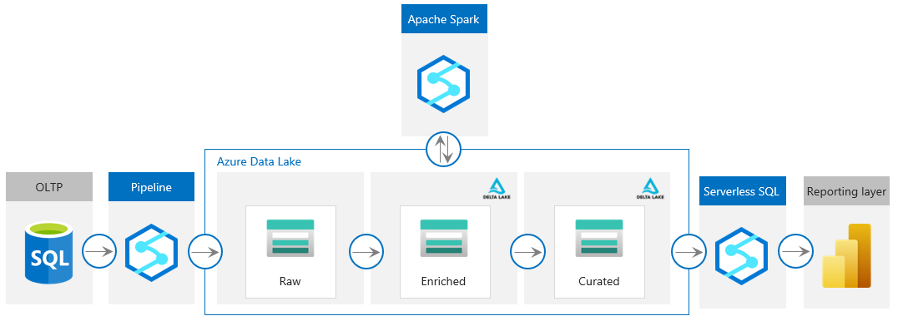

# Data Lakehouse Workshop

The data lakehouse is a data architecture pattern that combines functional aspects of the data warehouse, with the data lake, on one platform. This workshop will walk through an example of how the data lakehouse pattern can be facilitated in Azure with Azure Synapse Analytics.

## :thinking: Prerequisites

* An [Azure account](https://azure.microsoft.com/en-us/free/) with an active subscription. Note: If you don't have access to an Azure subscription, you may be able to start with a [free account](https://www.azure.com/free).
* You must have the necessary privileges within your Azure subscription to create resources, perform role assignments, register resource providers (if required), etc.

## :test_tube: Lab Environment Setup
* [Lab Environment](./modules/module00.md)
* [Post Deployment](./modules/moduleXX.md)

## :books: Learning Modules

1. Incremental copy from source  
    a) [dbo.Customers (via CDC)](./modules/module01a.md)  
    b) [dbo.Orders (via Watermark)](./modules/module01b.md)
2. [Incremental load Dimension (SCD Type 2)](./modules/module02.md)
3. [Incremental load Fact](./modules/module03.md)
4. [Logical Data Warehouse](./modules/module04.md)
5. [Data Visualisation](./modules/module05.md)

<a href="#data-lakehouse-workshop">↥ back to top</a>

## :link: Workshop URL

[aka.ms/lakehouselab](https://aka.ms/lakehouselab)
