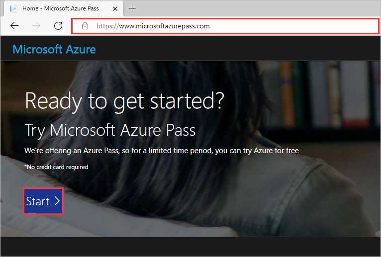
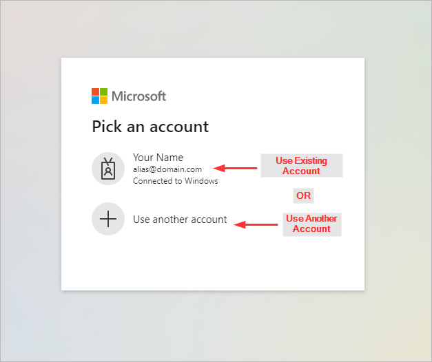
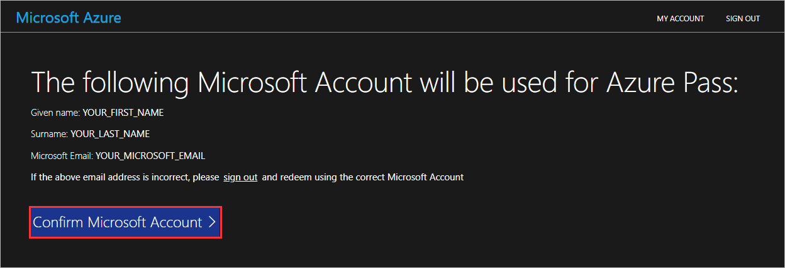
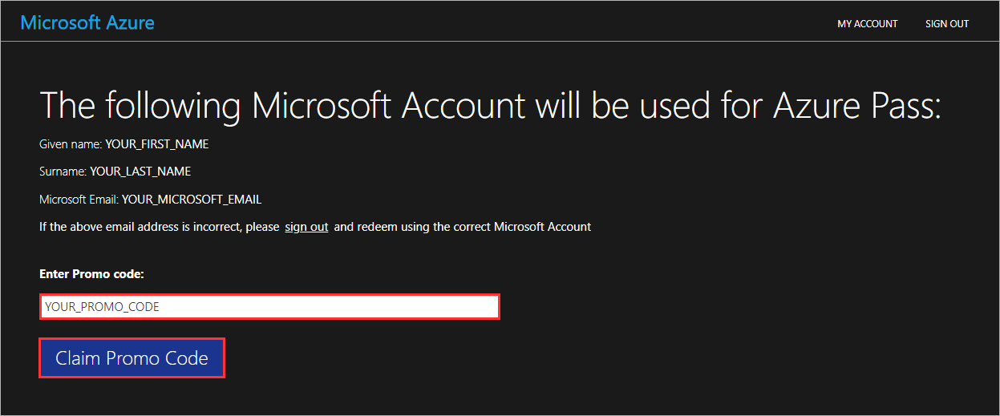
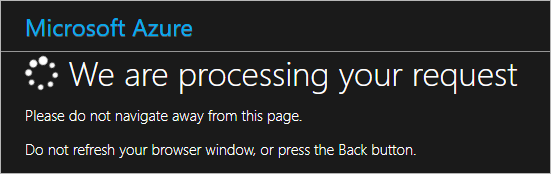
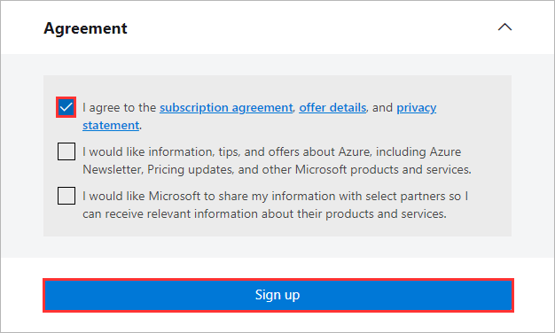
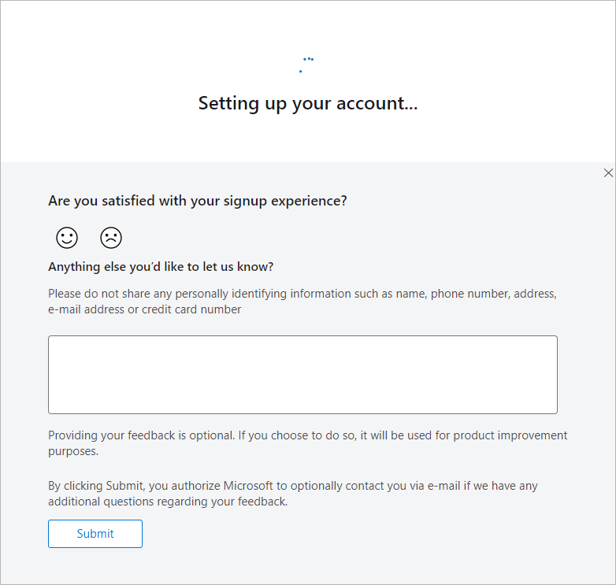
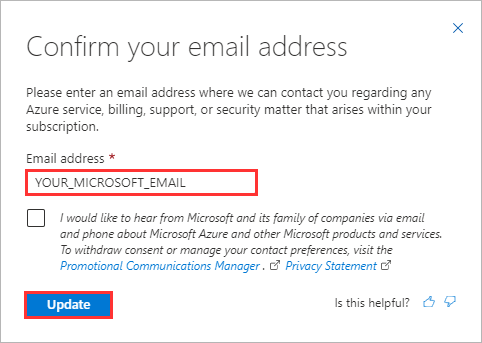

# How to Activate an Azure Pass

**[Home](./README.md)** - [Next Module >](./modules/providers.md)

## :stopwatch: Estimated Duration

10 minutes

## :thinking: Prerequisites

* An Azure Pass promo code

## :loudspeaker: Introduction

In order to follow along with the lab exercises, you will require an account with access to an active Azure subscription. If you are participating in this workshop as part of a proctored session, your proctor may have provided you with an Azure Pass promo code. The steps below will walk through how to activate your pass.

## Azure Pass Activation

1. Open the browser, navigate to [https://www.microsoftazurepass.com](https://www.microsoftazurepass.com), and click **Start**

    

2. You will need to sign in with a Microsoft account.

    * If the Microsoft account you would like to associate the Azure Pass with is **in the list**, click to use an **existing account**.
    * If the Microsoft account you would like to associate the Azure Pass with is **not in the list**, click **Use another account**.
    * Lastly, if you do not have a Microsoft account, click **Use another account** *(the next screen will contain a hyperlink where you can create one)*.

    

3. Validate that you are signed in with the correct Microsoft account and click **Confirm Microsoft Account**.

    

4. Paste your Azure Pass promo code and click **Claim Promo Code**.

    

5. Please wait while your request is being processed.

    

6. Select the checkbox to agree with the subscription agreement and click **Sign up**.

    

7. Please wait while your account is set up.

    

8. Finally, confirm your email address and click **Update**.

    

## :tada: Summary

You have successfully activated an Azure Pass promo code. You now have access to an Azure subscription.

[Continue >](./modules/module00.md)
