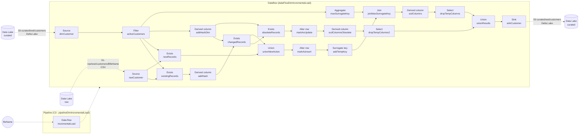

```mermaid
flowchart LR
    a1[Data flow\nincrementalLoad]
    
    df01[Source\nrawCustomer]
    df02[Exists\nnewRecords]
    df03[Exists\nexistingRecords]
    df04[Derived column\naddHash]
    df05[Exists\nchangedRecords]
    df06[Union\nunionNewActive]
    df07[Alter row\nmarkAsInsert]
    df08[Surrogate key\naddTempKey]
    df09[Join\njoinMaxSurrogateKey]
    df10[Derived column\nscdColumns]
    df11[Select\ndropTempColumns]
    df12[Union\nunionResults]
    df13[Sink\nsinkCustomer]
    df14[Source\ndimCustomer]
    df15[Filter\nactiveCustomers]
    df16[Aggregate\nmaxSurrogateKey]
    df17[Derived column\naddHashDim]
    df18[Exists\nobsoleteRecords]
    df19[Alter row\nmarkAsUpdate]
    df20[Derived column\nscdColumnsObsolete]
    df21[Select\ndropTempColumns2]

    param((fileName))
    param-.->a1

    ds1[(Data Lake\nraw)]
    ds2[(Data Lake\ncurated)]
    ds3[(Data Lake\ncurated)]
    ds1-."01-raw/wwi/customers/$fileName\nCSV".->df01
    df13-."03-curated/wwi/customers\nDelta Lake".->ds2
    ds3-."03-curated/wwi/customers\nDelta Lake".->df14


    subgraph p["Pipeline (C3 - pipelineDimIncrementalLoad)"]
    a1
    end
    
    a1-.->df
    
    subgraph df["Dataflow (dataFlowDimIncrementalLoad)"]
    df01-->df02
    df01-->df03
    df02-->df06
    df03-->df04
    df04-->df05
    df05-->df06
    df06-->df07
    df07-->df08
    df08-->df09
    df09-->df10
    df10-->df11
    df11-->df12
    df12-->df13
    df14-->df15
    df15-->df16
    df16-->df09
    df15-->df17
    df17-->df18
    df17-->df05
    df18-->df19
    df19-->df20
    df20-->df21
    df21-->df12
    df05-->df18
    df15-->df02
    df15-->df03

    end
```