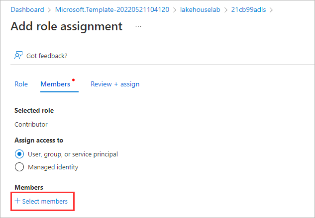
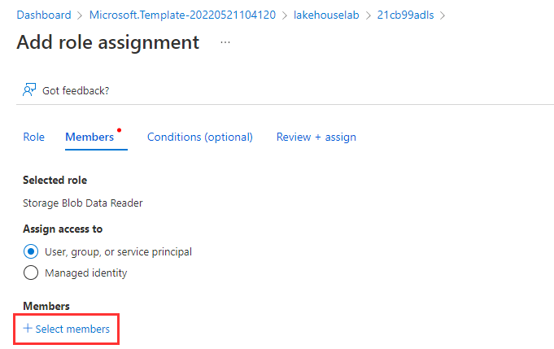
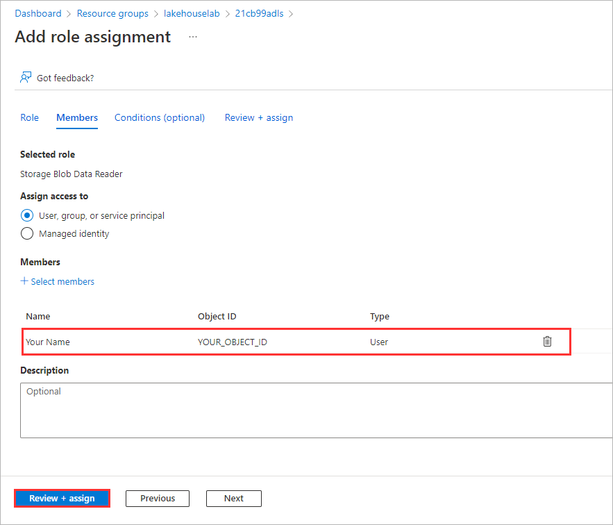
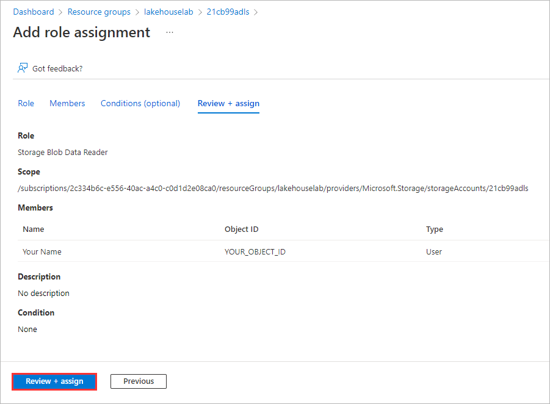

# Module 00 - Lab Environment Setup

**[Home](../README.md)** - [Next Module >](../modules/module01a.md)

## :stopwatch: Estimated Duration

10 minutes

## :thinking: Prerequisites

* An [Azure account](https://azure.microsoft.com/free) with an active subscription.
* Owner permissions within a Resource Group to create resources and manage role assignments.
* The subscription must have the following resource providers registered.
  * Microsoft.Authorization
  * Microsoft.EventGrid
  * Microsoft.Sql
  * Microsoft.Storage
  * Microsoft.Synapse
  * Microsoft.DataFactory

## :loudspeaker: Introduction

In order to follow along with the lab exercises, we need to provision a set of resources.

## Table of Contents

1. [Deploy Template](#1-deploy-template)
2. [RBAC Role Assignment (Storage Account > Contributor)](#2-rbac-role-assignment-storage-account--contributor)
3. [RBAC Role Assignment (Storage Account > Storage Blob Data Reader)](#3-rbac-role-assignment-storage-account--storage-blob-data-reader)

## 1. Deploy Template

The following steps will deploy Azure resources that will be used as part of the workshop. This will include a Synapse workspace, ADLS Gen2 Storage Account, and an Azure SQL Database. This will allow you to run the necessary SQL queries against the database.

1. `Right-click` or `Ctrl + click` the button below to open the Azure Portal in a new window.

    

2. Beneath the **Resource group** field, click **Create new** and provide a unique name (e.g. `lakehouselab`), select a valid location, and then click **Review + create**.

    Suggested Locations:

     * Australia East
     * Canada Central
     * Central India
     * Central US
     * East Asia
     * East US
     * East US 2
     * Germany West Central
     * Japan East
     * Korea Central
     * North Central US
     * Norway East
     * South Central US
     * Switzerland North
     * UAE North
     * West US
     * West US 3

3. Once the validation has passed, click **Create**.

4. The deployment should take approximately 5 minutes to complete. Once you see the message **Your deployment is complete**, click **Go to resource group**.

    

<a href="#module-00---lab-environment-setup">↥ back to top</a>

## 2. RBAC Role Assignment (Storage Account > Contributor)

The **Contributor** role assignment is required to ensure that your account has sufficient permissions to setup Synapse Pipelines that can be triggered from file events (e.g. Blob Created, Blob Updated).

1. Navigate to the **Storage account**

    

2. Select **Access Control (IAM)**

    

3. Click **Add role assignment**

    

4. Select `Contributor` and click **Next**

    

5. Click **Select members**

    

6. Search for your account, select your account, and click **Select**

    

7. Click **Review + assign**

    

8. Click **Review + assign**

    

<a href="#module-00---lab-environment-setup">↥ back to top</a>

## 3. RBAC Role Assignment (Storage Account > Storage Blob Data Reader)

The **Storage Blob Data Reader** role assignment is required to read files from the data lake using Azure Synapse Analytics built-in serverless SQL technology.

1. Navigate to the **Storage account**

    

2. Select **Access Control (IAM)**

    

3. Click **Add role assignment**

    

4. Select `Storage Blob Data Reader` and click **Next**

    

5. Click **Select members**

    

6. Search for your account, select your account, click **Select**

    

7. Click **Review + assign**

    

8. Click **Review + assign**

    

<a href="#module-00---lab-environment-setup">↥ back to top</a>

## :tada: Summary

By successfully deploying the lab template and executing the post deployment steps, you are ready to begin the workshop!

## :white_check_mark: Results

Azure Resources

- [x] 1 x Resource Group
- [x] 1 x SQL Database
- [x] 1 x SQL Server
- [x] 1 x Synapse Workspace
- [x] 1 x Storage Account

Azure Data Lake Storage Gen2

- [x] 2 x RBAC Role Assignments (Contributor, Storage Blob Data Reader)

[Continue >](../modules/module01a.md)
