# Module 00 - Lab Environment Setup

**[Home](../README.md)** - [Next Module >](../modules/module01a.md)

## :thinking: Prerequisites

* An [Azure account](https://azure.microsoft.com/en-us/free/) with an active subscription.
* Owner permissions within a Resource Group to create resources and manage role assignments.
* The subscription must have the following resource providers registered.
  * Microsoft.Authorization
  * Microsoft.EventGrid
  * Microsoft.Sql
  * Microsoft.Storage
  * Microsoft.Synapse

## :loudspeaker: Introduction

In order to follow along with the lab exercises, we need to provision a set of resources.

## 1. Deploy Template

The following steps will deploy Azure resources that will be used as part of the workshop (e.g. Synapse workspace, ADLS Gen2 Storage Account, SQL database).

1. Right-click or `Ctrl + click` the button below to open the Azure Portal in a new window.

    

2. Beneath the **Resource group** field, click **Create new** and provide a unique name (e.g. `lakehouse-rg`), select a valid location (e.g. `West Europe`), and then click **Review + create**.

3. Once the validation has passed, click **Create**.

4. The deployment should take approximately 5 minutes to complete. Once you see the message **Your deployment is complete**, click **Go to resource group**.

    <kbd>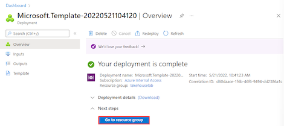</kbd>

<a href="#module-00---lab-environment-setup">↥ back to top</a>

## 2. Set Azure AD admin

The following steps will elevate your account as an Azure AD administrator of the logical SQL Server hosting the Azure SQL Database.

1. Navigate to the **SQL server**

    <kbd></kbd>

2. Select **Azure Active Directory**

    <kbd>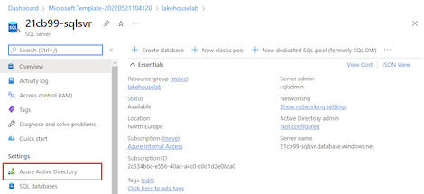</kbd>

3. Click **Set admin**

    <kbd>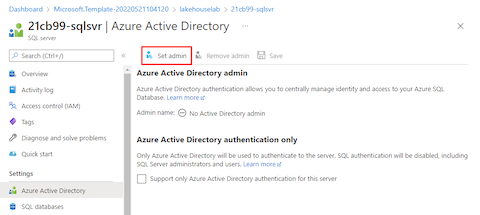</kbd>

4. Search for your account, select your account, click **Select** 

    <kbd></kbd>

5. Click **Save**

    <kbd>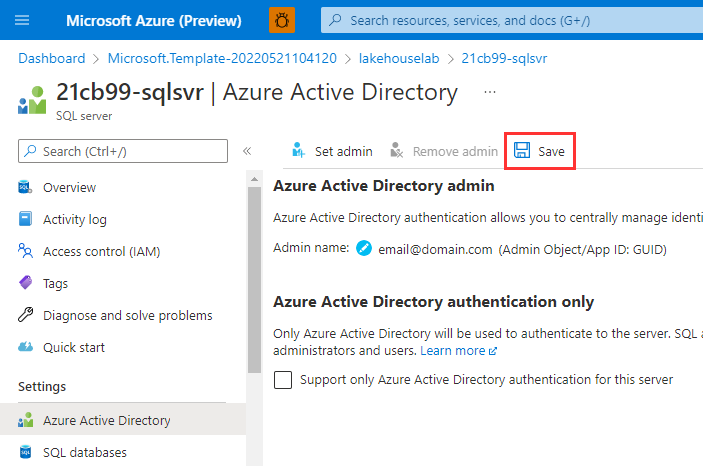</kbd>

<a href="#module-00---lab-environment-setup">↥ back to top</a>

## 3. RBAC Role Assignment (Storage Account > Contributor)

This role assignment is required to ensure that your account has sufficient permissions (Owner or Contributor) to setup Synapse Pipelines that can be triggered from file events (e.g. Blob Created, Blob Updated).

1. Navigate to the **Storage account**

    <kbd>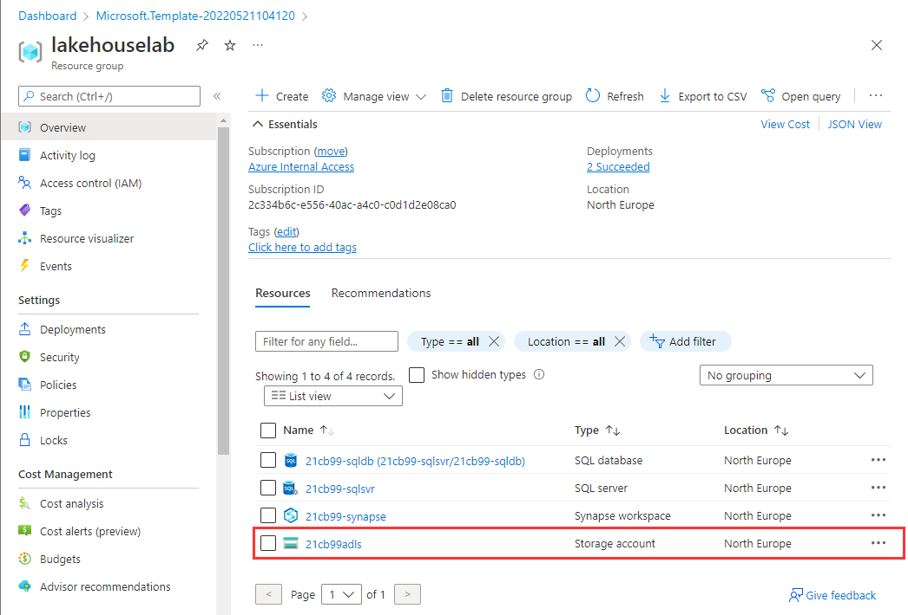</kbd>

2. Select **Access Control (IAM)**

    <kbd>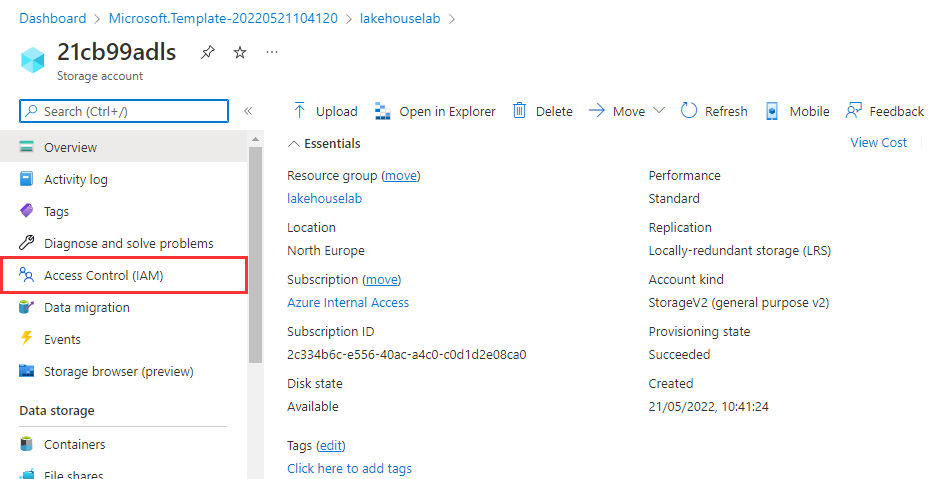</kbd>

3. Click **Add role assignment**

    <kbd>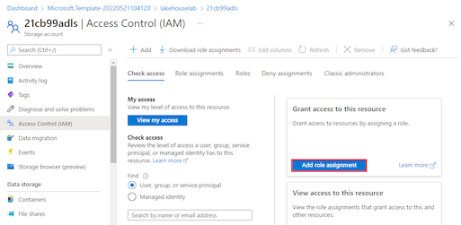</kbd>

4. Select `Contributor` and click **Next**

    <kbd>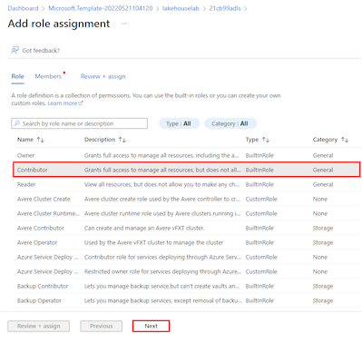</kbd>

5. Click **Select members**

    <kbd></kbd>

6. Search for your account, select your account, click **Select** 

    <kbd>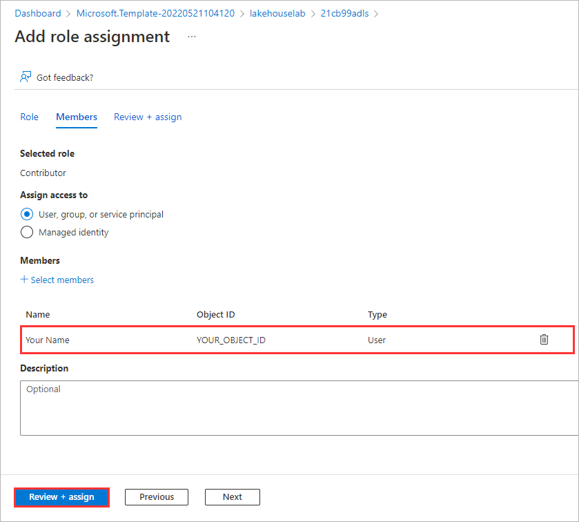</kbd>

7. Click **Review + assign**

    <kbd>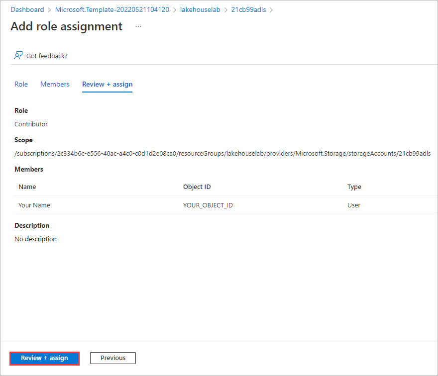</kbd>

8. Click **Review + assign**

<a href="#module-00---lab-environment-setup">↥ back to top</a>

## 4. RBAC Role Assignment (Storage Account > Storage Blob Data Reader)

This role assignment is required to read files from the data lake using Azure Synapse Analytics built-in serverless SQL technology.

1. Navigate to the **Storage account**

    <kbd></kbd>

2. Select **Access Control (IAM)**

    <kbd></kbd>

3. Click **Add role assignment**

    <kbd></kbd>

4. Select `Storage Blob Data Reader` and click **Next**

    <kbd>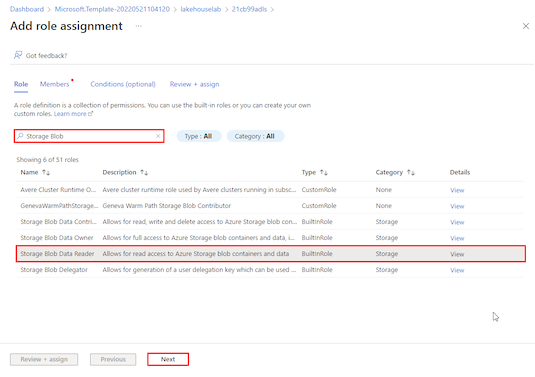</kbd>

5. Click **Select members**

    <kbd></kbd>

6. Search for your account, select your account, click **Select** 

    <kbd></kbd>

7. Click **Review + assign**

    <kbd></kbd>

8. Click **Review + assign**

    <kbd></kbd>

<a href="#module-00---lab-environment-setup">↥ back to top</a>

## :tada: Summary

By successfully deploying the lab template, you have the Azure resources needed to follow along with the learning exercises.

[Continue >](../modules/module01a.md)