# Module 01B - Dimension Table (Initial Load)

[< Previous Module](../modules/module01a.md) - **[Home](../README.md)** - [Next Module >](../modules/module01c.md)

## :thinking: Prerequisites

- [x] Lab environment deployed
- [x] Module 1A complete

## :loudspeaker: Introduction

In this module, we will setup a Synapse Pipeline to load data from our raw layer (CSV), into our curated layer (Delta Lake).

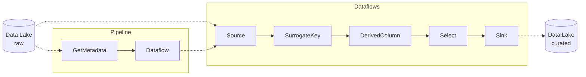

## :dart: Objectives

- Create a pipeline that will initialize a dimension table in the curated layer of our data lake using the Delta Lake file format

## Table of Contents

1. [Pipeline (initialLoad)](#1-Pipeline-initialLoad)
2. [Data flow (Source - rawCustomer)](#2-Data-flow-Source---rawCustomer)
3. [Data flow (Surrogate Key)](#3-Data-flow-Surrogate-Key)
4. [Data flow (Derived Column)](#4-Data-flow-Derived-Column)
5. [Data flow (Select)](#5-Data-flow-Select)
6. [Data flow (Sink)](#6-Data-flow-Sink)
7. [Pipeline (initialLoad)](#7-Pipeline-initialLoad)
8. [Query Delta Lake](#8-Query-Delta-Lake)

## 1. Pipeline (initialLoad)

In this example, we will be creating a pipeline that will reference one of the data files in the raw layer to initialize the dimension table. This process will involve populating the dimension table with some data as well as the creation of additional columns needed to facilitate future incremental loads. The pipeline will leverage the Get Metadata activity which can be used to retrieve metadata, in this case, file names within a folder path. This metadata will be used to pass a file name to the subsequent Data flow step where our transformation will occur.

1. Navigate to the **Integrate** hub

    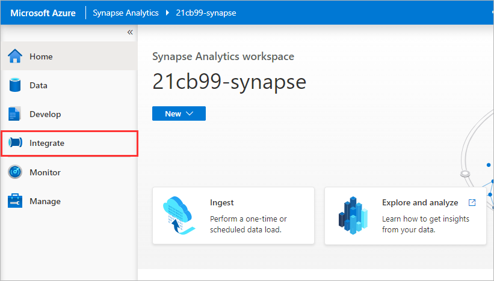

2. Under **Pipelines**, click on the ellipsis **[...]** icon to the right of the **Customers** folder and select **New pipeline**

    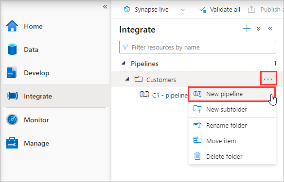

3. Rename the pipeline to `C2 - pipelineDimInitialLoad`

    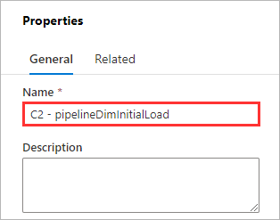

4. Within Activities, search for `Get Metadata`, and drag the **Get Metadata activity** onto the canvas

    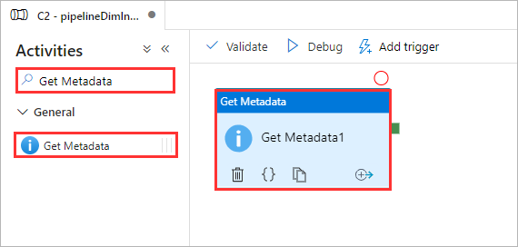

5. Rename the activity `getFiles`

    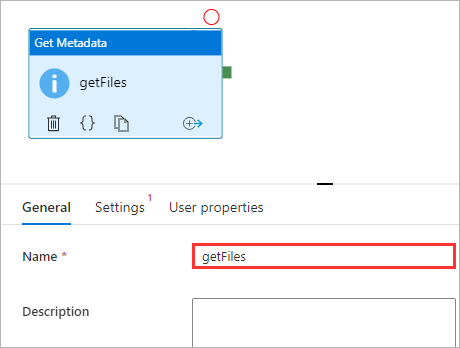

6. Switch to the **Settings** tab

    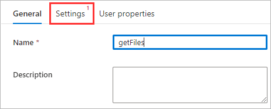

7. Set the **Source dataset** to **AdlsRawDelimitedText**

    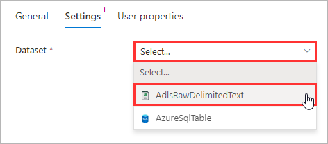

8. Set the Dataset property **folderPath** to `wwi/customers`

    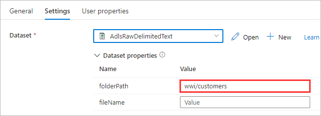

9. Set the Dataset property **fileName** to `/`

    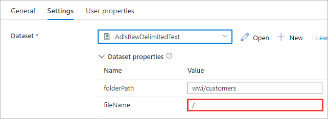

10. Next to the **Field list** property, click **New**

    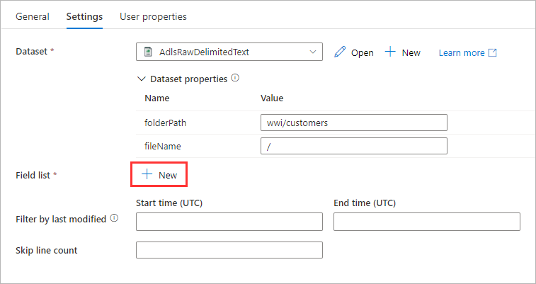

11. Open the **Argument** drop-down menu and select **Child items**

    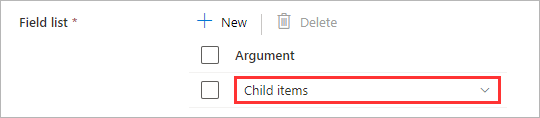

12. Within Activities, search for `Data flow`, and drag the **Data flow activity** onto the canvas

    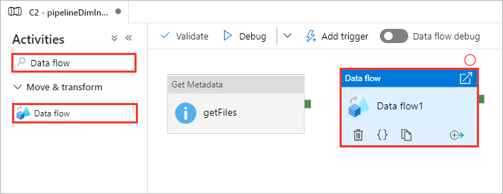

13. Click and drag on the green button on the previous **Get Metadata** activity (`getFiles`) to establish a connection to the **Data flow** activity

    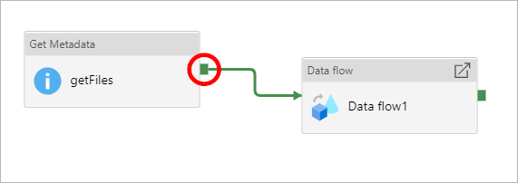

14. Rename the activity `initialLoad`

    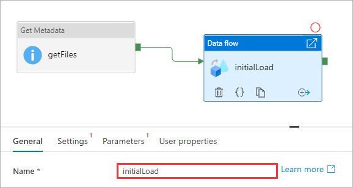

15. Switch to the **Settings** tab

    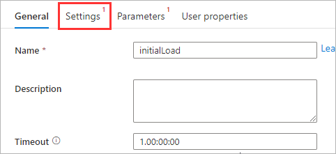

16. Next to the **Data flow** drop-down menu, click **New**

    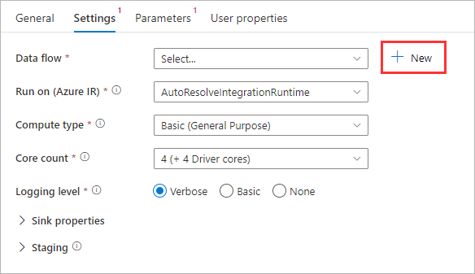

<div align="right"><a href="#module-01b---dimension-table-initial-load">↥ back to top</a></div>

## 2. Data flow (Source - rawCustomer)

Data flows provide a way to transform data at scale without any coding required. You can design a data transformation job in the data flow designer by constructing a series of transformations. In this step, we are going to start with a source that will reference a delimited text file (CSV) in the raw layer of our data lake.

1. Enable **Data flow debug**

    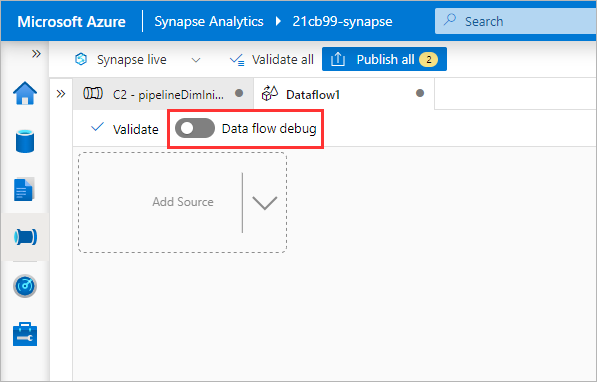

2. Rename the data flow `dataFlowDimInitialLoad`

    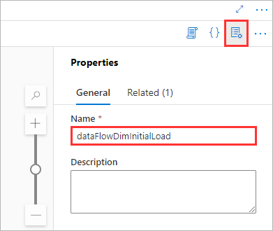

3. Under **Parameters**, click **New**

    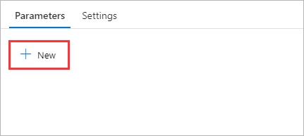

4. Rename **parameter1** to `fileName`

    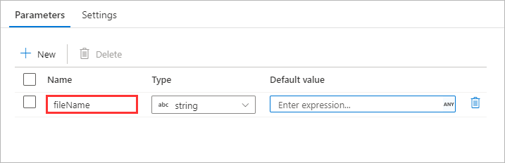

5. Within the data flow canvas, click **Add Source** and select **Add source**

    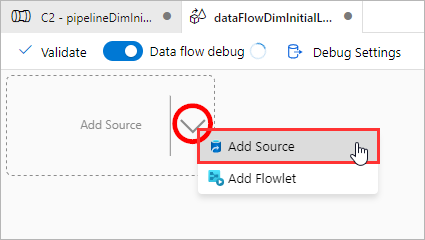

6. Rename the **Output stream name** to `rawCustomer`

    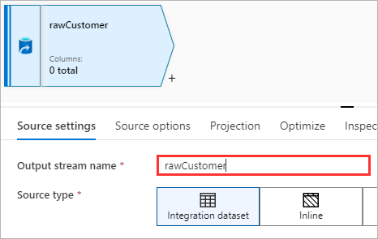

7. Set the **Source type** to **Inline**

    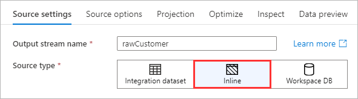

8. Set the **Inline dataset type** to **DelimitedText**

    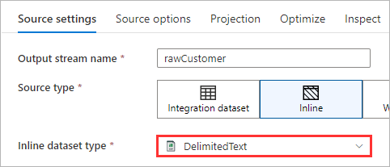

9. Set the **Linked Service** to the **Synapse Workspace Default Storage**.

    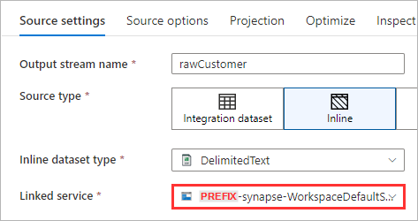

10. Switch to the **Source options** tab

    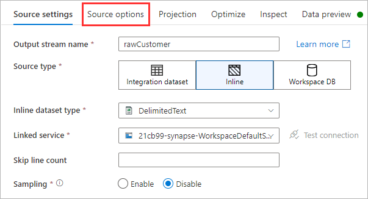

11. Click the **Browse** icon

    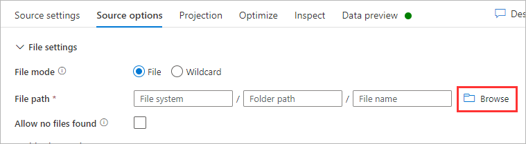

12. Navigate to `01-raw > wwi > customers` and click **OK**

    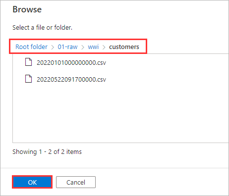

13. Click inside the **File name** text input and click **Add dynamic content**

    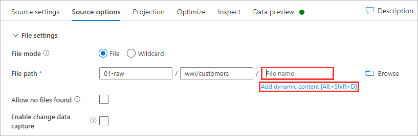

14. Under **Expression elements** click **Parameters**, select **fileName** and click **Save and finish**

    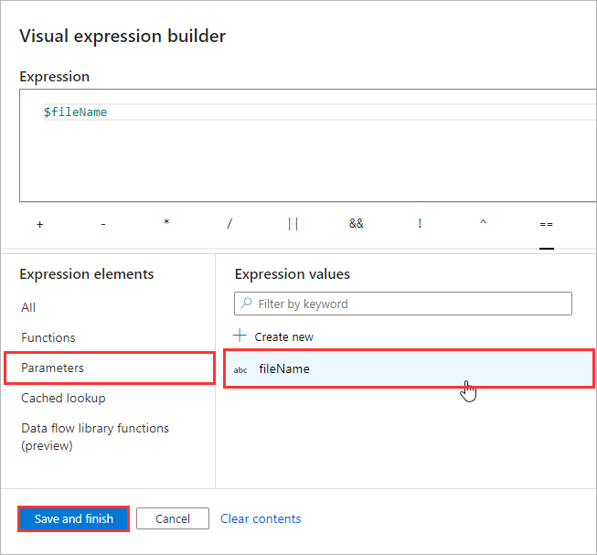

15. Enable **First row as header**

    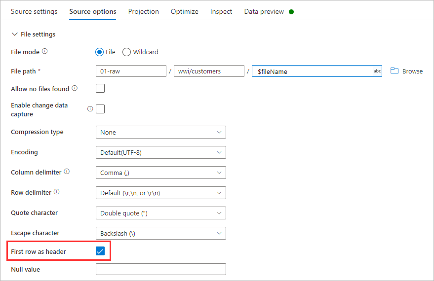

16. Switch to the **Projection** tab

    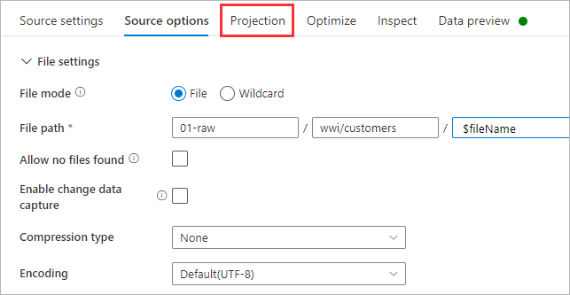

17. Click **Import schema**. Note: You may need to wait for the Data flow debug session to be ready before the button will become clickable.

    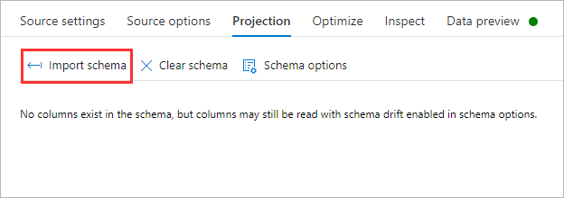

18. Click **Import**

    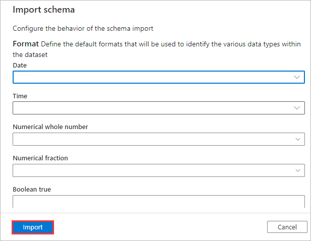

19. Under **Data flow parameters**, set the **fileName** property to an existing CSV file that resides within `01-raw > wwi > customers` and click **Save**.
    - Tip: In a new window, open the Azure Portal, navigate to the storage account, and use the Storage Browser to find an existing file.
    - Note: The string must be wrapped in single quotes.

    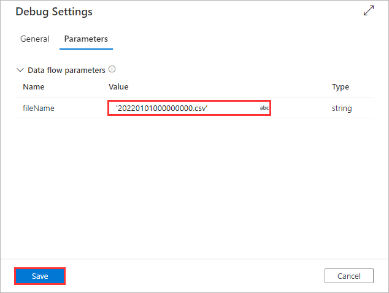

20. Switch to the **Data preview** tab and click **Refresh**

    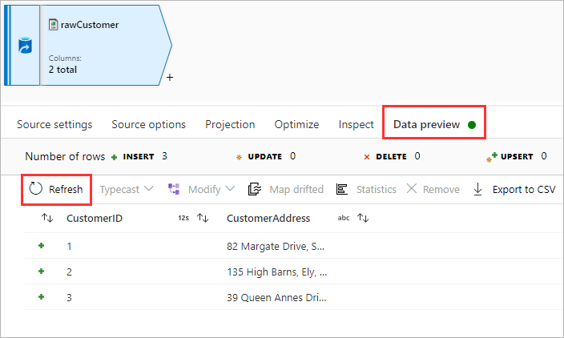

<div align="right"><a href="#module-01b---dimension-table-initial-load">↥ back to top</a></div>

## 3. Data flow (Surrogate Key)

The Surrogate Key transformation is used to add an incrementing key value to each row of data. This is useful when designing dimension tables in a star schema analytical data model. In a star schema, each member in your dimension tables requires a unique key (e.g. CustomerSurrogateKey) that is a non-business key (e.g. CustomerID). In this example, the business key (CustomerID) may repeat in our dimension table due to updates being made to a customer over time. The surrogate key enables us to uniquely identify records within our dimension table while persisting changes.

1. Click the **[+]** icon to add a new step, under **Schema modifier** select **Surrogate Key**

    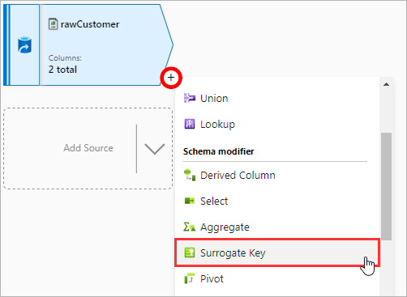

2. Rename the **Output stream name** to `surrogateKey`

    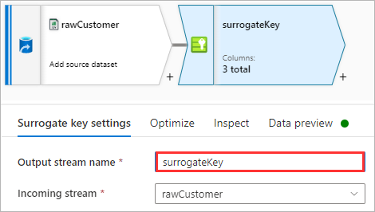

3. Set the **Key column** to `CustomerSK`

    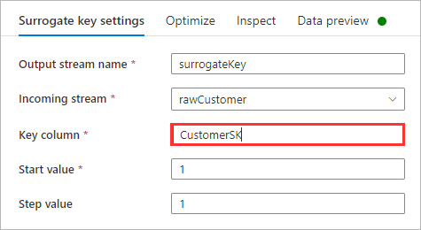

4. Switch to the **Data preview** tab and click **Refresh**

    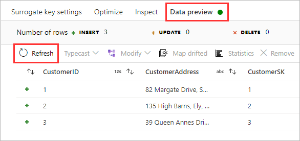

<div align="right"><a href="#module-01b---dimension-table-initial-load">↥ back to top</a></div>

## 4. Data flow (Derived Column)

The Derived Column transformation allows us to generate new columns and/or modify existing columns. In this example, we are going to add three new columns (`IsActive`, `ValidFrom`, and `ValidTo`) in addition to the columns that are arriving from the previous transformation (`CustomerSK`, `CustomerID`, and `CustomerAddress`). This additional columns will be used in future incremental loads that will adhere to the slowly changing dimension type 2 pattern where we are able to persist historical changes and quickly isolate the subset of rows which represent the currently active (i.e. IsActive == 1).

1. Click the **[+]** icon to add a new step, under **Schema modifier** select **Derived Column**

    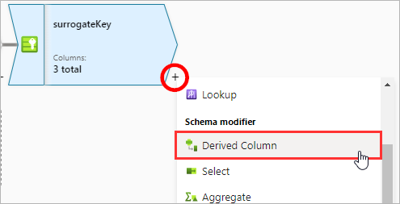

2. Rename the **Output stream name** to `derivedColumnsSCD`

    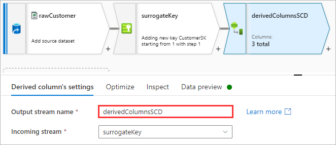

3. Copy and paste the **Column** values from the table below

    | Column | Expression |
    | --- | --- |
    | `IsActive` | `1` |

    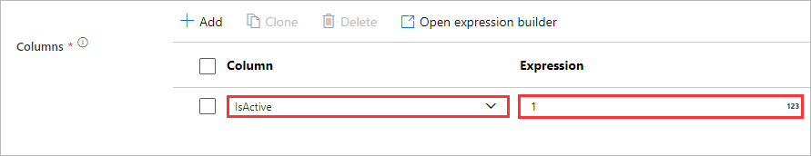

4. Click **Add** and select **Add column**

    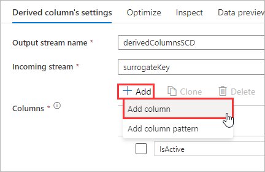

5. Copy and paste the **Column** values from the table below

    | Column | Expression |
    | --- | --- |
    | `ValidFrom` | `currentTimestamp()` |

    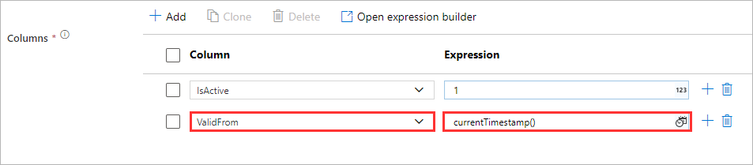

6. Click **Add** and select **Add column**

    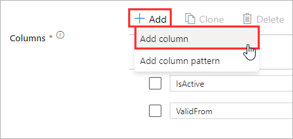

7. Copy and paste the **Column** values from the table below

    | Column | Expression |
    | --- | --- |
    | `ValidTo` | `toTimestamp('9999-12-31 00:00:00')` |

    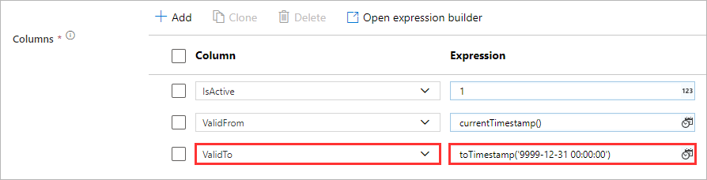

8. Switch to the **Data preview** tab and click **Refresh**

    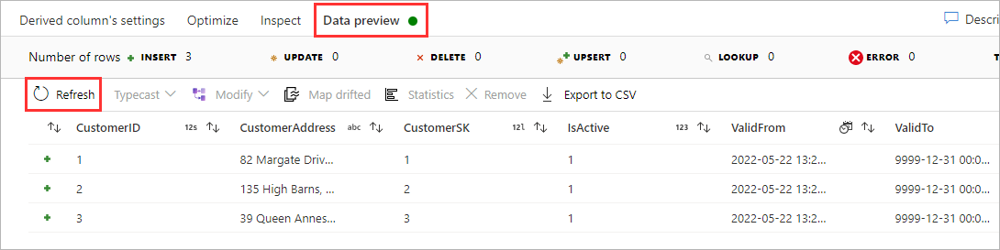

<div align="right"><a href="#module-01b---dimension-table-initial-load">↥ back to top</a></div>

## 5. Data flow (Select)

The Select transformation can be used to rename, drop, or reorder columns. In this example, we are going to reorder our columns so that the newly introduced `CustomerSK` is in the first position.

1. Click the **[+]** icon to add a new step, under **Schema modifier** select **Select**

    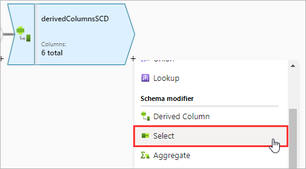

2. Rename the **Output stream name** to `reorderColumns`

    

3. Under **Input columns**, click and drag the **CustomerSK** column to be in the first position

    

4. Switch to the **Data preview** tab and click **Refresh**

    

<div align="right"><a href="#module-01b---dimension-table-initial-load">↥ back to top</a></div>

## 6. Data flow (Sink)

The final step in a data flow is to write the net effect of the transformations into a destination store by using the Sink transformation. In this example, we are going to write the net result of our data transformations to the curated layer within the data lake using the Delta Lake file format. Delta Lake is an open-source file format that enables building a lakehouse architecture by bringing features such as ACID (atomicity, consistency, isolation, and durability) compliant transactions.

1. Click the **[+]** icon to add a new step, under **Destination** select **Sink**

    

2. Rename the **Output stream name** to `curatedCustomer`

    

3. Set the **Sink type** to **Inline**

    

4. Set the **Inline dataset type** to **Delta**

    

5. Set the **Linked Service** to the **Synapse Workspace Default Storage**.

    

6. Switch to the **Settings** tab and click the **Browse** icon

    

7. Navigate to `03-curated` and click **OK**

    

8. Click inside the **Folder path** text input and set the value to `wwi/customers`

    

9. Set the **Compression type** to **snappy**

    

10. Set the **Table action** to **Truncate**

    

11. Switch to the **Data preview** tab and click **Refresh**

    

<div align="right"><a href="#module-01b---dimension-table-initial-load">↥ back to top</a></div>

## 7. Pipeline (initialLoad)

To finalize our pipeline, we must update the parameters of the data flow activity so that is is able to retrieve a file name from the previous step in the pipeline.

1. Navigate back to the **pipeline**, click to focus on the **Data flow** step

    

2. Switch to the **Parameters** tab

    

3. Under **Data flow parameters**, click the **value** field for the **fileName** parameter, and select **Pipeline expression**

    

4. Copy and paste the code snippet and click **OK**

    ```javascript
    @activity('getFiles').output.childItems[0].name
    ```

    

5. Click **Publish all**

    

6. Click **Publish**

    

7. Click **Debug**

    

8. Wait until all the activities in the pipeline have a status of **Succeeded**

    

<div align="right"><a href="#module-01b---dimension-table-initial-load">↥ back to top</a></div>

## 8. Query Delta Lake

The serverless SQL pool in Azure Synapse Analytics is an example compute engine that has the ability to read data stored in the Delta Lake format. Further into the workshop, we will leverage this capability to serve curated data to reporting tools such as Power BI.

1. Navigate to the **Data** hub

    

2. Browse the data lake folder structure to `03-curated > wwi > customers`

    

3. Right-click one of the **parquet** files, select **New SQL Script > Select TOP 100 rows**

    

4. Modify the **OPENROWSET** function to remove the file name from the **BULK** path, change the **FORMAT** to **DELTA**, and click **Run**

    

<div align="right"><a href="#module-01b---dimension-table-initial-load">↥ back to top</a></div>

## :tada: Summary

You have successfully setup a pipeline to initialize the dimension table (Customers) in the Delta Lake format.

[Continue >](../modules/module01c.md)
