# Module 01C - Dimension Table (Incremental Load, SCD Type 2)

[< Previous Module](../modules/module01b.md) - **[Home](../README.md)** - [Next Module >](../modules/module01d.md)

## :stopwatch: Estimated Duration

45 minutes

## :thinking: Prerequisites

- [x] Lab environment deployed
- [x] Module 1A complete
- [x] Module 1B complete

## :loudspeaker: Introduction

In this module, we will setup a Synapse Pipeline to incrementally load data from our raw layer (CSV), into our curated layer (Delta Lake) as a SCD Type 2 dimension table.

**Pipeline**

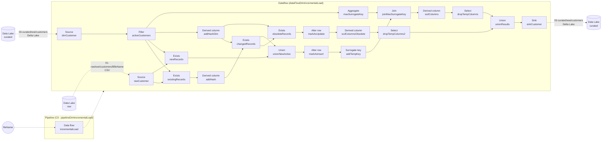

**Data flow sequence**
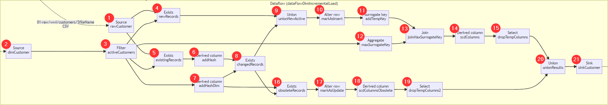

1. New customer data (rawCustomer)
2. Existing customer data (dimCustomer)
3. Filtered existing customer data (activeCustomer)
4. Identify net new customers (newRecords)
5. Identify existing customers (existingRecords)
6. Add hash fingerprint to existing customers from new data (addHash)
7. Add hash fingerprint to existing customers from existing data (addHashDim)
8. Identify existing customers with changed values (changedRecords)
9. Union newRecords and  changedRecords (unionNewActive)
10. Mark these rows as INSERT (markAsInsert)
11. Add an incremental key (addTempKey)
12. Calculate current maximum surrogate key from existing data (maxSurrogateKey)
13. Join two data streams addTempKey and maxSurrogateKey (joinMaxSurrogateKey)
14. Set value for SCD columns such as CustomerSK, IsActive, ValidFrom, ValidTo (scdColumns)
15. Drop temporary columns such as Hash, TempKey, and MaxCustomerSK (dropTempColumns)
16. Identify obsolete customer records (obsoleteRecords)
17. Mark these rows as UPDATE (markAsUpdate)
18. Set value for SCD columns such as IsActive and ValidTo (scdColumnsObsolete)
19. Drop the temporary column Hash (dropTempColumns2)
20. Union the two streams (unionResults)
21. Write the results into the Delta Lake (sinkCustomer)

## :dart: Objectives

- Create a pipeline that will incrementally load data as new files arrive.

## Table of Contents

1. [Pipeline (pipelineDimIncrementalLoad)](#1-Pipeline-pipelineDimIncrementalLoad)
2. [Data flow (Source - rawCustomer)](#2-Data-flow-Source---rawCustomer)
3. [Data flow (Source - dimCustomer)](#3-Data-flow-Source---dimCustomer)
4. [Data flow (Filter - activeCustomers)](#4-Data-flow-Filter---activeCustomers)
5. [Data flow (Derived column - addHashDim)](#5-Data-flow-Derived-column---addHashDim)
6. [Data flow (Aggregate - maxSurrogateKey)](#6-Data-flow-Aggregate---maxSurrogateKey)
7. [Data flow (Exists - existingRecords)](#7-Data-flow-Exists---existingRecords)
8. [Data flow (Exists - newRecords)](#8-Data-flow-Exists---newRecords)
9. [Data flow (Derived column - addHash)](#9-Data-flow-Derived-column---addHash)
10. [Data flow (Exists - changedRecords)](#10-Data-flow-Exists---changedRecords)
11. [Data flow (Union - unionNewActive)](#11-Data-flow-Union---unionNewActive)
12. [Data flow (Alter row - markAsInsert)](#12-Data-flow-Alter-row---markAsInsert)
13. [Data flow (Surrogate key - addTempKey)](#13-Data-flow-Surrogate-key---addTempKey)
14. [Data flow (Join - joinMaxSurrogateKey)](#14-Data-flow-Join---joinMaxSurrogateKey)
15. [Data flow (Derived column - scdColumns)](#15-Data-flow-Derived-column---scdColumns)
16. [Data flow (Select - dropTempColumns)](#16-Data-flow-Select---dropTempColumns)
17. [Data flow (Exists - obsoleteRecords)](#17-Data-flow-Exists---obsoleteRecords)
18. [Data flow (Alter row - markAsUpdate)](#18-Data-flow-Alter-row---markAsUpdate)
19. [Data flow (Derived column - scdColumnsObsolete)](#19-Data-flow-Derived-column---scdColumnsObsolete)
20. [Data flow (Select - dropTempColumns2)](#20-Data-flow-Select---dropTempColumns2)
21. [Data flow (Union - unionResults)](#21-Data-flow-Union---unionResults)
22. [Data flow (Sink - sinkCustomer)](#22-Data-flow-Sink---sinkCustomer)
23. [Pipeline (pipelineDimIncrementalLoad)](#23-Pipeline-pipelineDimIncrementalLoad)
24. [Debug Pipeline](#24-Debug-Pipeline)

## 1. Pipeline (pipelineDimIncrementalLoad)

In this module, we will be creating a pipeline to incrementally load the Customers dimension table. The transformation logic will be encapsulated within a data flow and will follow an SCD Type 2 pattern, this is where a new record is added to the dimension table to cater for data changes.

1. Navigate to the **Integrate** hub

    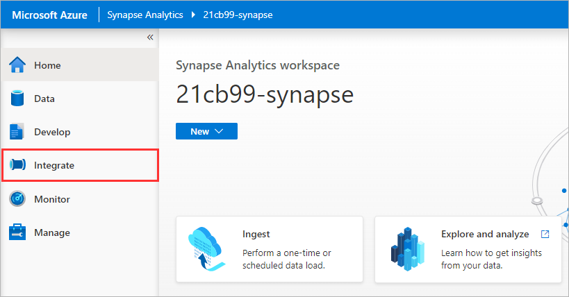

2. Under **Pipelines**, click on the ellipsis **[...]** icon to the right of the `Customers` folder and select **New pipeline**

    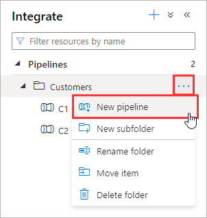

3. Rename the pipeline to `C3 - pipelineDimIncrementalLoad`

    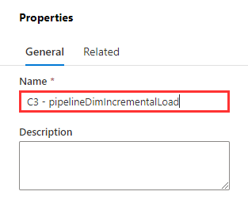

4. Under **Parameters**, click **New**

    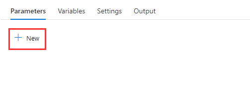

5. Set the name of the parameter to `fileName`

    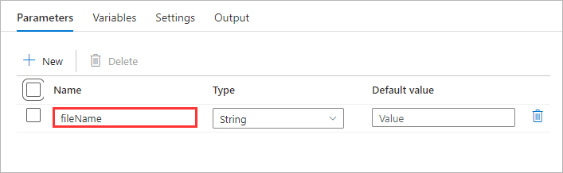

6. Within Activities, search for `Data flow`, and drag the **Data flow activity** onto the canvas

    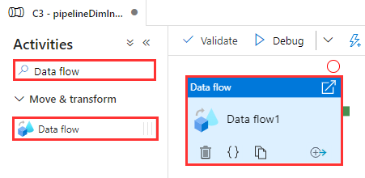

7. Rename the activity `incrementalLoad`

    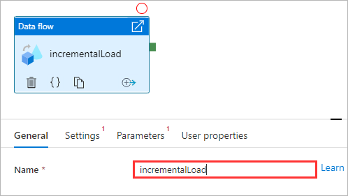

8. Switch to the **Settings** tab

    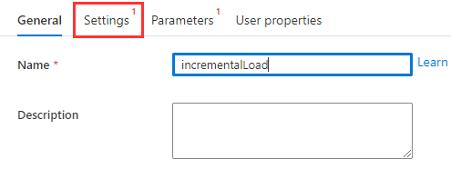

9. Next to the **Data flow** property, click **New**

    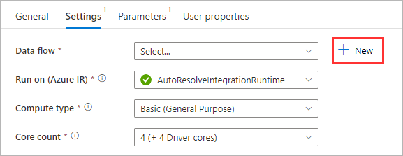

<div align="right"><a href="#module-01c---dimension-table-incremental-load-scd-type-2">↥ back to top</a></div>

## 2. Data flow (Source - rawCustomer)

In this step, we start with a **source** transformation that will reference a delimited text file (CSV) in the raw layer of our data lake. The data flow will include a file name parameter, this will allow the pipeline to dynamically pass a file name at runtime.

1. Enable **Data flow debug**

    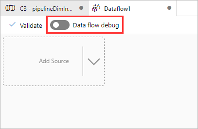

2. Rename the data flow `dataFlowDimIncrementalLoad`

    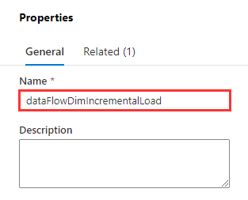

3. Under **Parameters**, click **New**

    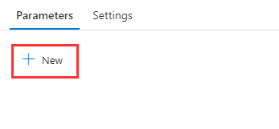

4. Rename **parameter1** to `fileName`

    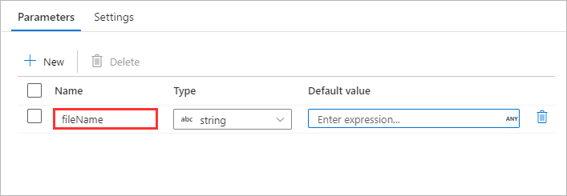

5. Within the data flow canvas, click **Add Source** and select **Add source**

    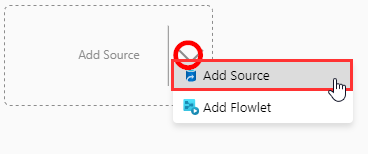

6. Rename the **Output stream name** to `rawCustomer`

    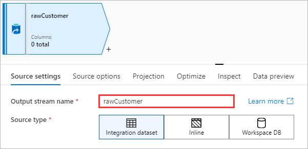

7. Set the **Source type** to **Inline**

    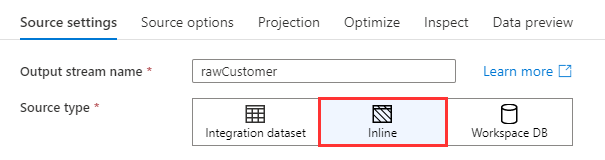

8. Set the **Inline dataset type** to **DelimitedText**

    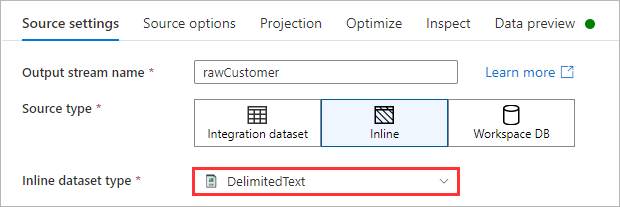

9. Set the **Linked Service** to the **Synapse Workspace Default Storage**.

    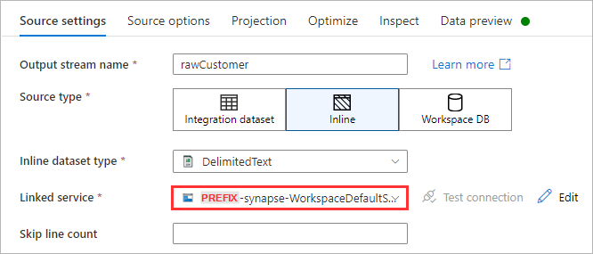

10. Switch to the **Source options** tab

    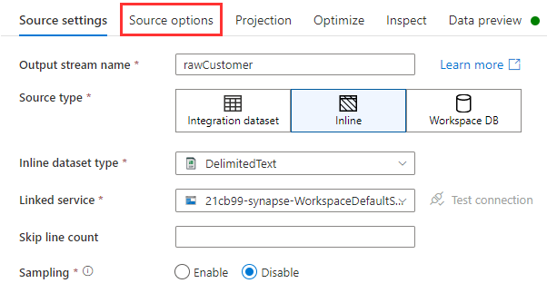

11. Click the **Browse** icon

    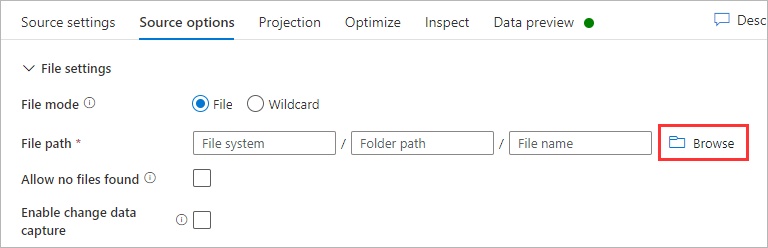

12. Navigate to `01-raw > wwi > customers` and click **OK**

    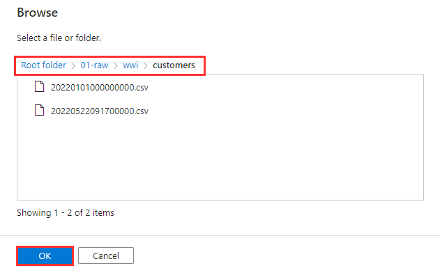

13. Click inside the **File name** text input and click **Add dynamic content**

    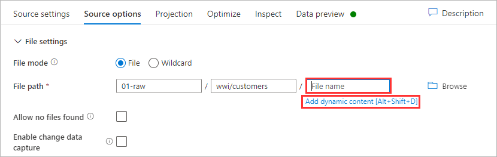

14. Under **Expression elements** click **Parameters**, select **Filename**, and click **Save and finish**

    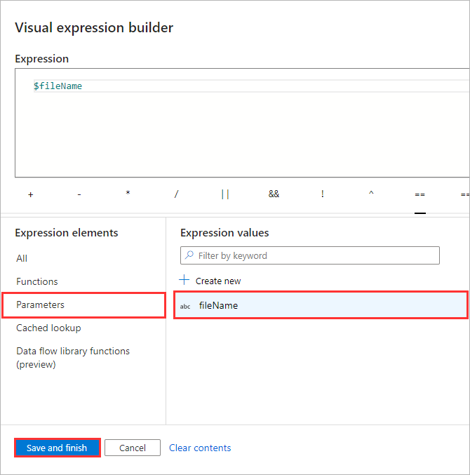

15. Enable **First row as header**

    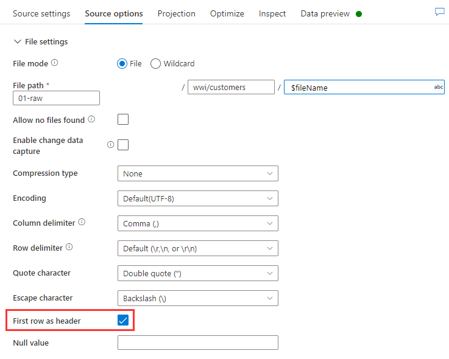

16. Switch to the **Projection** tab and click **Import schema**

    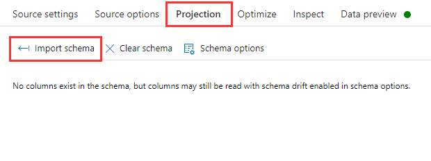

17. Click **Import**

    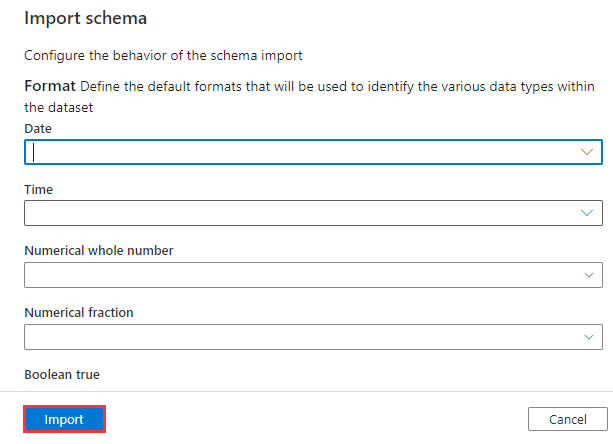

18. Under **Data flow parameters**, set the **fileName** property to an existing CSV file that resides within `01-raw > wwi > customers` and click **Save**.
    - Tip #1: In a new window, open the Azure Portal, navigate to the storage account, and use the Storage Browser to find an existing file.
    - Tip #2: To see the effect of new data during development, select the **second CSV file** (with the latest timestamp).
    - Note: The string must be wrapped in single quotes.

    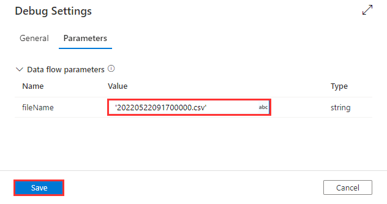

19. Switch to the **Data preview** tab and click **Refresh**

    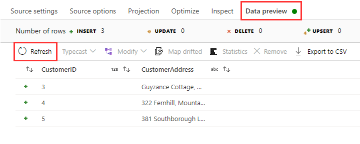

<div align="right"><a href="#module-01c---dimension-table-incremental-load-scd-type-2">↥ back to top</a></div>

## 3. Data flow (Source - dimCustomer)

In this step, we will add a second source transformation that will reference the existing Customer dimension table (Delta Lake) in the curated layer of our data lake.

1. Within the data flow canvas, click **Add Source** and select **Add source**

    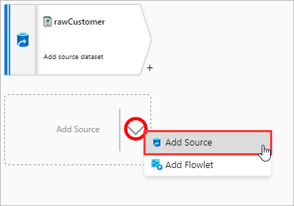

2. Rename the **Output stream name** to `dimCustomer`

    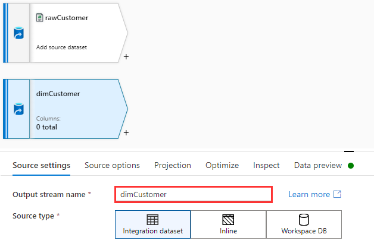

3. Set the **Source type** to **Inline**

    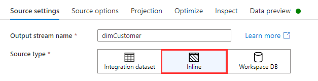

4. Set the **Inline dataset type** to **Delta**

    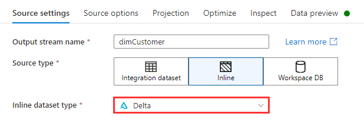

5. Set the **Linked Service** to the **Synapse Workspace Default Storage**.

    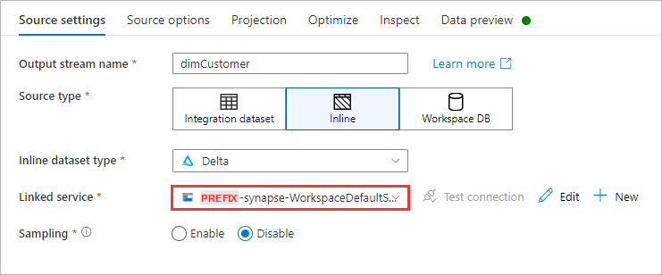

6. Switch to the **Source options** tab and click the **Browse** icon

    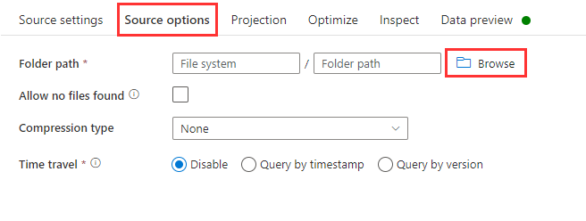

7. Navigate to `03-curated > wwi > customers` and click **OK**

    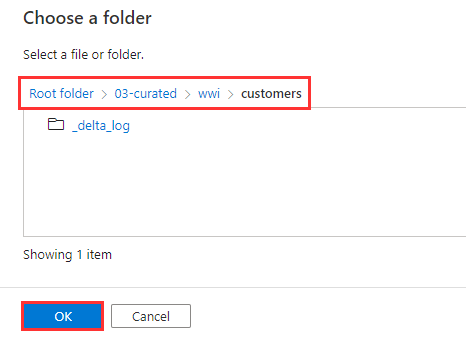

8. Set the **Compression type** to **snappy**

    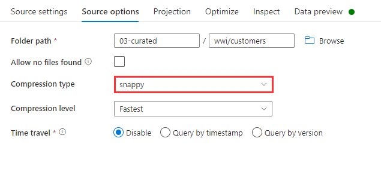

9. Switch to the **Projection** tab and click **Import schema**

    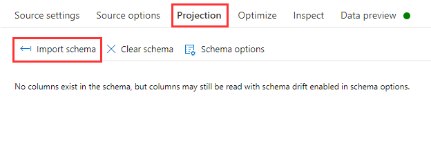

10. Click **Import**

    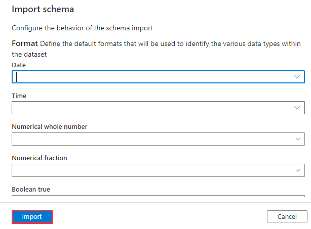

11. Switch to the **Data preview** tab and click **Refresh**

    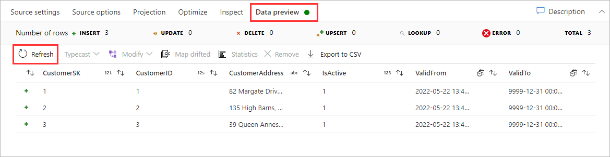

<div align="right"><a href="#module-01c---dimension-table-incremental-load-scd-type-2">↥ back to top</a></div>

## 4. Data flow (Filter - activeCustomers)

The [Filter](https://docs.microsoft.com/azure/data-factory/data-flow-filter) transformation allows row filtering based upon a condition. In this step, we will filter the Customers dimension table to only include rows that are active. This is a necessary step as we will eventually compare the new incoming data with the existing active data.

1. Click the **[+]** icon to the right of `dimCustomer`, under **Row modifier** select **Filter**

    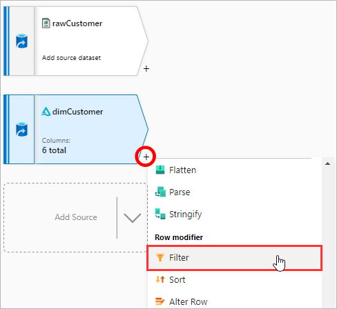

2. Rename the **Output stream name** to `activeCustomers`

    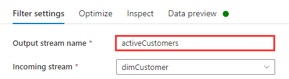

3. Set the **Filter on** property to `IsActive == 1`

    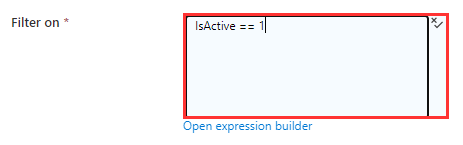

4. Switch to the **Data preview** tab and click **Refresh**

    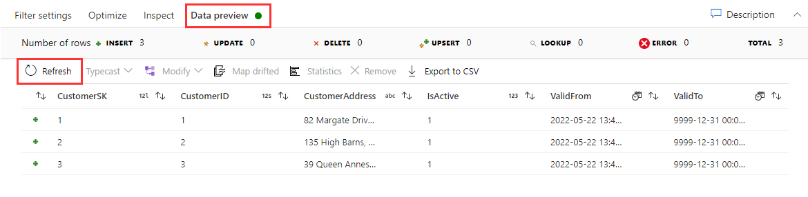

<div align="right"><a href="#module-01c---dimension-table-incremental-load-scd-type-2">↥ back to top</a></div>

## 5. Data flow (Derived column - addHashDim)

The [Derived Column](https://docs.microsoft.com/azure/data-factory/data-flow-derived-column) transformation allows us to generate new columns and/or modify existing columns. In this step, we are adding a new column called `Hash`. This column is calculated by calling the `md5` function against the same columns that exist in the source stream (i.e. excludes dimension columns such as `CustomerSK`, `IsActive`, `ValidFrom`, and `ValidTo`). The `md5` function returns a 32-character hex string which can be used to calculate a fingerprint for a row. This will be used later in the module to compare against a hash from the new data stream.

1. Click the **[+]** icon to the right of `activeCustomers`, under **Schema modifier** select **Derived Column**

    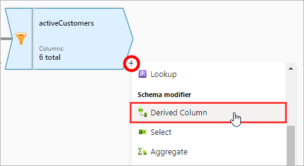

2. Rename the **Output stream name** to `addHashDim`

    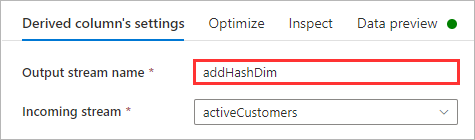

3. Copy and paste the **Column** values from the table below

    | Column | Expression |
    | --- | --- |
    | `Hash` | `md5(CustomerID,CustomerAddress)` |

    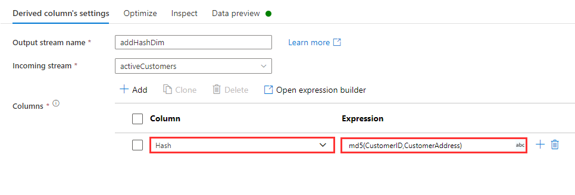

4. Switch to the **Data preview** tab and click **Refresh**

    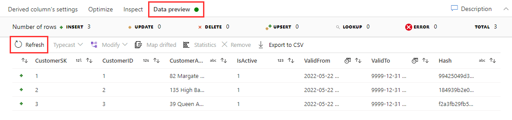

<div align="right"><a href="#module-01c---dimension-table-incremental-load-scd-type-2">↥ back to top</a></div>

## 6. Data flow (Aggregate - maxSurrogateKey)

The [Aggregate](https://docs.microsoft.com/azure/data-factory/data-flow-aggregate) transformation defines aggregations of columns in your data streams. In this step, we are going to use the Aggregate transformation to calculate the max `CustomerSK` value. This will be referenced by our data flow for INSERT operations so that the Customer surrogate key can resume incrementing from the last max value.

1. Click the **[+]** icon to the right of `activeCustomers`, under **Multiple inputs/outputs** select **New branch**

    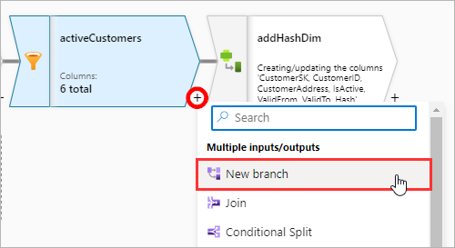

2. Click the **[+]** icon to the right of `activeCustomers` (new branch), under **Schema modifier** select **Aggregate**

    

3. Rename the **Output stream name** to `maxSurrogateKey`

    

4. Switch to **Aggregates**

    

5. Copy and paste the **Column** values from the table below

    | Column | Expression |
    | --- | --- |
    | `MaxCustomerSK` | `max(CustomerSK)` |

    

6. Switch to the **Data preview** tab and click **Refresh**

    

<div align="right"><a href="#module-01c---dimension-table-incremental-load-scd-type-2">↥ back to top</a></div>

## 7. Data flow (Exists - existingRecords)

The [Exists](https://docs.microsoft.com/azure/data-factory/data-flow-exists) transformation is a row filtering transformation that checks whether your data exists in another source or stream. The output includes all rows in the left stream that exist or don't exist in the right stream. In this step, we are going to return all rows from the left stream (rawCustomer) where the `CustomerID` **exists** in the right stream (activeCustomers).

1. Click the **[+]** icon to the right of `rawCustomer`, under **Multiple inputs/outputs** select **Exists**

    

2. Rename the **Output stream name** to `existingRecords`

    

3. Set the **Right stream** to `activeCustomers`

    

4. Set the **Exist type** to **Exists**

    

5. Under **Exists conditions**, set the **Left** and **Right** to `CustomerID`

    

6. Switch to the **Data preview** tab and click **Refresh**

    

<div align="right"><a href="#module-01c---dimension-table-incremental-load-scd-type-2">↥ back to top</a></div>

## 8. Data flow (Exists - newRecords)

In this step, we will add a second exists transformation that will return records from the left stream (`rawCustomer`) that **do not exist** in right stream (`activeCustomers`) based on the `CustomerID` (new records).

1. Click the **[+]** icon to the right of `rawCustomer`, under **Multiple inputs/outputs** select **New branch**

    

2. Click the **[+]** icon to the right of `rawCustomer` (new branch), under **Multiple inputs/outputs** select **Exists**

    

3. Rename the **Output stream name** to `newRecords`

    

4. Set the **Right stream** to `activeCustomers`

    

5. Set the **Exist type** to **Doesn't exist**

    

6. Under **Exists conditions**, set the **Left** and **Right** to `CustomerID`

    

7. Switch to the **Data preview** tab and click **Refresh**

    

<div align="right"><a href="#module-01c---dimension-table-incremental-load-scd-type-2">↥ back to top</a></div>

## 9. Data flow (Derived column - addHash)

In this step, we are adding a new column called `Hash` to the `existingRecords`. This column is calculated by calling the **md5 function** against the columns. The md5 function returns a 32-character hex string which can be used to calculate a fingerprint for a row.

1. Click the **[+]** icon to the right of `existingRecords`, under **Schema modifier** select **Derived Column**

    

2. Rename the **Output stream name** to `addHash`

    

3. Copy and paste the **Column** values from the table below

    | Column | Expression |
    | --- | --- |
    | `Hash` | `md5(columns())` |

    

4. Switch to the **Data preview** tab and click **Refresh**

    

<div align="right"><a href="#module-01c---dimension-table-incremental-load-scd-type-2">↥ back to top</a></div>

## 10. Data flow (Exists - changedRecords)

In this step, we will add a third exists transformation that will return records from the left stream (`addHash`) that **do not exist** in right stream (`addHashDim`) based on the `Hash` field (changed records). This will identify existing customers where one or more customer attributes (e.g. CustomerAddress) has changed.

1. Click the **[+]** icon to the right of `addHash`, under **Multiple inputs/outputs** select **Exists**

    

2. Rename the **Output stream name** to `changedRecords`

    

3. Set the **Right stream** to `addHashDim`

    

4. Set the **Exist type** to **Doesn't exist**

    

5. Under **Exists conditions**, set the **Left** and **Right** to `Hash`

    

6. Switch to the **Data preview** tab and click **Refresh**

    

<div align="right"><a href="#module-01c---dimension-table-incremental-load-scd-type-2">↥ back to top</a></div>

## 11. Data flow (Union - unionNewActive)

[Union](https://docs.microsoft.com/azure/data-factory/data-flow-union) will combine rows from multiple data streams into one. In this step, we will combine data from the incoming stream `changedRecords`, with stream `newRecords`. This will reflect active records (either those customers who exist in the dimension table but have had changes and/or net new customers).

1. Click the **[+]** icon to the right of `changedRecords`, under **Multiple inputs/outputs** select **Union**

    

2. Rename the **Output stream name** to `unionNewActive`

    

3. Under **Union with**, set the **Streams** to `newRecords`

    

4. Switch to the **Data preview** tab and click **Refresh**

    

<div align="right"><a href="#module-01c---dimension-table-incremental-load-scd-type-2">↥ back to top</a></div>

## 12. Data flow (Alter row - markAsInsert)

[Alter Row](https://docs.microsoft.com/azure/data-factory/data-flow-alter-row) set the INSERT, DELETE, UPDATE, and UPSERT policies on rows based on conditions. Each row will be marked with the policy corresponding to the first-matching expression. In this step, we will mark all rows from the incoming stream `unionNewActive` with the **INSERT** policy.

1. Click the **[+]** icon to the right of `unionNewActive`, under **Row modifier** select **Alter Row**

    

2. Rename the **Output stream name** to `markAsInsert`

    

3. Under **Alter row conditions**, set the condition to **Insert If** and the expression as `true()`

    

4. Switch to the **Data preview** tab and click **Refresh**

    

<div align="right"><a href="#module-01c---dimension-table-incremental-load-scd-type-2">↥ back to top</a></div>

## 13. Data flow (Surrogate key - addTempKey)

[Surrogate Key](https://docs.microsoft.com/azure/data-factory/data-flow-surrogate-key) adds an incrementing key value to each row of data. In this step, we will add a temporary surrogate key `TempKey`, that increments with a starting value of `1`. Note: The eventual key value for each row will be offset in a subsequent transformation step by the MAX surrogate key value found in the existing dimension table.

1. Click the **[+]** icon to the right of `markAsInsert`, under **Schema modifier** select **Surrogate Key**

    

2. Rename the **Output stream name** to `addTempKey`

    

3. Set the **Key column** to `TempKey`

    

4. Switch to the **Data preview** tab and click **Refresh**

    

<div align="right"><a href="#module-01c---dimension-table-incremental-load-scd-type-2">↥ back to top</a></div>

## 14. Data flow (Join - joinMaxSurrogateKey)

[Join](https://docs.microsoft.com/azure/data-factory/data-flow-join) will combine data from two streams, the output will include all columns from both sources based on a join condition. In this step, we will combine all the columns from the left stream `addTempKey`, with all the columns from the right stream `maxSurrogateKey`.

1. Click the **[+]** icon to the right of `addTempKey`, under **Multiple inputs/outputs** select **Join**

    

2. Rename the **Output stream name** to `joinMaxSurrogateKey`

    

3. Set the **Right stream** to `maxSurrogateKey`

    

4. Set the **Join type** to `Custom (cross)`

    

5. Set the **Condition** to `true()`

    

6. Switch to the **Data preview** tab and click **Refresh**

    

<div align="right"><a href="#module-01c---dimension-table-incremental-load-scd-type-2">↥ back to top</a></div>

## 15. Data flow (Derived column - scdColumns)

In this step, we are adding columns `CustomerSK`, `IsActive`, `ValidFrom`, and `ValidTo` to the incoming stream `joinMaxSurrogateKey`.

- `CustomerSK` is calculated by adding `MaxCustomerSK` to `TempKey`
- `IsActive` is set to `1`
- `ValidFrom` is set to the filename timestamp
- `ValidTo` is set to `9999-12-31 00:00:00`

1. Click the **[+]** icon to the right of `joinMaxSurrogateKey`, under **Schema modifier** select **Derived Column**

    

2. Rename the **Output stream name** to `scdColumns`

    

3. Copy and paste the **Column** values from the table below

    | Column | Expression |
    | --- | --- |
    | `CustomerSK` | `TempKey + MaxCustomerSK` |

    

4. Click **Add** then select **Add column**

    

5. Copy and paste the **Column** values from the table below

    | Column | Expression |
    | --- | --- |
    | `IsActive` | `1` |

    

6. Click **Add** then select **Add column**

    

7. Copy and paste the **Column** values from the table below

    | Column | Expression |
    | --- | --- |
    | `ValidFrom` | `toTimestamp(split($fileName,'.')[1], 'yyyyMMddHHmmssSSS')` |

    

8. Click **Add** then select **Add column**

    

9. Copy and paste the **Column** values from the table below

    | Column | Expression |
    | --- | --- |
    | `ValidTo` | `toTimestamp('9999-12-31 00:00:00')` |

    

10. Switch to the **Data preview** tab and click **Refresh**

    

<div align="right"><a href="#module-01c---dimension-table-incremental-load-scd-type-2">↥ back to top</a></div>

## 16. Data flow (Select - dropTempColumns)

[Select](https://docs.microsoft.com/azure/data-factory/data-flow-select) can be used to rename, drop, and reorder columns. In this step, we will **drop** the temporary columns that no longer need to be propagated downstream - `Hash`, `TempKey`, and `MaxCustomerSK`. In addition, we will **reorder** the columns by moving `CustomerSK` to the first position.

1. Click the **[+]** icon to the right of `scdColumns`, under **Schema modifier** select **Select**

    

2. Rename the **Output stream name** to `dropTempColumns`

    

3. Under the Input columns, delete the `Hash`, `TempKey`, and `MaxCustomerSK` columns

    

4. On the left hand side of the `CustomerSK`, click and drag the column to the first position

    

5. Switch to the **Data preview** tab and click **Refresh**

    

<div align="right"><a href="#module-01c---dimension-table-incremental-load-scd-type-2">↥ back to top</a></div>

## 17. Data flow (Exists - obsoleteRecords)

In this step, we will add a fourth exists transformation that will return records from the left stream (`addHashDim`) that **exist** in right stream (`changedRecords`) based on the `CustomerID` field. This will identify the customer records that exist in the Delta Lake table but are now obsolete due to new changes, and therefore will need to be expired (e.g. IsActive = 0) which will be set in a subsequent transformation step.

1. Click the **[+]** icon to the right of `addHashDim`, under **Multiple inputs/outputs** select **Exists**

    

2. Rename the **Output stream name** to `obsoleteRecords`

    

3. Set the **Right stream** to `changedRecords`

    

4. Set the **Exist type** to **Exists**

    

5. Under **Exists conditions**, set the **Left** and **Right** to `CustomerID`

    

6. Switch to the **Data preview** tab and click **Refresh**

    

<div align="right"><a href="#module-01c---dimension-table-incremental-load-scd-type-2">↥ back to top</a></div>

## 18. Data flow (Alter row - markAsUpdate)

In this step, we will mark all rows from the incoming stream `obsoleteRecords` with the **UPDATE** policy.

1. Click the **[+]** icon to the right of `obsoleteRecords`, under **Row modifier** select **Alter Row**

    

2. Rename the **Output stream name** to `markAsUpdate`

    

3. Under **Alter row conditions**, set the condition to **Update If** and the expression as `true()`

    

4. Switch to the **Data preview** tab and click **Refresh**

    

<div align="right"><a href="#module-01c---dimension-table-incremental-load-scd-type-2">↥ back to top</a></div>

## 19. Data flow (Derived column - scdColumnsObsolete)

In this step, we are updating columns `IsActive` and `ValidTo` from the incoming stream `markAsUpdate`.

- `IsActive` is set to `0`
- `ValidTo` is set to the filename timestamp

1. Click the **[+]** icon to the right of `markAsUpdate`, under **Schema modifier** select **Derived Column**

    

2. Rename the **Output stream name** to `scdColumnsObsolete`

    

3. Copy and paste the **Column** values from the table below

    | Column | Expression |
    | --- | --- |
    | `IsActive` | `0` |

    

4. Click **Add** then select **Add column**

    

5. Copy and paste the **Column** values from the table below

    | Column | Expression |
    | --- | --- |
    | `ValidTo` | `toTimestamp(split($fileName,'.')[1], 'yyyyMMddHHmmssSSS')` |

    

6. Switch to the **Data preview** tab and click **Refresh**

    

<div align="right"><a href="#module-01c---dimension-table-incremental-load-scd-type-2">↥ back to top</a></div>

## 20. Data flow (Select - dropTempColumns2)

In this step, we will **drop** the temporary column `Hash`.

1. Click the **[+]** icon to the right of `scdColumnsObsolete`, under **Schema modifier** select **Select**

    

2. Rename the **Output stream name** to `dropTempColumns2`

    

3. Under the Input columns, delete the `Hash` column

    

4. Switch to the **Data preview** tab and click **Refresh**

    

<div align="right"><a href="#module-01c---dimension-table-incremental-load-scd-type-2">↥ back to top</a></div>

## 21. Data flow (Union - unionResults)

In this step, we will combine data from the incoming stream `dropTempColumns`, with stream `dropTempColumns2`. This will reflect all rows that will be written to the sink using an INSERT or UPDATE operation.

1. Click the **[+]** icon to the right of `dropTempColumns`, under **Multiple inputs/outputs** select **Union**

    

2. Rename the **Output stream name** to `unionResults`

    

3. Under **Union with**, set the **Streams** to `dropTempColumns2`

    

4. Switch to the **Data preview** tab and click **Refresh**

    

<div align="right"><a href="#module-01c---dimension-table-incremental-load-scd-type-2">↥ back to top</a></div>

## 22. Data flow (Sink - sinkCustomer)

[Sink](https://docs.microsoft.com/azure/data-factory/data-flow-sink) writes the net result of our transformation into a destination data store. In this step, we will write the results from the incoming stream `unionResults` to the destination Delta Lake table.

1. Click the **[+]** icon to the right of `unionResults`, under **Destination** select **Sink**

    

2. Rename the **Output stream name** to `sinkCustomer`

    

3. Set the **Sink type** to **Inline**

    

4. Set the **Inline dataset type** to **Delta**

    

5. Set the **Linked Service** to the **Synapse Workspace Default Storage**

    

6. Switch to the **Settings** tab and click the **Browse** icon

    

7. Navigate to `03-curated > wwi > customers` and click **OK**

    

8. Set the **Compression type** to `snappy`

    

9. Set the **Update method** to **Allow insert** and **Allow upsert**

    

10. Set the **Key columns** to `CustomerSK`

    

11. Switch to the **Data preview** tab and click **Refresh**

    

<div align="right"><a href="#module-01c---dimension-table-incremental-load-scd-type-2">↥ back to top</a></div>

## 23. Pipeline (pipelineDimIncrementalLoad)

Update the Data Flow activity within the pipeline to pass the pipeline parameter `@pipeline().parameters.fileName` to the Data Flow parameter `fileName`.

1. Navigate back to the pipeline `C3 - pipelineDimIncrementalLoad`

    

2. Click to focus on the **Data flow** activity and switch to the **Parameters** tab

    

3. Under **Data flow parameters**, click inside the fileName **Value** and select **Pipeline expression**

    

4. Copy and paste the code snippet and click **OK**

    ```javascript
    @pipeline().parameters.fileName
    ```

    

5. Click **Publish all**

    

6. Click **Publish**

    

<div align="right"><a href="#module-01c---dimension-table-incremental-load-scd-type-2">↥ back to top</a></div>

## 24. Debug Pipeline

To test that our pipeline is working correctly, we will trigger a manual run using the [Debug](https://docs.microsoft.com/azure/data-factory/iterative-development-debugging?tabs=data-factory) capability.

1. Click **Debug**

    

2. Set the **fileName** parameter value to the name of the second CSV file (with the latest timestamp) and click **OK**

    

3. Once successful, navigate to the **Data** hub, browse the data lake folder structure to `03-curated > wwi`, right-click the folder `customers`, and select **New SQL Script > Select TOP 100 rows**

    <!--  -->

4. Set the **File type** to **Delta format** and click **Apply**

    <!--  -->

5. Click **Run**

    Note: You will notice there are six records in total (five active, one inactive). Try to alter the SQL query so that you only see active records sorted by CustomerID.

    <!--  -->

<div align="right"><a href="#module-01c---dimension-table-incremental-load-scd-type-2">↥ back to top</a></div>

## :tada: Summary

You have successfully setup a pipeline to incrementally load the dimension table (Customer) following the SCD Type 2 pattern using the Delta Lake format.

## :white_check_mark: Results

Azure Synapse Analytics

- [x] 1 x Pipeline (C3 - pipelineDimIncrementalLoad)
- [x] 1 x Data flow (dataFlowDimIncrementalLoad)

Azure Data Lake Storage Gen2

- [x] 7 x Parquet file (03-curated/wwi/customers)
- [x] 1 x Delta log file (03-curated/wwi/customers/_delta_log)

[Continue >](../modules/module01d.md)
