# Module 02A - Incremental Copy to Raw (using High Watermark)

[< Previous Module](../modules/module01d.md) - **[Home](../README.md)** - [Next Module >](../modules/module02b.md)

## :thinking: Prerequisites

- [x] Lab environment deployed
- [x] Module 1A (Linked Service, Integration Datasets)

## :loudspeaker: Introduction

In this module, we will setup a Synapse Pipeline to incrementally copy data from an OLTP source (Azure SQL Database), leveraging a watermark value to isolate changes. The data will be copied to the raw layer of our Azure Data Lake Storage Gen2 account.

## :dart: Objectives

- Prepare source system to store and update a watermark value
- Create a Pipeline
- Copy data changes to the data lake

## Table of Contents

1. [Source Environment (dbo.Orders)](#1-Source-Environment-dboOrders)
2. [Pipeline (Lookup - getOldWatermark)](#2-Pipeline-Lookup---getOldWatermark)
3. [Pipeline (Lookup - getNewWatermark)](#3-Pipeline-Lookup---getNewWatermark)
4. [Pipeline (Lookup - getChangeCount)](#4-Pipeline-Lookup---getChangeCount)
5. [Pipeline (If Condition)](#5-Pipeline-If-Condition)
6. [Pipeline (Copy data)](#6-Pipeline-Copy-data)
7. [Pipeline (Stored procedure)](#7-Pipeline-Stored-procedure)

## 1. Source Environment (dbo.Orders)

1. Navigate to the **SQL database**

    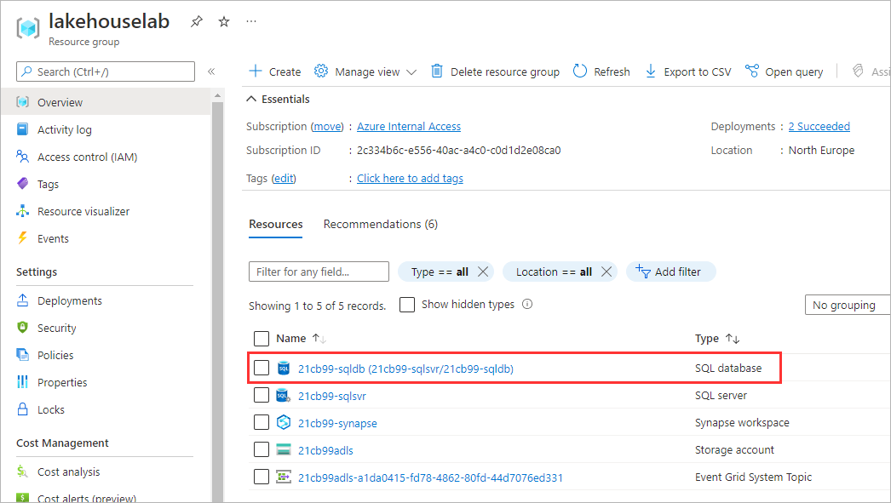

2. Click **Query editor**

    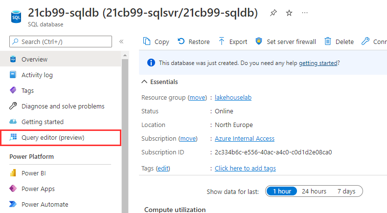

3. Click **Continue us <your_alias>@<your_domain>.com**

    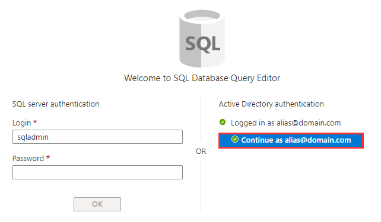

4. To create the source table, copy and paste the code snippet below and click **Run**

    ```sql
    CREATE TABLE Orders (
        OrderID int IDENTITY(1,1) PRIMARY KEY,
        CustomerID int FOREIGN KEY REFERENCES Customers(CustomerID),
        Quantity int NOT NULL,
        OrderDateTime DATETIME default CURRENT_TIMESTAMP,
        LastModifiedDateTime DATETIME default CURRENT_TIMESTAMP
    );
    INSERT INTO dbo.Orders (CustomerID, Quantity)
    VALUES
        (1,38),
        (2,27),
        (3,16),
        (1,52);
    ```

    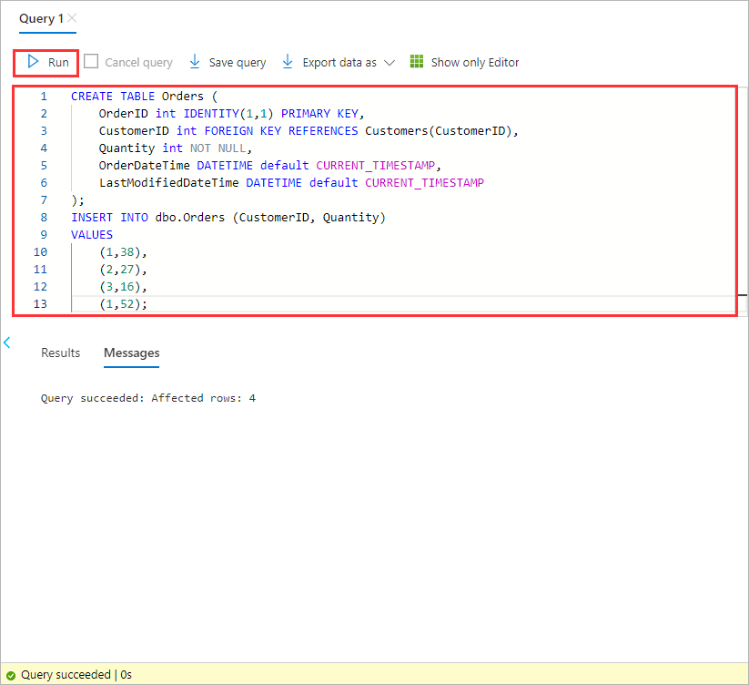

5. To create a SQL trigger that will automatically update the LastModifiedDateTime colum on UPDATE, copy and paste the code snippet below and click **Run**

    ```sql
    CREATE TRIGGER trg_orders_update_modified
    ON dbo.Orders
    AFTER UPDATE 
    AS
        UPDATE dbo.Orders
        SET LastModifiedDateTime = CURRENT_TIMESTAMP
        FROM Inserted i
        WHERE dbo.Orders.OrderID = i.OrderID;
    ```

    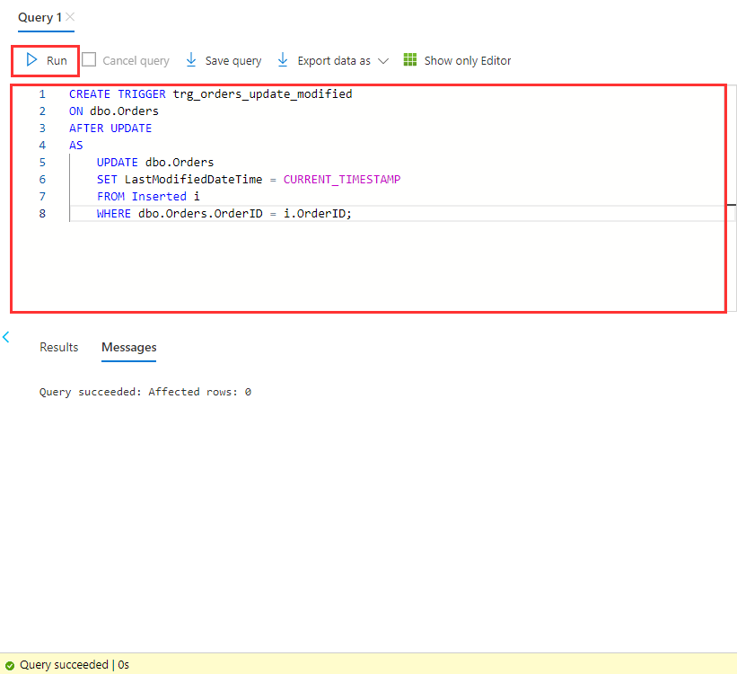

6. To initialize the watermark table, copy and paste the code snippet below and click **Run**

    ```sql
    CREATE TABLE Watermark (
        TableName varchar(255),
        Watermark DATETIME
    );
    INSERT INTO dbo.Watermark
    VALUES
    ('dbo.Orders', '1/1/2022 12:00:00 AM');
    ```

    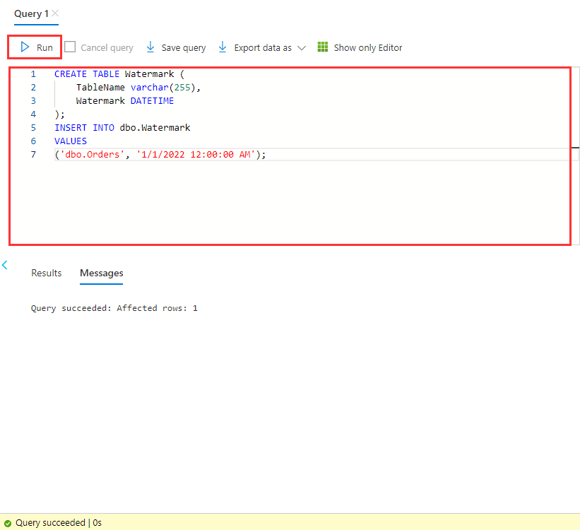

7. To enable the ability to programmatically update the watermark value via a stored procedure, copy and paste the code snippet below and click **Run**

    ```sql
    CREATE PROCEDURE sp_update_watermark @LastModifiedDateTime datetime, @TableName varchar(50)
    AS
        UPDATE Watermark
        SET [Watermark] = @LastModifiedDateTime
        WHERE [TableName] = @TableName;
    ```

    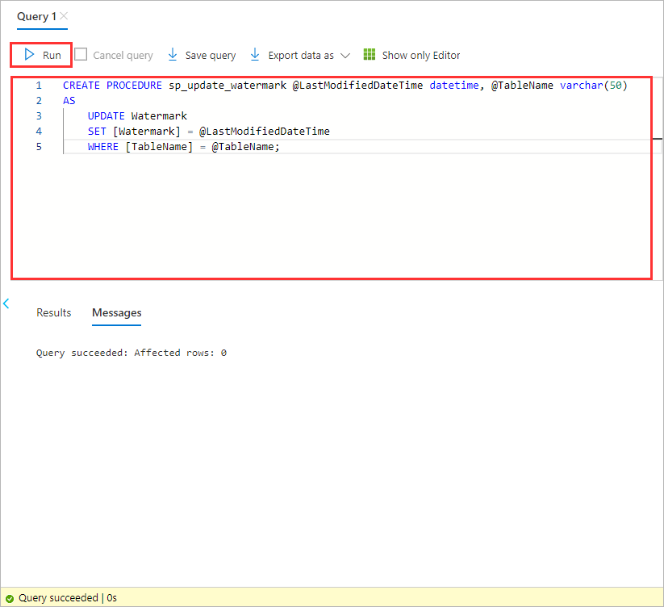

<div align="right"><a href="#module-02a---incremental-copy-to-raw-using-high-watermark">↥ back to top</a></div>

## 2. Pipeline (Lookup - getOldWatermark)

1. Navigate to the **Synapse workspace**

    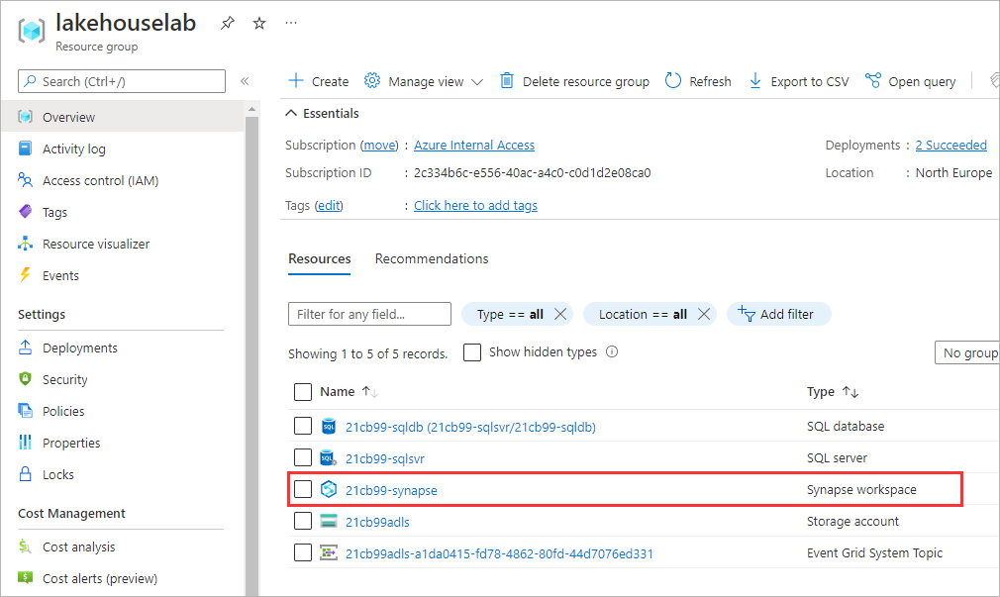

2. Open **Synapse Studio**

    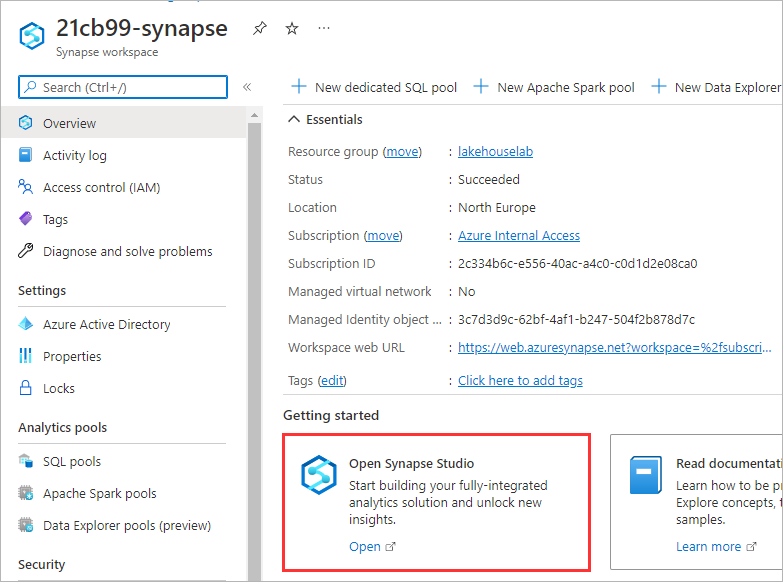

3. Navigate to the **Integrate** hub

    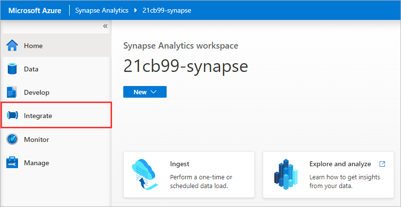

4. On the right hand side of **Pipelines**, click the **[...]** ellipsis icon and select **New folder**

    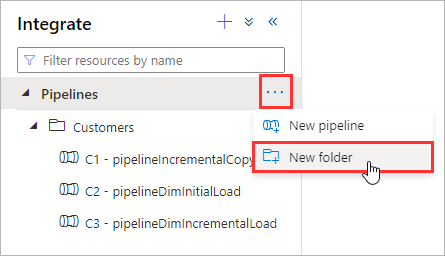

5. Name the folder `Orders` and click **Create**

    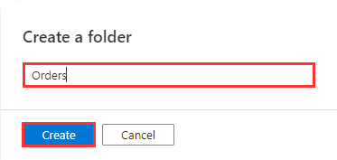

6. On the right hand side of the **Orders** folder, click the **[...]** ellipsis icon and select **New pipeline**

    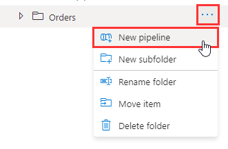

7. Rename the pipeline to `O1 - pipelineIncrementalCopyWatermark`

    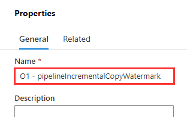

8. Within Activities, search for `Lookup`, and drag the **Lookup activity** onto the canvas

    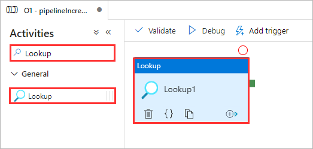

9. Rename the activity `getOldWatermark`

    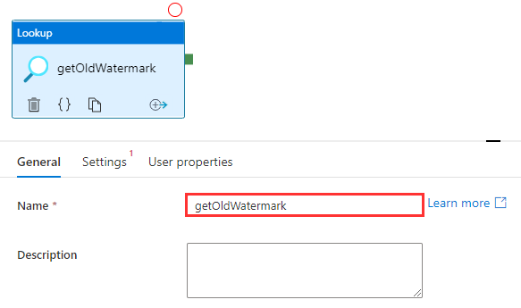

10. Switch to the **Settings** tab and set the **Source dataset** to **AzureSqlTable**

    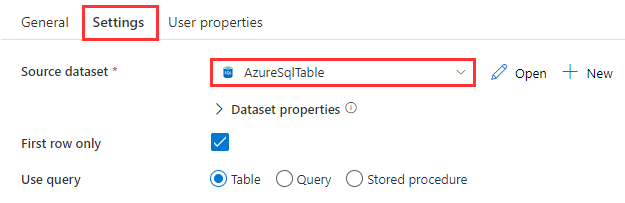

11. Set the Dataset property **schema** to `dbo`

    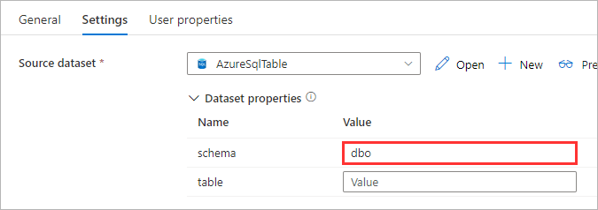

12. Set the Dataset property **table** to `Watermark`

    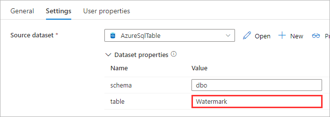

13. Set the **Use query** property to **Query**, click inside the **Query** text, and copy and paste the code snippet

    ```sql
    SELECT * FROM Watermark WHERE TableName = 'dbo.Orders'
    ```

    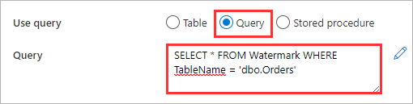

14. Click **Preview data** to confirm the query is valid

    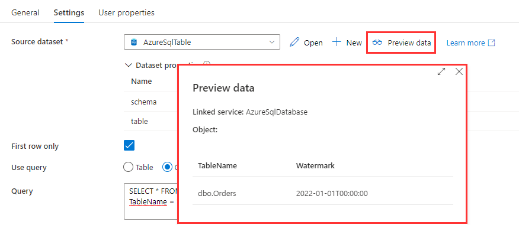

<div align="right"><a href="#module-02a---incremental-copy-to-raw-using-high-watermark">↥ back to top</a></div>

## 3. Pipeline (Lookup - getNewWatermark)

1. Within Activities, search for `Lookup`, and drag the **Lookup activity** onto the canvas

    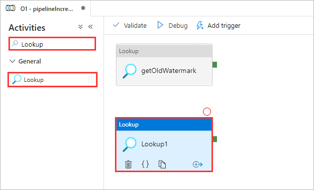

2. Rename the activity `getNewWatermark`

    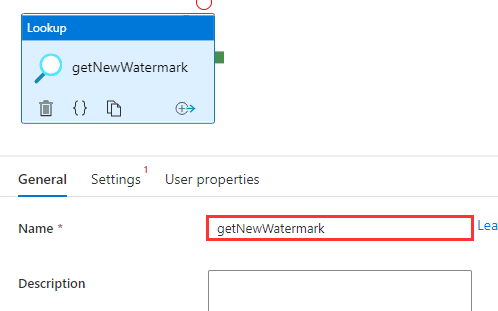

3. Switch to the **Settings** tab and set the **Source dataset** to **AzureSqlTable**

    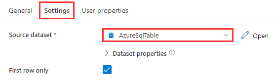

4. Set the Dataset property **schema** to `dbo`

    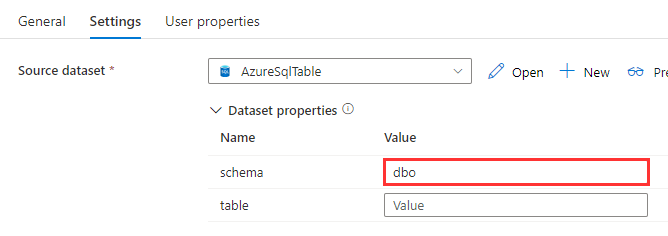

5. Set the Dataset property **table** to `Orders`

    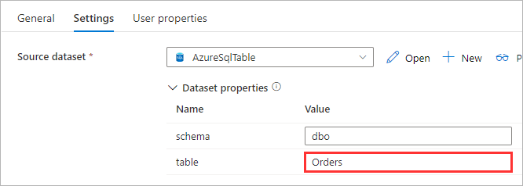

6. Set the **Use query** property to **Query**, click inside the **Query** text, and copy and paste the code snippet

    ```sql
    SELECT MAX(LastModifiedDateTime) as NewWatermarkValue FROM dbo.Orders
    ```

    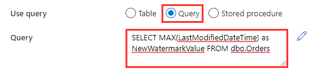

7. Click **Preview data** to confirm the query is valid

    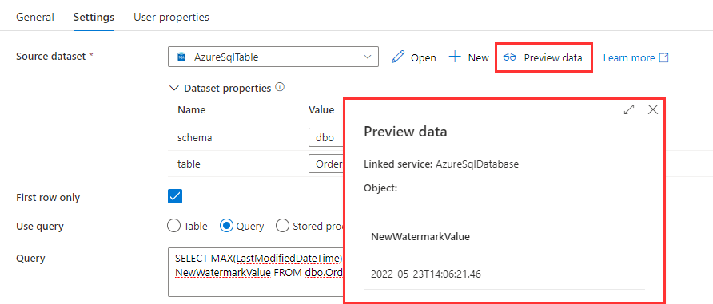

<div align="right"><a href="#module-02a---incremental-copy-to-raw-using-high-watermark">↥ back to top</a></div>

## 4. Pipeline (Lookup - getChangeCount)

1. Within Activities, search for `Lookup`, and drag the **Lookup activity** onto the canvas

    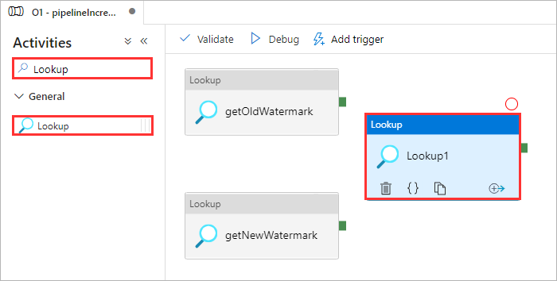

2. Rename the activity `getChangeCount`

    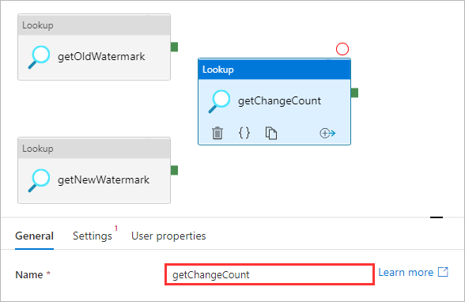

3. Click and drag on the green button from each **Lookup** activity (`getOldWatermark` and `getNewWatermark`) to establish a connection to the new **Lookup** activity (`getChangeCount`)

    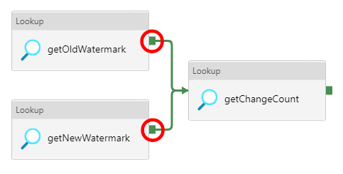

4. Switch to the **Settings** tab and set the **Source dataset** to **AzureSqlTable**

    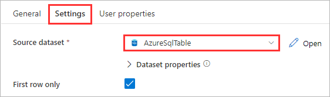

5. Set the Dataset property **schema** to `dbo`

    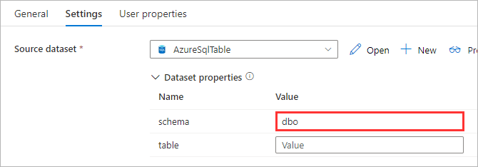

6. Set the Dataset property **table** to `Orders`

    

7. Set the **Use query** property to **Query**, click inside the **Query** text, and copy and paste the code snippet

    ```sql
    SELECT COUNT(*) as changecount FROM dbo.Orders WHERE LastModifiedDateTime > '@{activity('getOldWatermark').output.firstRow.Watermark}' and LastModifiedDateTime <= '@{activity('getNewWatermark').output.firstRow.NewWatermarkValue}'
    ```

    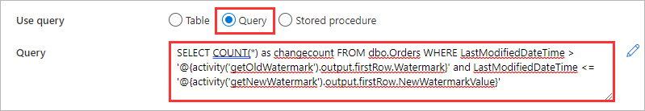

8. Click **Debug**

    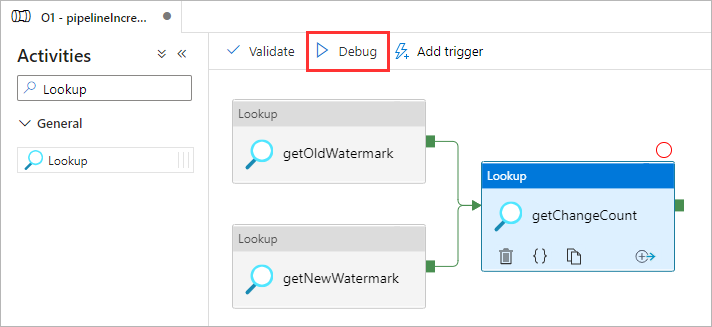

9. Once the pipeline has finished running, under **Output**, hover your mouse over the `getChangeCount` activity and click the **Output** icon. You should see a `changecount` property with a value of `4`.

    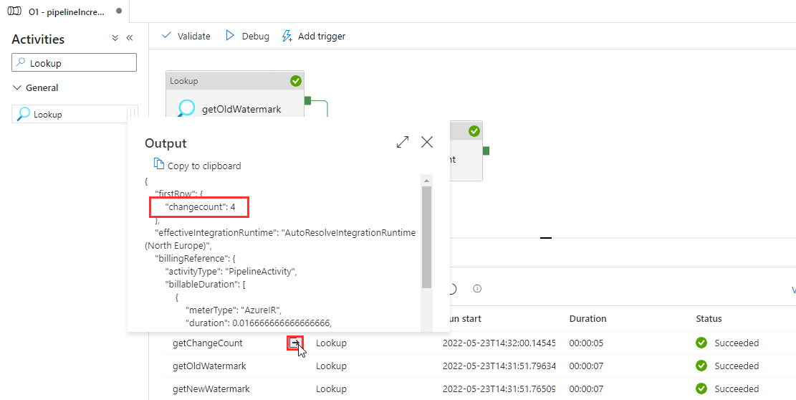

<div align="right"><a href="#module-02a---incremental-copy-to-raw-using-high-watermark">↥ back to top</a></div>

## 5. Pipeline (If Condition)

1. Within Activities, search for `If`, and drag the **If condition activity** onto the canvas

    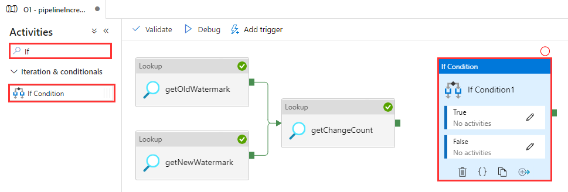

2. Rename the activity `hasChangedRows`

    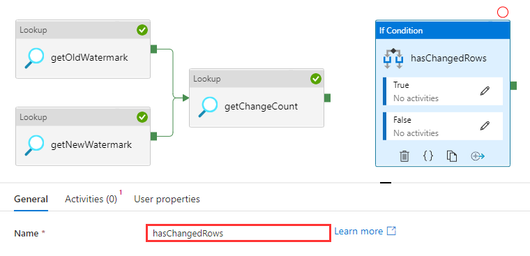

3. Click and drag on the green button on the previous **Lookup** activity (`getChangeCount`) to establish a connection to the **If Condition** activity

    

4. Switch to the **Activities** tab, click inside the **Expression** text input, and click **Add dynamic content**

    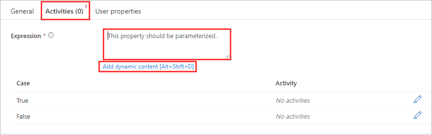

5. Copy and paste the code snippet and click **OK**

    ```javascript
    @greater(int(activity('getChangeCount').output.firstRow.changecount),0)
    ```

    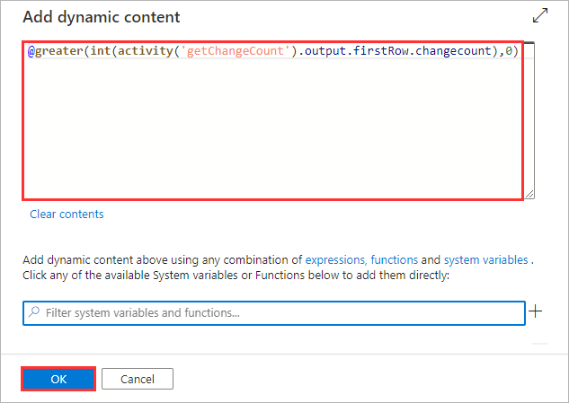

6. Within the **True** case, click the **pencil** icon

    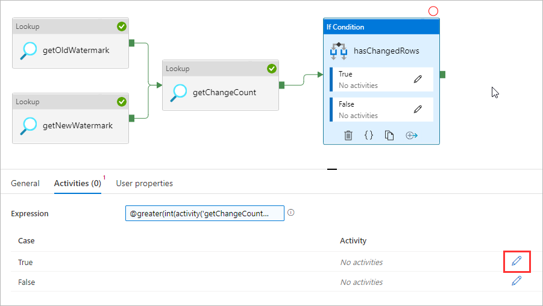

<div align="right"><a href="#module-02a---incremental-copy-to-raw-using-high-watermark">↥ back to top</a></div>

## 6. Pipeline (Copy data)

1. Within Activities, search for `Copy`, and drag the **Copy data activity** onto the canvas

    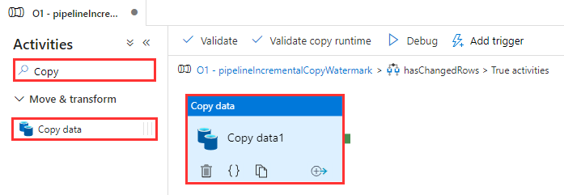

2. Rename the activity `incrementalCopy`

    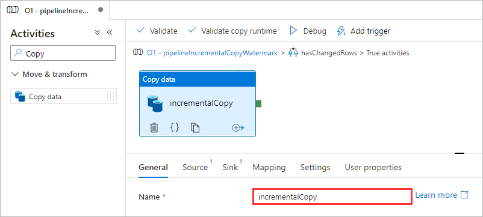

3. Switch to the **Source** tab and set the **Source dataset** to **AzureSqlTable**

    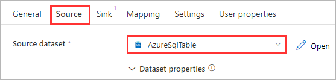

4. Under **Dataset properties**, set the **schema** to `dbo`

    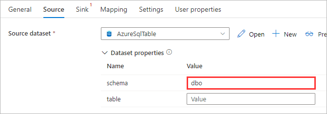

5. Under **Dataset properties**, set the **table** to `Orders`

    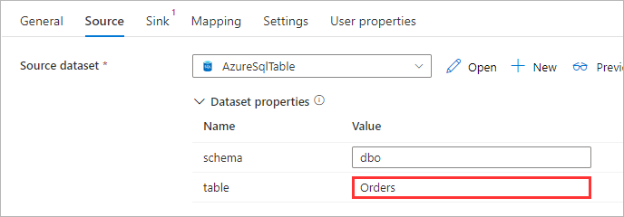

6. Set **Use query** to **Query**, click inside the **Query** text input, and click **Add dynamic content**

    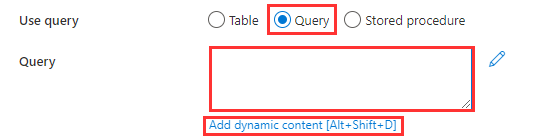

7. Copy and paste the code snippet and click **OK**

    ```sql
    SELECT * FROM dbo.Orders WHERE LastModifiedDateTime > '@{activity('getOldWatermark').output.firstRow.Watermark}' and LastModifiedDateTime <= '@{activity('getNewWatermark').output.firstRow.NewWatermarkValue}'
    ```

    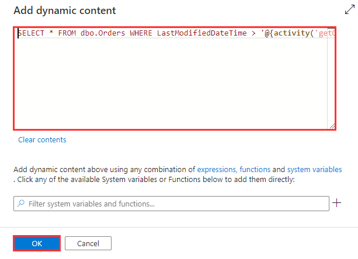

8. Switch to the **Sink** tab and set the **Source dataset** to **AdlsRawDelimitedText**

    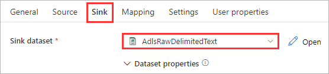

9. Under **Dataset properties**, set the **folderPath** to `wwi/orders`

    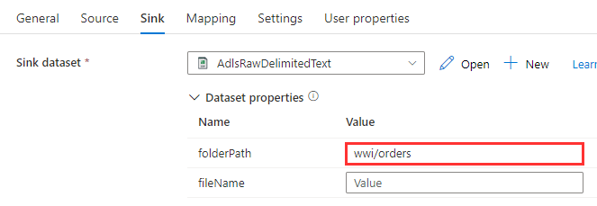

10. Under **Dataset properties**, click inside the **fileName** text input and click **Add dynamic content**

    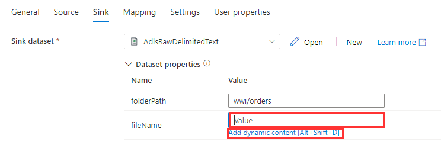

11. Copy and paste the code snippet and click **OK**

    ```javascript
    @concat(formatDateTime(pipeline().TriggerTime,'yyyyMMddHHmmssfff'),'.csv')
    ```

    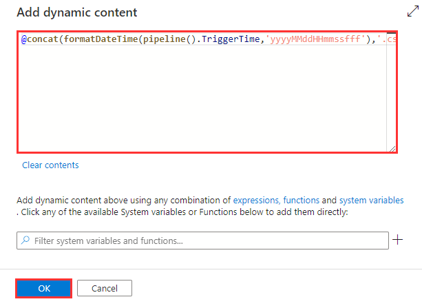

<div align="right"><a href="#module-02a---incremental-copy-to-raw-using-high-watermark">↥ back to top</a></div>

## 7. Pipeline (Stored procedure)

1. Within Activities, search for `Stored`, and drag the **Stored procedure activity** onto the canvas

    

2. Rename the activity `updateWatermark`

    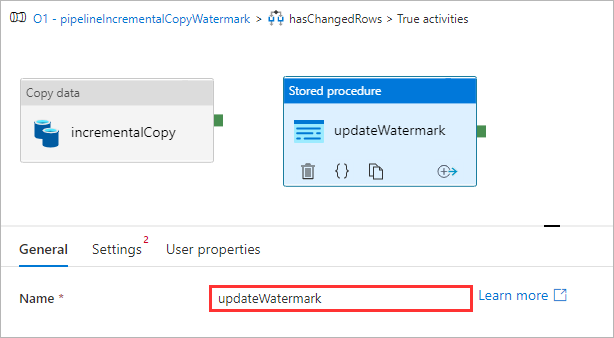

3. Click and drag on the green button from the **Copy data** activity to establish a connection to the **Stored procedure** activity

    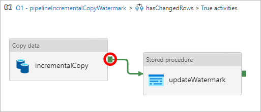

4. Switch to the **Settings** tab and set the **Linked service** to **AzureSqlDatabase**

    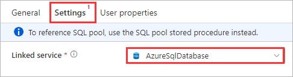

5. Set the Stored procedure name to `[dbo].[sp_update_watermark]`

    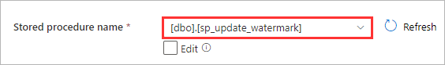

6. Under **Stored procedure parameters**, click **Import**

    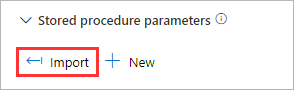

7. Click inside the **LastModifiedDateTime** value text input and click **Add dynamic content**

    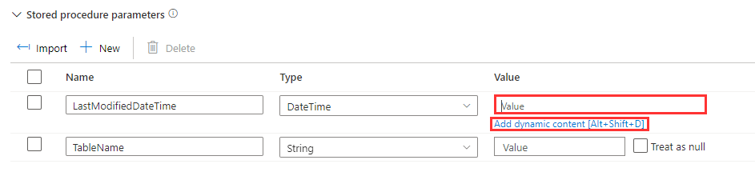

8. Copy and paste the code snippet and click **OK**

    ```javascript
    @{activity('getNewWatermark').output.firstRow.NewWatermarkValue}
    ```

    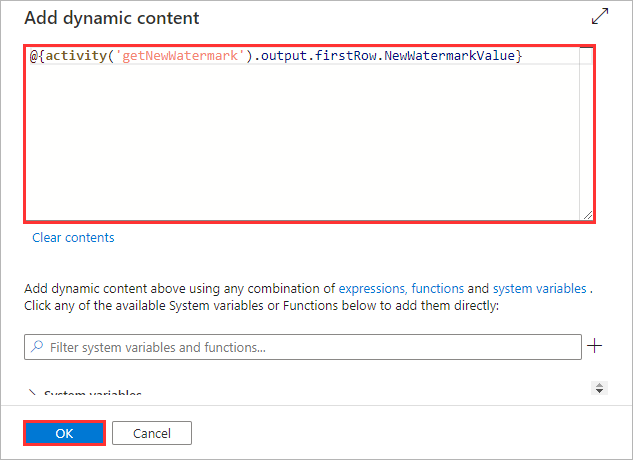

9. Click inside the **TableName** value text input and click **Add dynamic content**

    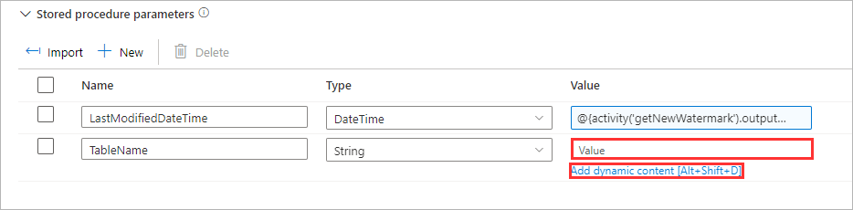

10. Copy and paste the code snippet and click **OK**

    ```javascript
    @{activity('getOldWatermark').output.firstRow.TableName}
    ```

    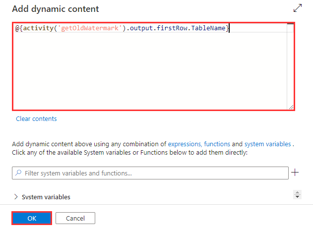

11. Click **Publish all**

    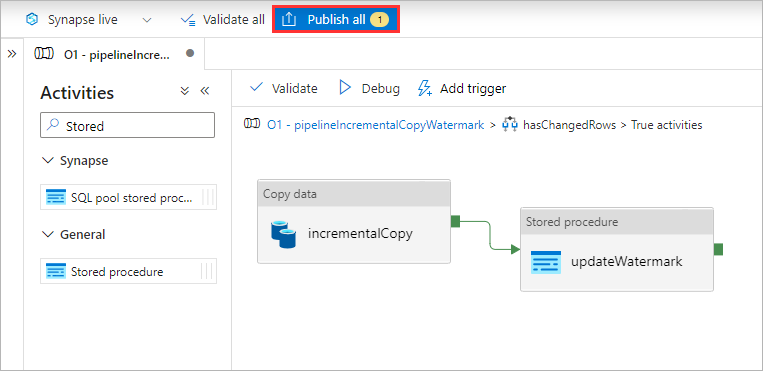

12. Click **Publish**

    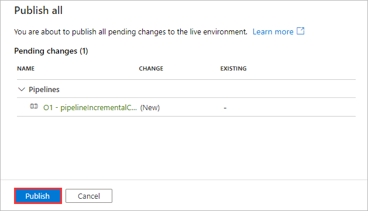

13. Navigate back to the pipeline and click **Debug**

    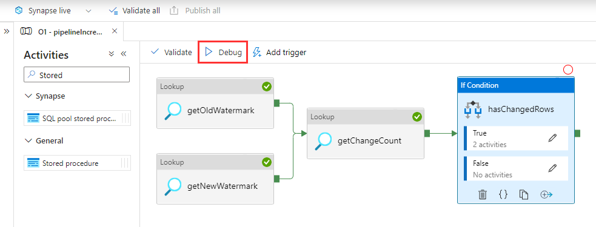

14. Periodically click **Refresh** until all the activities within the pipeline have succeeded

    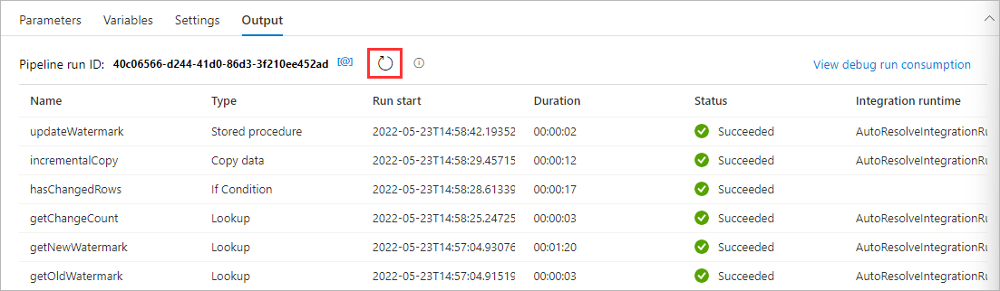

15. Navigate to the **Data** hub, browse the data lake folder structure under the **Linked tab** to `01-raw/wwi/orders`, right-click the newest CSV file and select **New SQL Script > Select TOP 100 rows**

    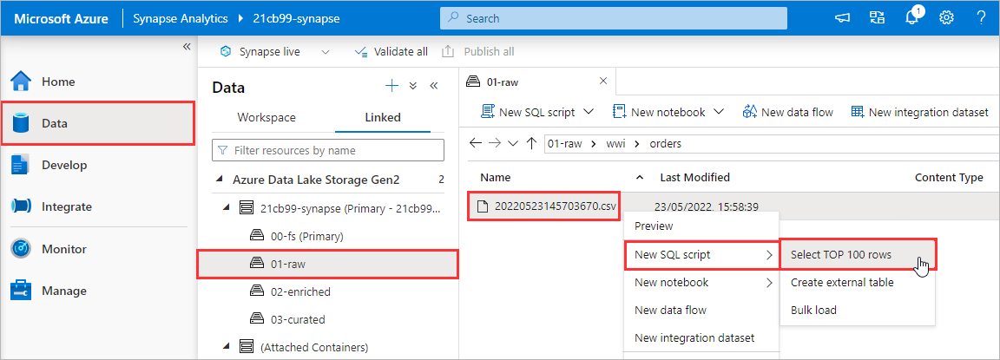

16. Modify the SQL statement to include `HEADER_ROW = TRUE` within the OPENROWSET function and click **Run**

    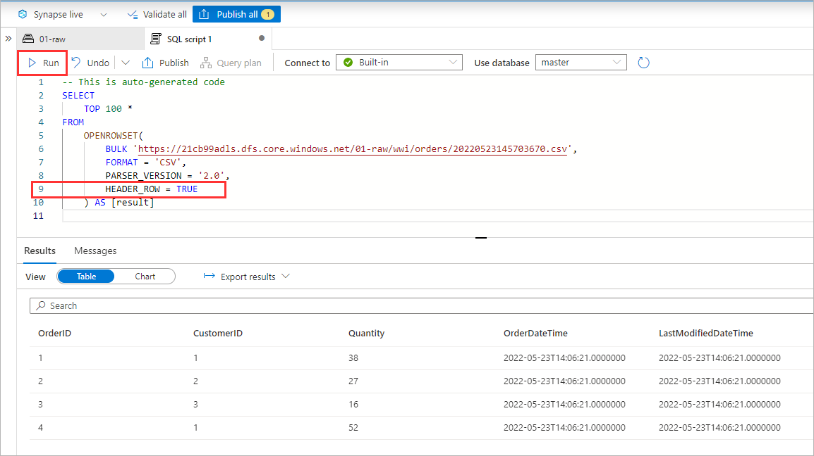

<div align="right"><a href="#module-02a---incremental-copy-to-raw-using-high-watermark">↥ back to top</a></div>

## :tada: Summary

You have successfully setup a pipeline that can check for changes in the source system by referencing the last high waterman, and copy those changes to the raw layer within your data lake.

[Continue >](../modules/module02b.md)
