# Module 02B - Incremental Load Fact

[< Previous Module](../modules/module02a.md) - **[Home](../README.md)** - [Next Module >](../modules/module02c.md)

## :stopwatch: Estimated Duration

20 minutes

## :thinking: Prerequisites

- [x] Lab environment deployed
- [x] Module 1A (Linked Service, Integration Datasets)
- [x] Module 2A complete

## :loudspeaker: Introduction

In this module, we will setup a Synapse Pipeline to incrementally load data from our raw layer (CSV), into our curated layer (Delta Lake) where our fact table resides.

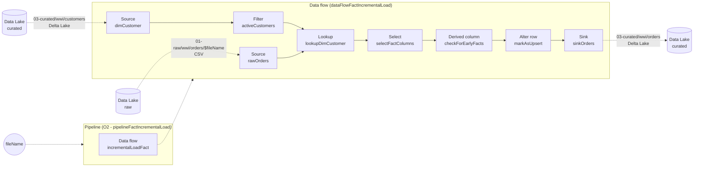

## :dart: Objectives

- Create a pipeline that will incrementally load data as new files arrive.

## Table of Contents

1. [Pipeline (pipelineFactIncrementalLoad)](#1-Pipeline-pipelineFactIncrementalLoad)
2. [Data flow (Source - rawOrders)](#2-Data-flow-Source---rawOrders)
3. [Data flow (Source - dimCustomer)](#3-Data-flow-Source---dimCustomer)
4. [Data flow (Filter - activeCustomers)](#4-Data-flow-Filter---activeCustomers)
5. [Data flow (Lookup - lookupDimCustomer)](#5-Data-flow-Lookup---lookupDimCustomer)
6. [Data flow (Select - selectFactColumns)](#6-Data-flow-Select---selectFactColumns)
7. [Data flow (Derived column - checkForEarlyFacts)](#7-Data-flow-Derived-column---checkForEarlyFacts)
8. [Data flow (Alter row - markAsUpsert)](#8-Data-flow-Alter-row---markAsUpsert)
9. [Data flow (Sink - sinkOrders)](#9-Data-flow-Sink---sinkOrders)
10. [Pipeline (pipelineFactIncrementalLoad)](#10-Pipeline-pipelineFactIncrementalLoad)
11. [Debug Pipeline](#11-Debug-Pipeline)

## 1. Pipeline (pipelineFactIncrementalLoad)

In this step, we are going to create a new pipeline `O2 - pipelineFactIncrementalLoad` that will include a **Data flow** activity to incrementally load data from `raw` into our fact table within the `curated` layer.

1. Navigate to the **Integrate** hub

    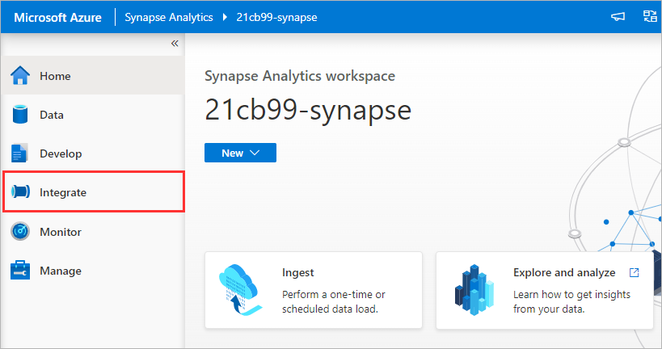

2. Under **Pipelines**, click on the ellipsis **[...]** icon to the right of the `Orders` folder and select **New pipeline**

    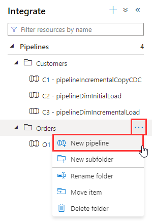

3. Rename the pipeline to `O2 - pipelineFactIncrementalLoad`

    

4. Under **Parameters**, click **New**

    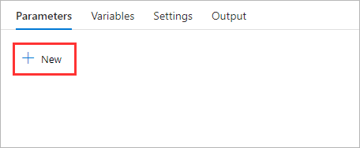

5. Set the name of the parameter to `fileName`

    

6. Within Activities, search for `Data flow`, and drag the **Data flow activity** onto the canvas

    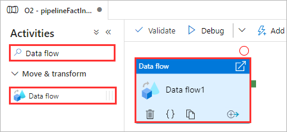

7. Rename the activity `incrementalLoadFact`

    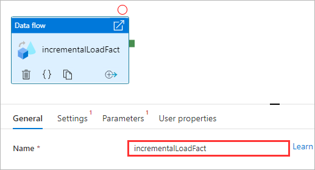

8. Switch to the **Settings** tab

    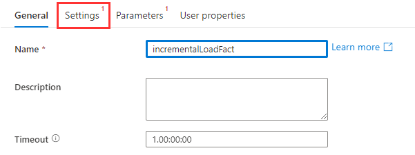

9. Next to the **Data flow** property, click **New**

    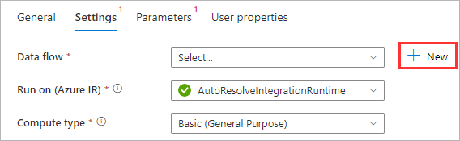

<div align="right"><a href="#module-02b---incremental-load-fact">↥ back to top</a></div>

## 2. Data flow (Source - rawOrders)

In this step, we start with a **source** transformation that will reference a delimited text file (CSV) in the raw layer of our data lake. The data flow will include a file name parameter, this will allow the pipeline to dynamically pass a file name at runtime.

1. Enable **Data flow debug**

    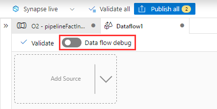

2. Rename the data flow `dataFlowFactIncrementalLoad`

    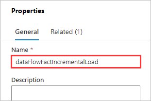

3. Under **Parameters**, click **New**

    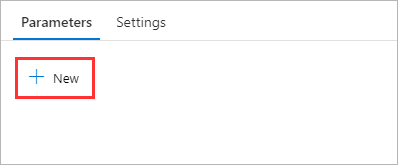

4. Rename **parameter1** to `fileName`

    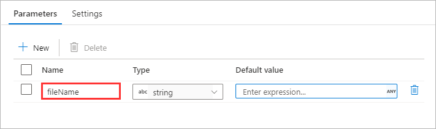

5. Within the data flow canvas, click **Add Source** and select **Add source**

    

6. Rename the **Output stream name** to `rawOrders`

    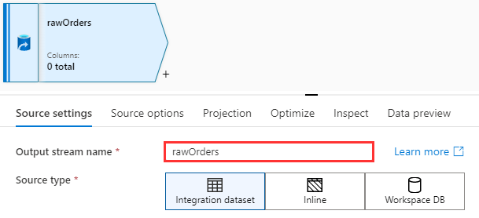

7. Set the **Source type** to **Inline**

    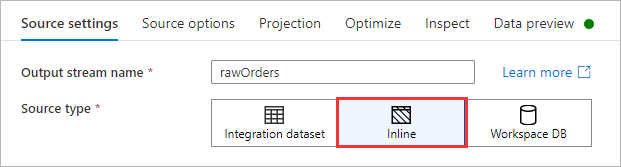

8. Set the **Inline dataset type** to **DelimitedText**

    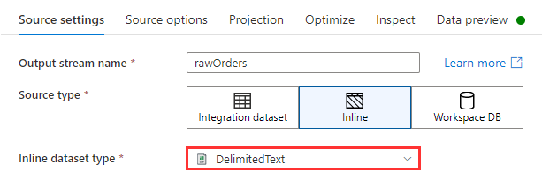

9. Set the **Linked Service** to the **Synapse Workspace Default Storage**

    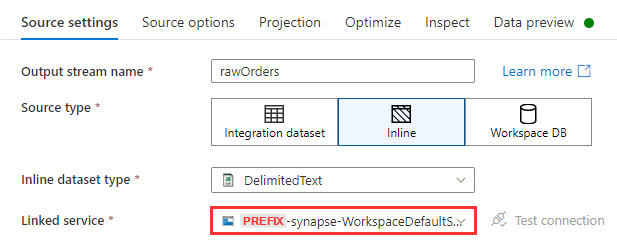

10. Switch to the **Source options** tab and click the **Browse** icon

    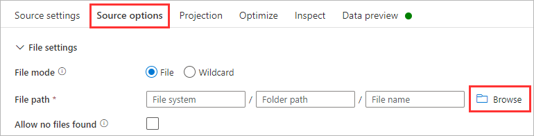

11. Navigate to `01-raw > wwi > orders` and click **OK**

    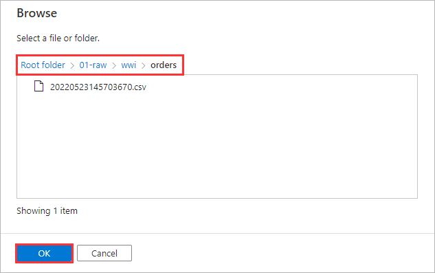

12. Click inside the **File name** text input and click **Add dynamic content**

    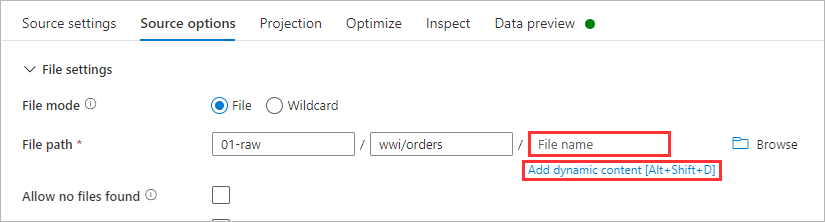

13. Under **Expression elements** click **Parameters**, select **fileName**, and click **Save and finish**

    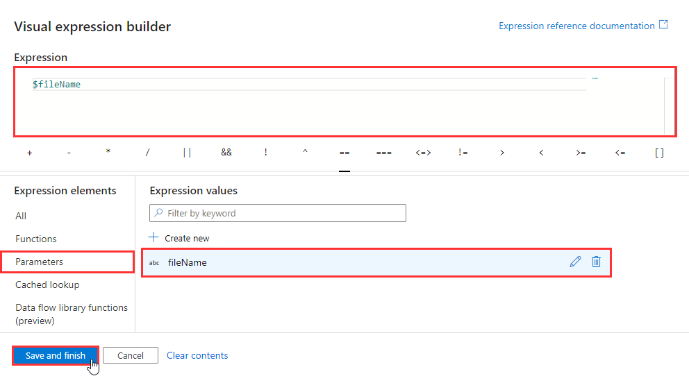

14. Enable **First row as header**

    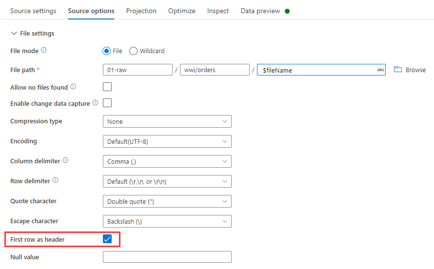

15. Switch to the **Projection** tab and click **Import schema**

    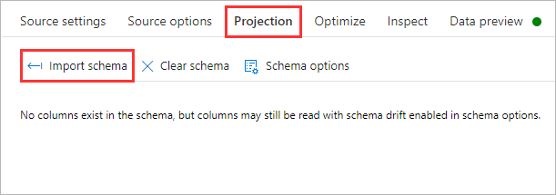

16. Click **Import**

    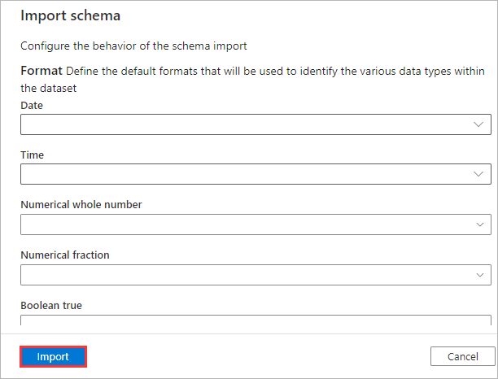

17. Under **Data flow parameters**, set the **fileName** property to an existing CSV file that resides within `01-raw > wwi > orders`, and click **Save**
    - Tip: In a new window, open the Azure Portal, navigate to the storage account, and use the Storage Browser to find an existing file.
    - Note: The string must be wrapped in single quotes.

    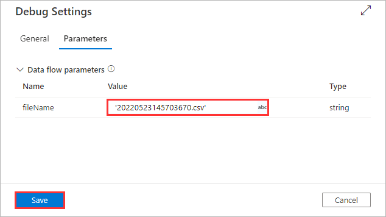

18. Switch to the **Data preview** tab and click **Refresh**

    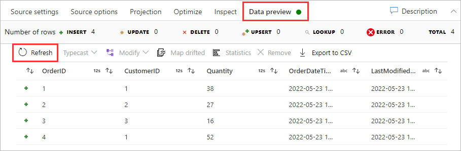

<div align="right"><a href="#module-02b---incremental-load-fact">↥ back to top</a></div>

## 3. Data flow (Source - dimCustomer)

In this step, we will add a second **source** transformation that will reference the existing Customer dimension table (Delta Lake) in the curated layer of our data lake.

1. Within the data flow canvas, click **Add Source** and select **Add source**

    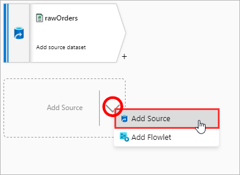

2. Rename the **Output stream name** to `dimCustomer`

    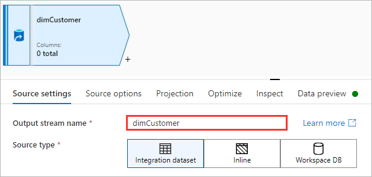

3. Set the **Source type** to **Inline**

    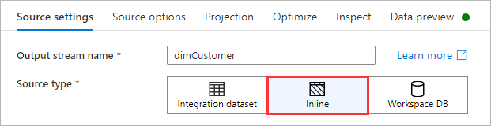

4. Set the **Inline dataset type** to **Delta**

    

5. Set the **Linked Service** to the **Synapse Workspace Default Storage**

    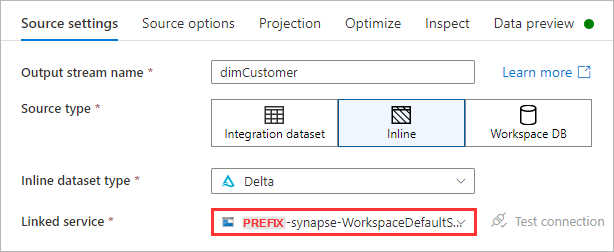

6. Switch to the **Source options** tab and click the **Browse** icon

    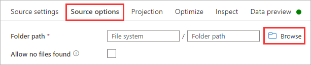

7. Navigate to `03-curated > wwi > customers` and click **OK**

    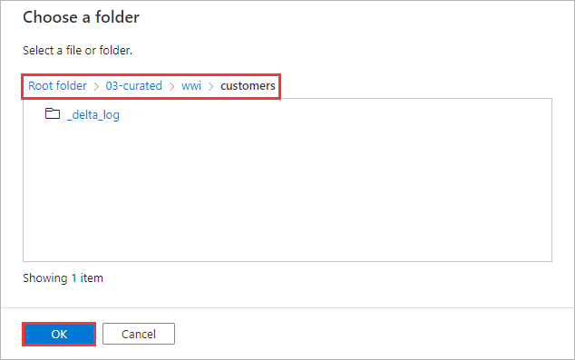

8. Set the **Compression type** to **snappy**

    

9. Switch to the **Projection** tab and click **Import schema**

    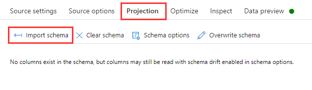

10. Click **Import**

    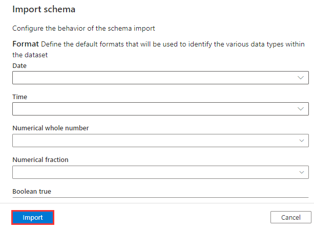

11. Switch to the **Data preview** tab and click **Refresh**

    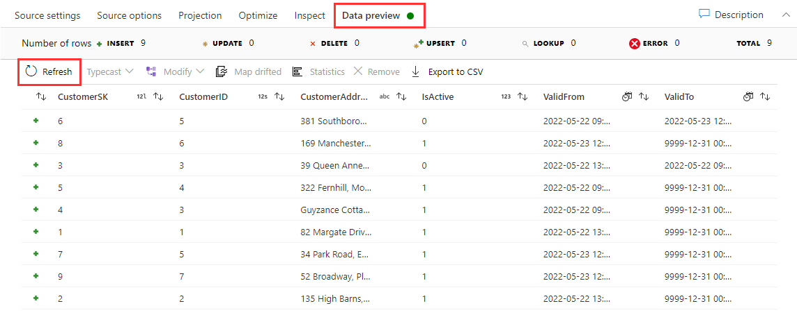

<div align="right"><a href="#module-02b---incremental-load-fact">↥ back to top</a></div>

## 4. Data flow (Filter - activeCustomers)

In this step, we will **filter** the Customers dimension table to only include rows that are active. This is a necessary step as we will eventually **lookup** which customers are being referenced in the incoming orders data by their `CustomerID`.

1. Click the **[+]** icon to the right of `dimCustomer`, under **Row modifier** select **Filter**

    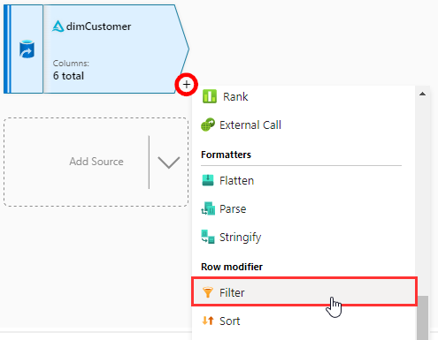

2. Rename the **Output stream name** to `activeCustomers`

    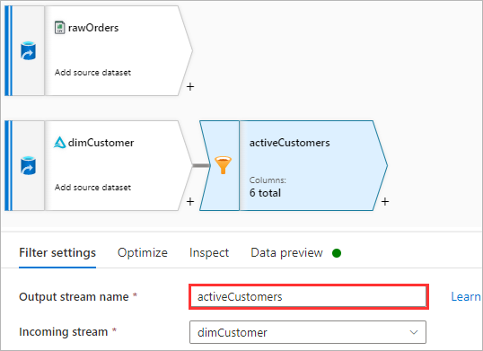

3. Set the **Filter on** property to `IsActive == 1`

    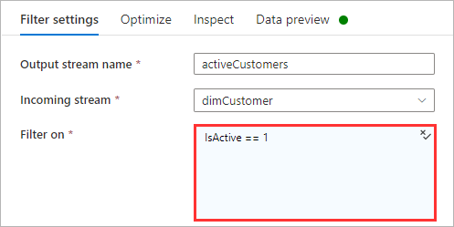

4. Switch to the **Data preview** tab and click **Refresh**

    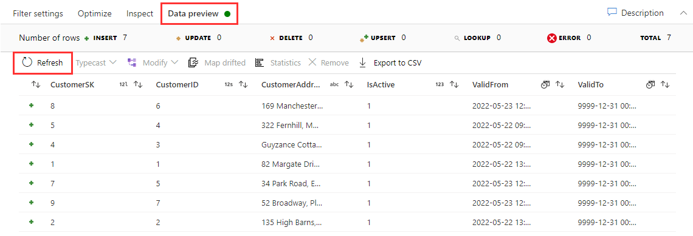

<div align="right"><a href="#module-02b---incremental-load-fact">↥ back to top</a></div>

## 5. Data flow (Lookup - lookupDimCustomer)

The lookup transformation references data from a secondary stream, where there is a match, the step will append columns with the columns from the primary stream. In this step, we will lookup customer records from `activeCustomers` and append matched records with the orders data `rawOrders`.

1. Click the **[+]** icon to the right of `rawOrders`, under **Multiple inputs/outputs** select **Lookup**

    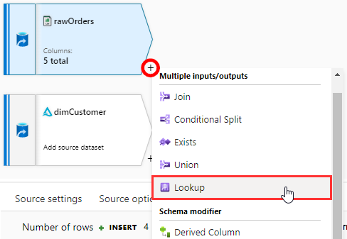

2. Rename the **Output stream name** to `lookupDimCustomer`

    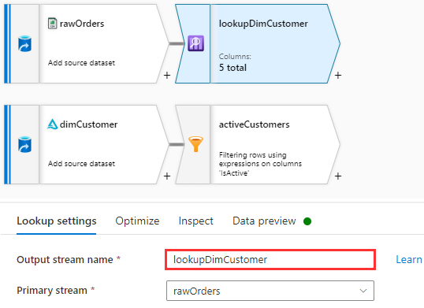

3. Set the **Lookup stream** to `activeCustomers`

    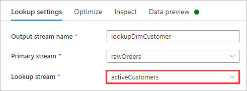

4. Set the **Lookup conditions** to `CustomerID` on both the Left and Right

    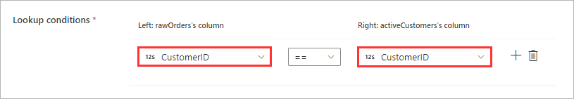

5. Switch to the **Data preview** tab and click **Refresh**

    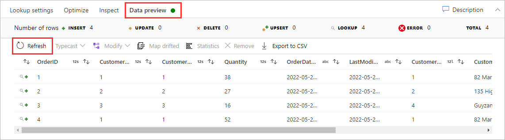

<div align="right"><a href="#module-02b---incremental-load-fact">↥ back to top</a></div>

## 6. Data flow (Select - selectFactColumns)

In this step, we will use a **select** transformation to drop all columns except `OrderId`, `CustomerSK`, and `Quantity`, reorder `CustomerSK` to the second position, and rename `CustomerSK` to `CustomerKey`.

1. Click the **[+]** icon to the right of `lookupDimCustomer`, under **Schema modifier** select **Select**

    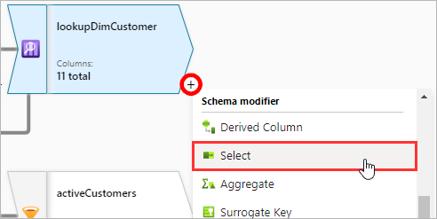

2. Rename the **Output stream name** to `selectFactColumns`

    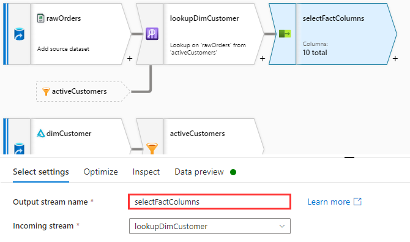

3. Under the Input columns, delete all columns except `OrderID`, `CustomerSK`, and `Quantity`

    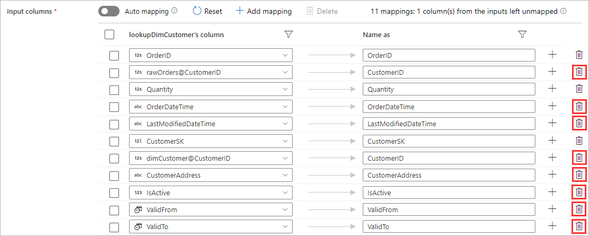

4. On the left hand side of the `CustomerSK`, click and drag the column to the second position

    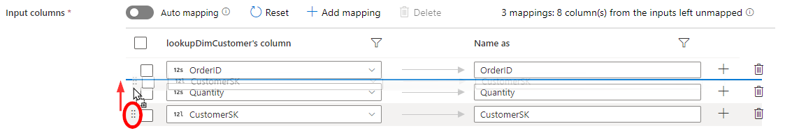

5. Rename `CustomerSK` to `CustomerKey`

    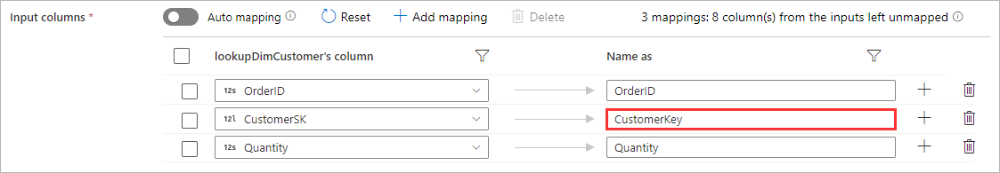

6. Switch to the **Data preview** tab and click **Refresh**

    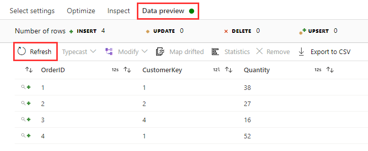

<div align="right"><a href="#module-02b---incremental-load-fact">↥ back to top</a></div>

## 7. Data flow (Derived column - checkForEarlyFacts)

In this step, we are going to update an existing column `CustomerKey` and set it to 0 if the existing value is null.

1. Click the **[+]** icon to the right of `selectFactColumns`, under **Schema modifier** select **Derived Column**

    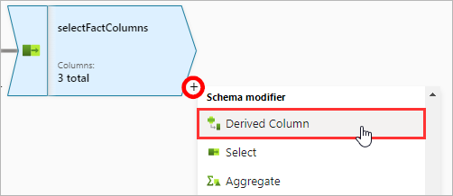

2. Rename the **Output stream name** to `checkForEarlyFacts`

    

3. Under **Columns**, click the **Column** drop-down menu and select `CustomerKey`

    

4. Copy and paste the code snippet into the **Expression**

    ```javascript
    iif(isNull(CustomerKey),toLong(0),CustomerKey)
    ```

    

5. Switch to the **Data preview** tab and click **Refresh**

    

<div align="right"><a href="#module-02b---incremental-load-fact">↥ back to top</a></div>

## 8. Data flow (Alter row - markAsUpsert)

In this step, we are going to mark all rows from the incoming stream with the **UPSERT** policy.

1. Click the **[+]** icon to the right of `checkForEarlyFacts`, under **Row modifier** select **Alter Row**

    

2. Rename the **Output stream name** to `markAsUpsert`

    

3. Under **Alter row conditions**, set the condition to **Upsert If** and the expression as `true()`

    

4. Switch to the **Data preview** tab and click **Refresh**

    

<div align="right"><a href="#module-02b---incremental-load-fact">↥ back to top</a></div>

## 9. Data flow (Sink - sinkOrders)

In this step, we will write the the results from the incoming stream to the destination Delta Lake table.

1. Click the **[+]** icon to the right of `markAsUpsert`, under **Destination** select **Sink**

    

2. Rename the **Output stream name** to `sinkOrders`

    

3. Set the **Sink type** to **Inline**

    

4. Set the **Inline dataset type** to **Delta**

    

5. Set the **Linked Service** to the **Synapse Workspace Default Storage**

    

6. Switch to the **Settings** tab and click the **Browse** icon

    

7. Navigate to `03-curated > wwi` and click **OK**

    

8. Within the **Folder path** property, replace `wwi` with `wwi/orders`

    

9. Set the **Compression type** to `snappy`

    

10. Set the **Update method** to **Allow insert** and **Allow upsert**

    

11. Set the **Key columns** to `OrderID`

    

12. Switch to the **Data preview** tab and click **Refresh**

    

<div align="right"><a href="#module-02b---incremental-load-fact">↥ back to top</a></div>

## 10. Pipeline (pipelineFactIncrementalLoad)

Update the Data Flow activity within the pipeline to pass the pipeline parameter `@pipeline().parameters.fileName` to the Data Flow parameter `fileName`.

1. Navigate back to the pipeline `O2 - pipelineFactIncrementalLoad`

    

2. Click to focus on the **Data flow** activity and switch to the **Parameters** tab

    

3. Under **Data flow parameters**, click inside the fileName **Value** and select **Pipeline expression**

    

4. Copy and paste the code snippet and click **OK**

    ```javascript
    @pipeline().parameters.fileName
    ```

    

5. Click **Publish all**

    

6. Click **Publish**

    

<div align="right"><a href="#module-02b---incremental-load-fact">↥ back to top</a></div>

## 11. Debug Pipeline

To test that our pipeline is working correctly, we will trigger a manual run using the **Debug** capability.

1. Click **Debug**

    

2. Set the **fileName** parameter value to the name of an existing CSV file and click **OK**

    

3. Periodically click **Refresh** until the pipeline has succeeded

    

4. Navigate to the **Data** hub, browse the data lake folder structure to `03-curated > wwi`, right-click the folder `orders`, and select **New SQL Script > Select TOP 100 rows**

    

5. Set the **File type** to **Delta format** and click **Apply**

    

6. Click **Run**

    

<div align="right"><a href="#module-02b---incremental-load-fact">↥ back to top</a></div>

## :tada: Summary

You have successfully setup a pipeline to incrementally load the fact table (Orders) using the Delta Lake format.

## :white_check_mark: Results

Azure Synapse Analytics

- [x] 1 x Pipeline (O2 - pipelineFactIncrementalLoad)
- [x] 1 x Data flow (dataFlowFactIncrementalLoad)

Azure Data Lake Storage Gen2

- [x] 1 x Delta log file (03-curated/wwi/orders/_delta_log)
- [x] 2 x Parquet files (03-curated/wwi/orders)

[Continue >](../modules/module02c.md)
