# Module 02C - Automation using Triggers

[< Previous Module](../modules/module02b.md) - **[Home](../README.md)** - [Next Module >](../modules/module03.md)

## :stopwatch: Estimated Duration

15 minutes

## :thinking: Prerequisites

- [x] Lab environment deployed
- [x] Module 1A (Linked Service, Integration Datasets)
- [x] Module 2A complete
- [x] Module 2B complete

## :loudspeaker: Introduction

In this module, we will automate ingestion and loading of Order data using triggers.

## :dart: Objectives

- Periodically copy changes from source using a Tumbling Window trigger.
- On the arrival of new files in the data lake, incrementally load the fact table using a Storage Event trigger.

## Table of Contents

1. [Trigger (Tumbling Window)](#1-Trigger-Tumbling-Window)
2. [Trigger (Storage Event)](#2-Trigger-Storage-Event)
3. [Load Additional Data into dbo.Orders](#3-Load-Additional-Data-into-dboOrders)
4. [Monitor](#4-Monitor)
5. [Query Delta Lake](#5-Query-Delta-Lake)

## 1. Trigger (Tumbling Window)

Create a new **tumbling window trigger** that will be associated with the pipeline `O1 - pipelineIncrementalCopyWatermark`. The trigger will be set to run every 5 minutes. Note: Since the pipeline contains an If Condition activity which checks for new or changed records, data will only be be copied if there are new or changed records in the source system since the last load.

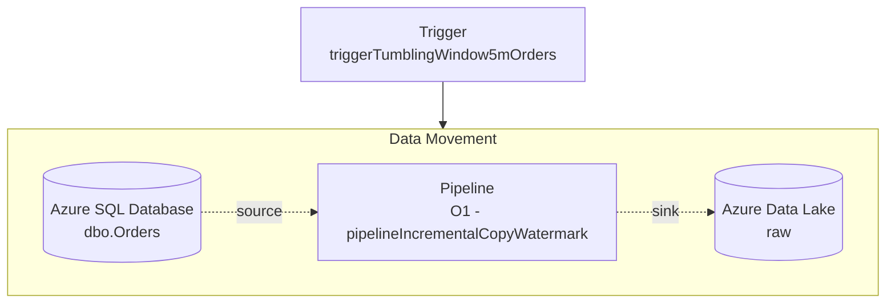
```mermaid

flowchart TB

t1[Trigger\ntriggerTumblingWindow5mOrders]
p1[Pipeline\nO1 - pipelineIncrementalCopyWatermark]
ds1[(Azure SQL Database\ndbo.Orders)]
ds2[(Azure Data Lake\nraw)]

t1-->sg

subgraph sg[Data Movement]
ds1-.source.->p1-.sink.->ds2
end

```

1. Navigate to the **Integrate** hub

    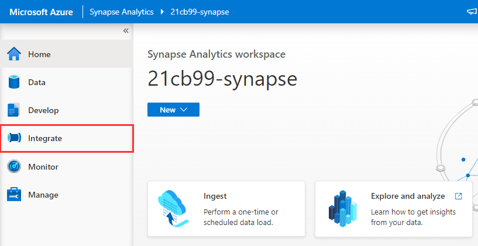

2. Open the pipeline `O1 - pipelineIncrementalCopyWatermark`

    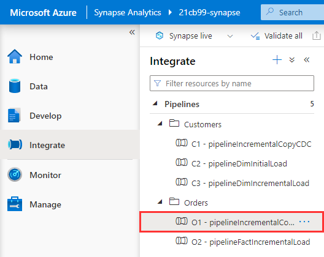

3. Click **Add trigger** and select **New/Edit**

    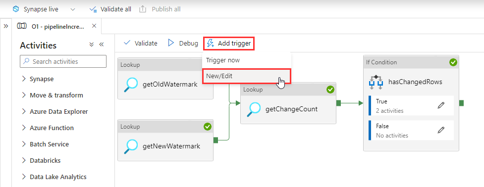

4. Open the **Choose trigger...** drop-down menu and click **New**

    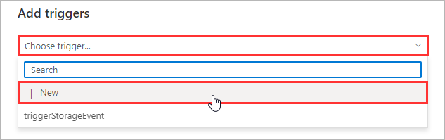

5. Rename the trigger to `triggerTumblingWindow5mOrders`

    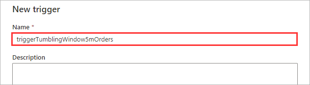

6. Set the **Type** to **Tumbling window**

    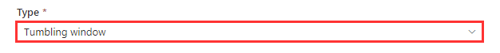

7. Set the **Recurrence** to **5 minutes**

    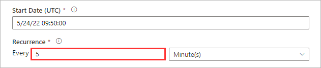

8. Click **OK**

    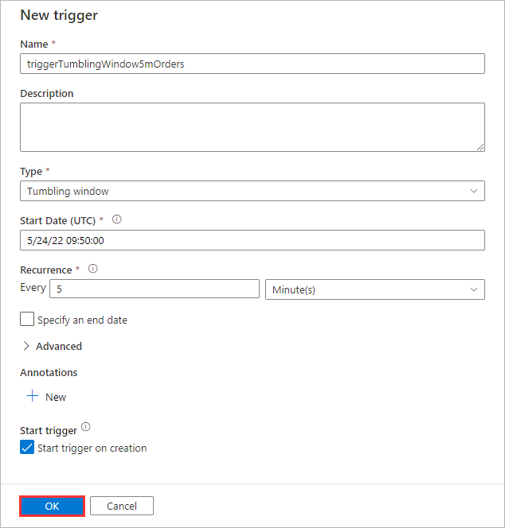

9. Click **OK**

    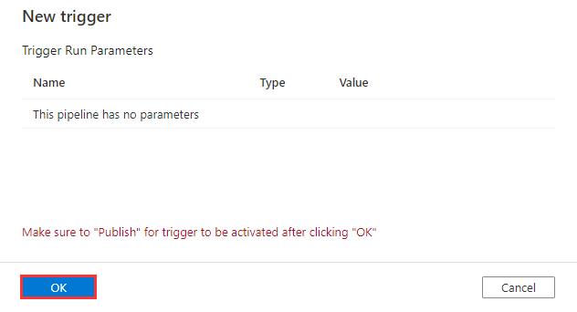

10. Click **Publish all**

    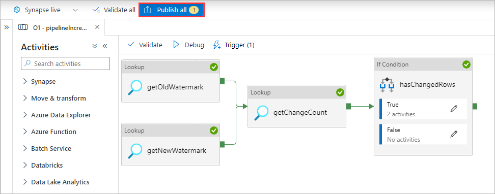

11. Click **Publish**

    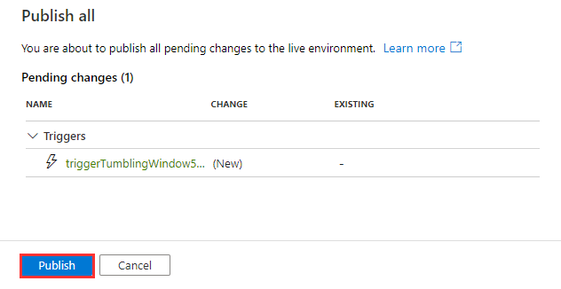

<div align="right"><a href="#module-02c---automation-using-triggers">↥ back to top</a></div>

## 2. Trigger (Storage Event)

Create a new storage event trigger that will be associated with the pipeline `O2 - pipelineFactIncrementalLoad`. The trigger will be set to fire whenever a **Blob created** event occurs within the `01-raw/wwi/orders` directory for blob paths that end in `.csv`. Trigger output `@trigger().outputs.body.fileName` will be passed to the pipeline parameter `fileName`.

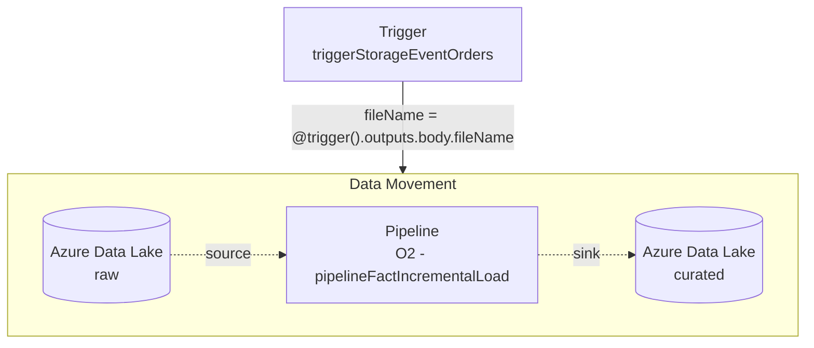
```mermaid

flowchart TB

t2[Trigger\ntriggerStorageEventOrders]
p2[Pipeline\nO2 - pipelineFactIncrementalLoad]
ds2[(Azure Data Lake\nraw)]
ds3[(Azure Data Lake\ncurated)]

t2--"fileName = @trigger().outputs.body.fileName"-->sg

subgraph sg[Data Movement]
ds2-.source.->p2-.sink.->ds3
end

```

1. Open the pipeline `O2 - pipelineFactIncrementalLoad`

    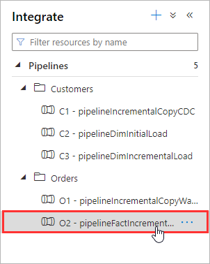

2. Click **Add trigger** and select **New/Edit**

    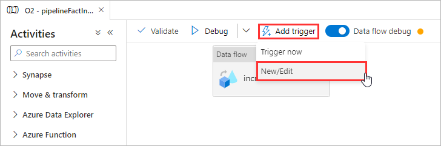

3. Open the **Choose trigger...** drop-down menu and click **New**

    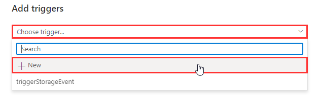

4. Rename the trigger to `triggerStorageEventOrders`

    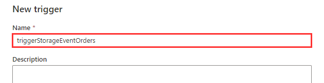

5. Set the **Type** to **Storage events**

    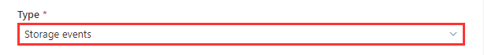

6. Provide the **Azure storage account** details
    - **Azure subscription** to the Azure subscription that contains your Azure Data Lake Storage Gen2 account
    - **Storage account name** to the Azure Data Lake Storage Gen2 account name
    - **Container name** via the drop-down menu to `01-raw`

    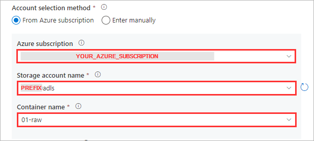

7. Set the **Blob path begins** with to `wwi/orders`

    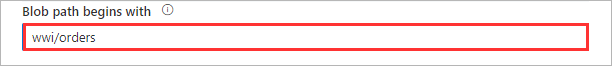

8. Set the **Blob path ends with** to `.csv`

    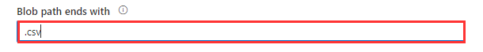

9. Set the **Event** to `Blob created`

    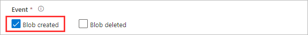

10. Click **Continue**

    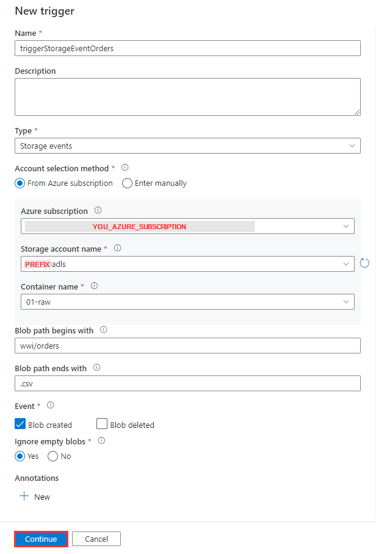

11. Click **Continue**

    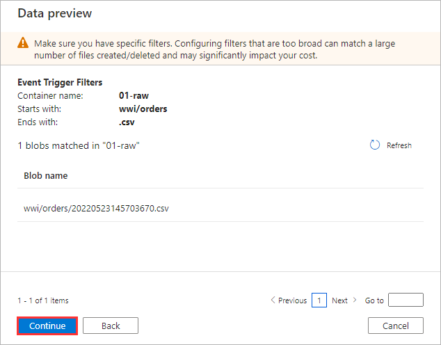

12. Copy and paste the code snippet to set the **Trigger Run Parameter** (fileName) and click **OK**

    ```javascript
    @trigger().outputs.body.fileName
    ```

    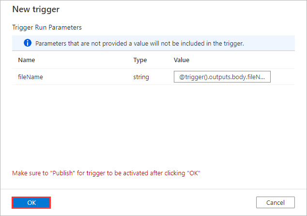

13. Click **Publish all**

    

14. Click **Publish**

    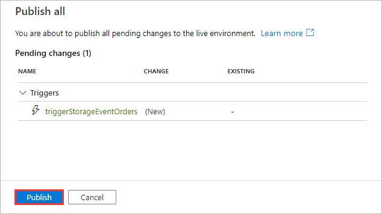

<div align="right"><a href="#module-02c---automation-using-triggers">↥ back to top</a></div>

## 3. Load Additional Data into dbo.Orders

Execute SQL code within the **Azure SQL Database** (source system) against the target table dbo.Orders. The code will add new order records (INSERT).

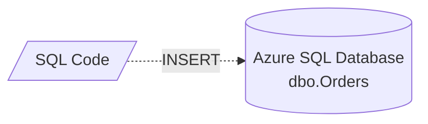
```mermaid
flowchart LR
ds1[(Azure SQL Database\ndbo.Orders)]
sql[/SQL Code/]
sql-.INSERT.->ds1
```

1. Navigate to the **SQL database**

    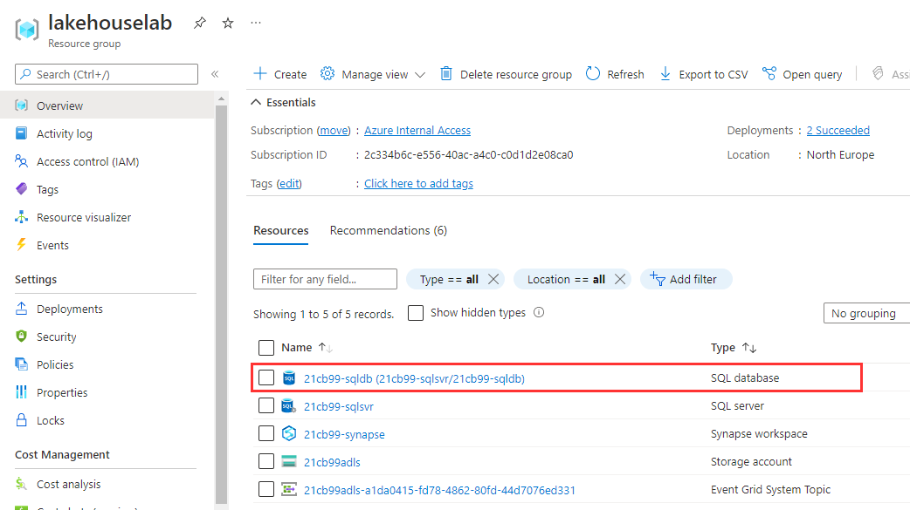

2. Click **Query editor**

    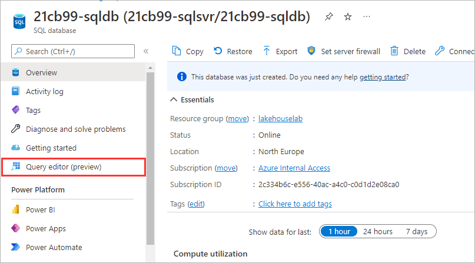

3. Copy and paste your **Login** and **Password** from the code snippets below

    Login

    ```text
    sqladmin
    ```

    Password

    ```text
    sqlPassword!
    ```

    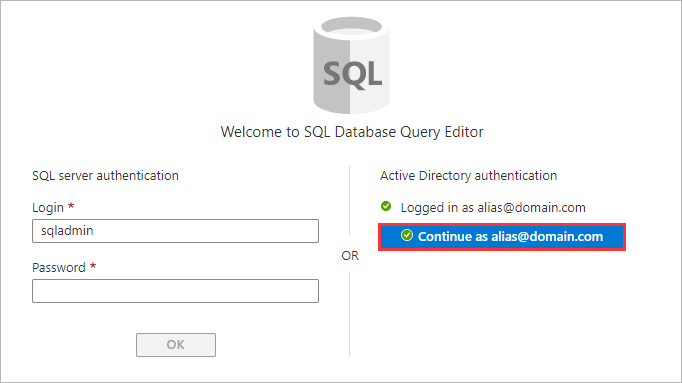

4. Copy and paste the code snippets below and click **Run**

```sql
INSERT INTO dbo.Orders (CustomerID, Quantity)
VALUES
    (1,13),
    (2,72),
    (5,52),
    (7,28);
SELECT * FROM [dbo].[Orders];
```

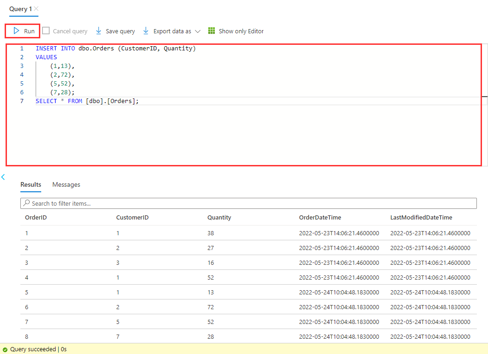

<div align="right"><a href="#module-02c---automation-using-triggers">↥ back to top</a></div>

## 4. Monitor

Since our pipelines are being automatically executed based on triggers, the data changes applied in the previous step will result in data automatically flowing from source (Azure SQL Database) to destination (Azure Data Lake Storage Gen2), then subsequently transformed before finally being loaded in the Delta Lake table format.

- The tumbling window trigger will execute `O1 - pipelineIncrementalCopyWatermark` every 5 minutes.
- If changes are detected, data is copied to ADLS Gen 2 (raw).
- Upon the detection of a new CSV file, the storage event trigger will execute `O2 - pipelineFactIncrementalLoad`.
- The pipeline will reference existing customers (Delta Lake) with the raw order data (CSV) and UPSERT the new data accordingly.

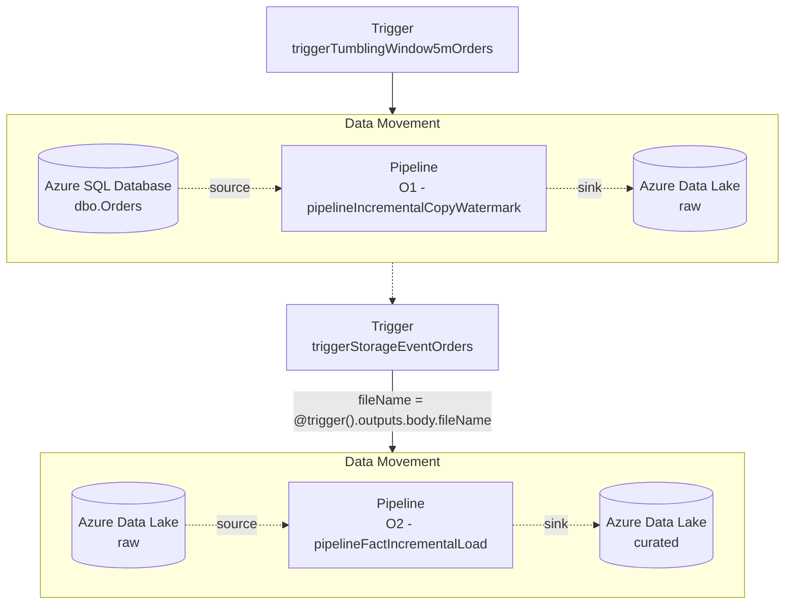
```mermaid

flowchart TB

t1[Trigger\ntriggerTumblingWindow5mOrders]
p1[Pipeline\nO1 - pipelineIncrementalCopyWatermark]
ds1[(Azure SQL Database\ndbo.Orders)]
ds2[(Azure Data Lake\nraw)]

t1-->sg

subgraph sg[Data Movement]
ds1-.source.->p1-.sink.->ds2
end

sg-.->t2


t2[Trigger\ntriggerStorageEventOrders]
p2[Pipeline\nO2 - pipelineFactIncrementalLoad]
ds2a[(Azure Data Lake\nraw)]
ds3[(Azure Data Lake\ncurated)]

t2--"fileName = @trigger().outputs.body.fileName"-->sg2

subgraph sg2[Data Movement]
ds2a-.source.->p2-.sink.->ds3
end


```

1. Navigate to the **Monitor** hub

    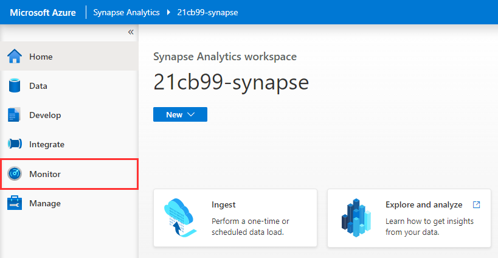

2. Under **Integration**, click **Pipeline runs**

    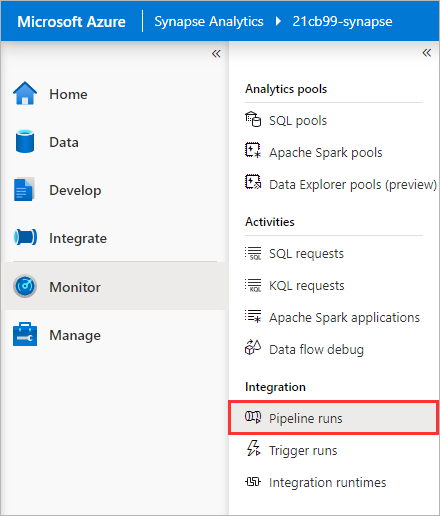

3. Set the **Pipeline name** filter to `O1 - pipelineIncrementalCopyWatermark`

    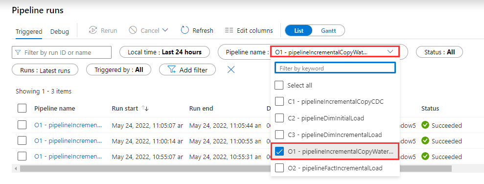

4. Periodically click **Refresh** until the next instance of the pipeline is triggered to run from the Tumbling Window trigger

    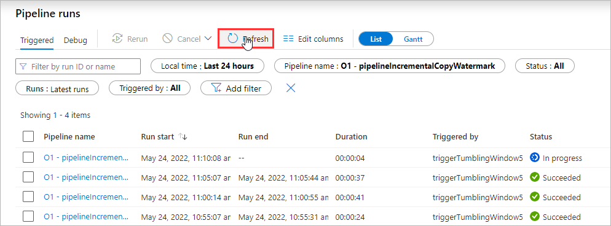

5. Once successful, change the **Pipeline name** filter to `O2 - pipelineFactIncrementalLoad`

    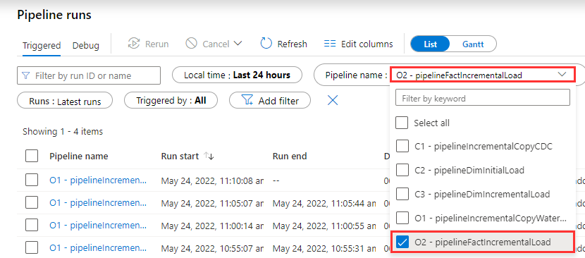

6. Periodically click **Refresh** until you observe a successful instance

    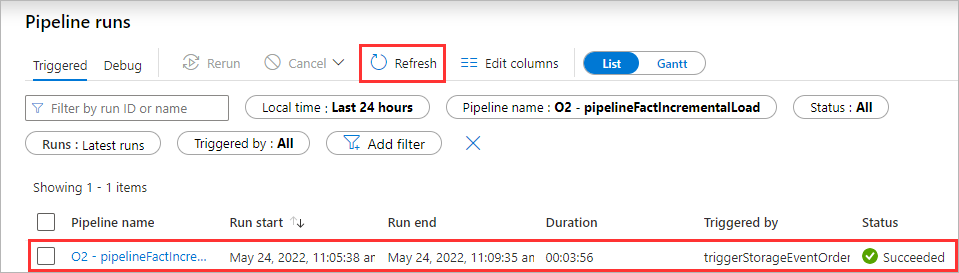

<div align="right"><a href="#module-02c---automation-using-triggers">↥ back to top</a></div>

## 5. Query Delta Lake

Use the Serverless SQL pool query service to execute T-SQL syntax to query the newly loaded order data from the Delta Lake table.

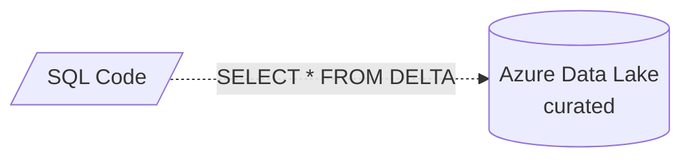
```mermaid
flowchart LR
ds1[(Azure Data Lake\ncurated)]
sql[/SQL Code/]
sql-.SELECT * FROM DELTA.->ds1
```

1. Navigate to the **Data** hub

    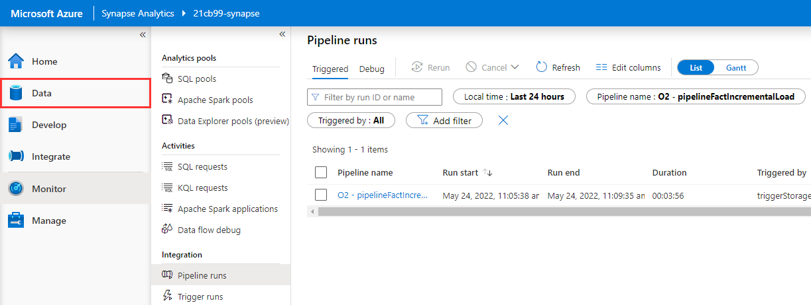

2. Browse the data lake folder structure to `03-curated > wwi`, right-click the folder `orders`, and select **New SQL Script > Select TOP 100 rows**

    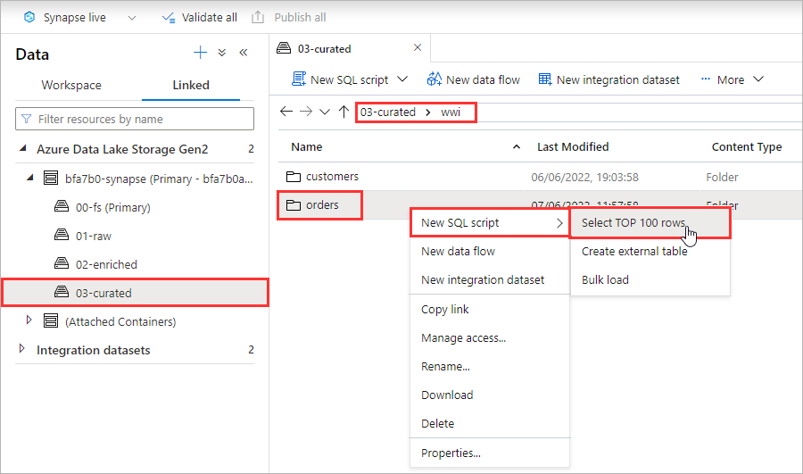

3. Set the **File type** to **Delta format** and click **Apply**

    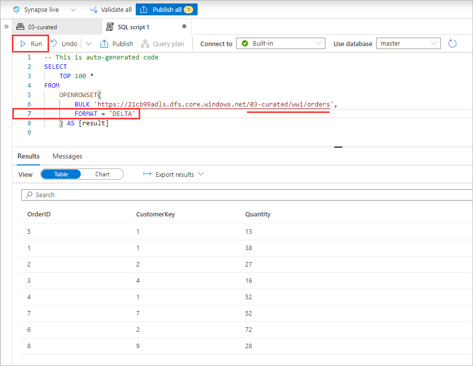

4. Click **Run**

    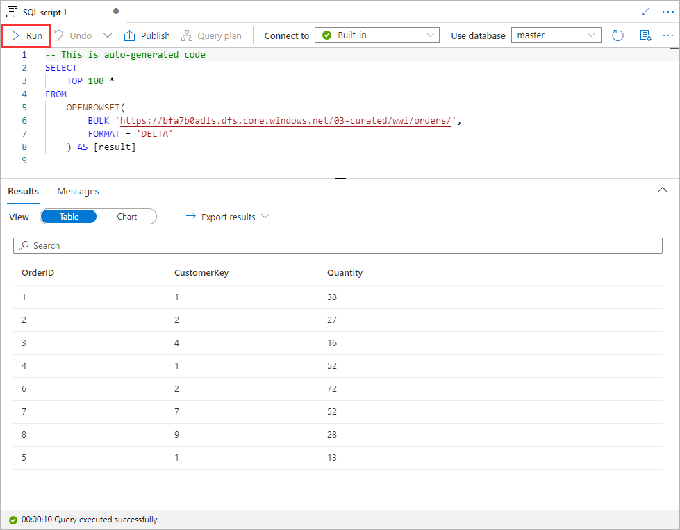

<div align="right"><a href="#module-02c---automation-using-triggers">↥ back to top</a></div>

## :tada: Summary

You have successfully automated the execution of the Order pipelines using triggers.

## :white_check_mark: Results

Azure Synapse Analytics

- [x] 2 x Triggers (triggerStorageEventOrders, triggerTumblingWindow5mOrders)

Azure Data Lake Storage Gen2

- [x] 1 x CSV file (01-raw/wwi/orders)
- [x] 1 x Delta log file (03-curated/wwi/orders/_delta_log)
- [x] 5 x Parquet files (03-curated/wwi/orders)

[Continue >](../modules/module03.md)
