# Module 03 - Logical Data Warehouse

[< Previous Module](../modules/module02c.md) - **[Home](../README.md)** - [Next Module >](../modules/module04.md)

## :stopwatch: Estimated Duration

10 minutes

## :thinking: Prerequisites

- [x] Lab environment deployed
- [x] Module 1D complete
- [x] Module 2C complete

## :loudspeaker: Introduction

In this module, we will setup a Logical Data Warehouse (LDW), a relational layer, on top of the data files residing in the data lake. This will enable a broad range of business intelligence tools to query data from the Delta Lake tables using the serverless SQL endpoint.

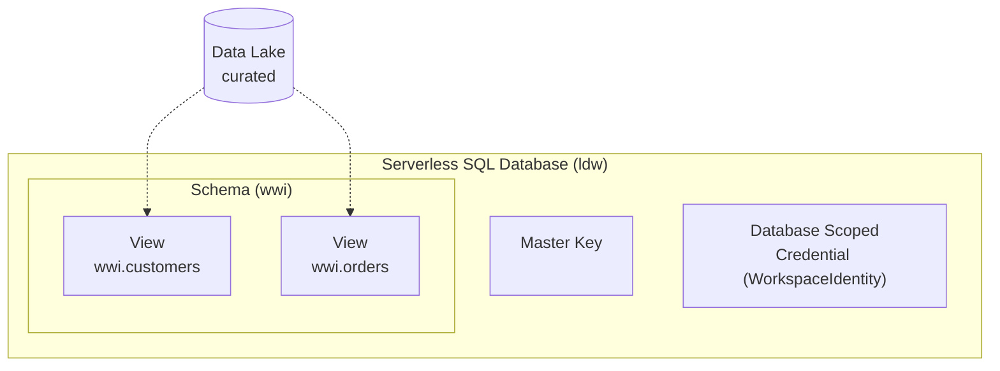

## :dart: Objectives

- Create a database.
- Create a schema.
- Create views on top of Delta Lake tables.

## Table of Contents

1. [Create a Database](#1-Create-a-Database)
2. [Create a Master Key](#2-Create-a-Master-Key)
3. [Create a Database Scoped Credential](#3-Create-a-Database-Scoped-Credential)
4. [Create a Schema](#4-Create-a-Schema)
5. [Create Views](#5-Create-Views)
6. [Explore your data](#6-Explore-your-data)

## 1. Create a Database

A [serverless SQL database](https://docs.microsoft.com/sql/t-sql/statements/create-database-transact-sql?view=azure-sqldw-latest&tabs=sqlod) is a logical container where users can create utility objects such as data sources, file formats and schemas, simplifying access to files placed in Azure storage (e.g. CSV, Parquet, Delta) through external tables and views. Note: The master database in serverless SQL pool does not support the creation of:

- External tables
- External data sources
- Database scoped credentials
- External file formats

In this step, we will create a user database with the name `ldw` and collation `Latin1_General_100_BIN2_UTF8`.

1. Navigate to the **Develop** hub

    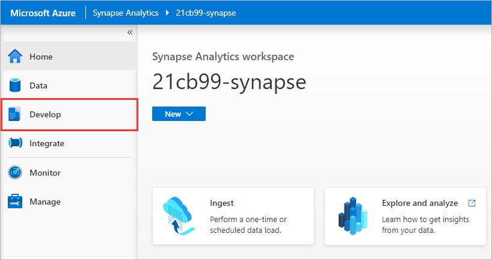

2. Click the **[+]** icon to add a new resource and select **SQL script**

    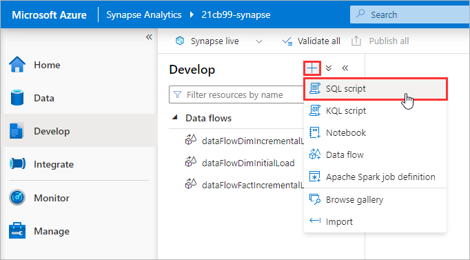

3. Copy and paste the code snippet below and click **Run**

    ```sql
    CREATE DATABASE ldw COLLATE Latin1_General_100_BIN2_UTF8;
    ```

    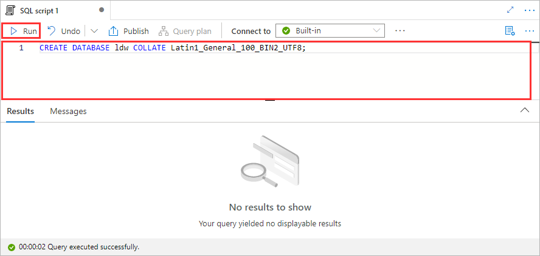

4. To the right of the **Use database** drop-down menu, click the **Refresh** icon

    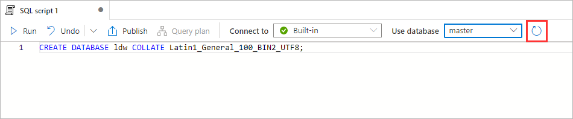

5. Set the **Use database** property to `ldw`

    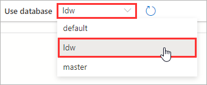

<div align="right"><a href="#module-03---logical-data-warehouse">↥ back to top</a></div>

## 2. Create a Master Key

A [master key](https://docs.microsoft.com/sql/t-sql/statements/create-master-key-transact-sql?view=azure-sqldw-latest) is used to protect the private keys of certificates and asymmetric keys that are present in the serverless SQL database. You [must](https://docs.microsoft.com/azure/synapse-analytics/sql/resources-self-help-sql-on-demand?tabs=x80070002#configuration) have a master key before you can create credentials.

1. Copy and paste the code snippet below and click **Run**

```sql
CREATE MASTER KEY;
```

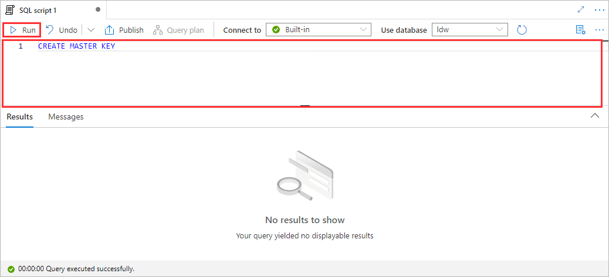

<div align="right"><a href="#module-03---logical-data-warehouse">↥ back to top</a></div>

## 3. Create a Database Scoped Credential

[Database-scoped credentials](https://docs.microsoft.com/azure/synapse-analytics/sql/develop-storage-files-storage-access-control?tabs=managed-identity#database-scoped-credential) are used when any principal calls the `OPENROWSET` function with `DATA_SOURCE`, or selects data from external table with a non-public location. In this step, we will create a database-scoped credential using a **Managed Identity**, this will use the Synapse workspace identity to access files that are persisted on Azure storage.

1. Copy and paste the code snippet below and click **Run**

```sql
CREATE DATABASE SCOPED CREDENTIAL WorkspaceIdentity
WITH IDENTITY = 'Managed Identity';
```

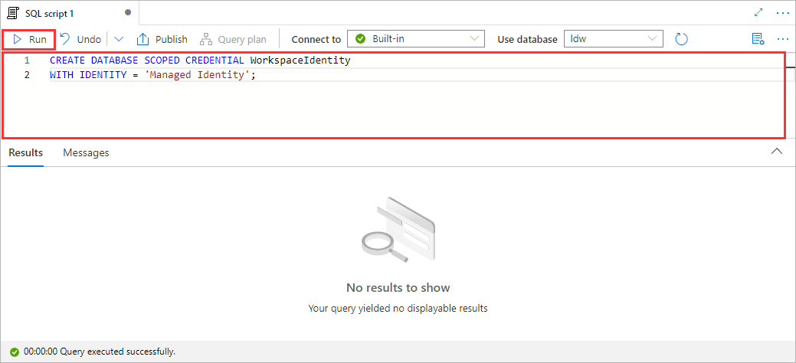

<div align="right"><a href="#module-03---logical-data-warehouse">↥ back to top</a></div>

## 4. Create a Schema

A [schema](https://docs.microsoft.com/sql/t-sql/statements/create-schema-transact-sql?view=azure-sqldw-latest) can be used to logically group metadata such as tables and views within a user database. In this step, we will create a schema called `wwi`.

1. Copy and paste the code snippet below and click **Run**

```sql
CREATE SCHEMA wwi;
```

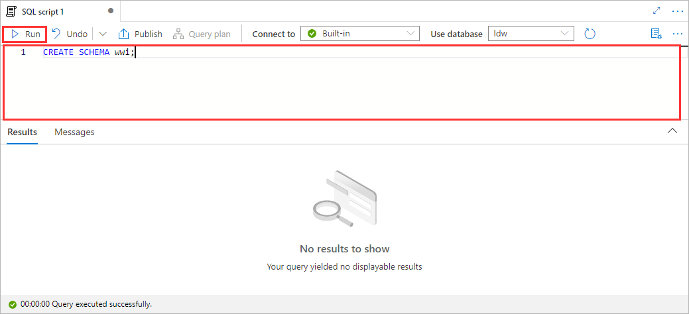

<div align="right"><a href="#module-03---logical-data-warehouse">↥ back to top</a></div>

## 5. Create Views

[Views](https://docs.microsoft.com/sql/t-sql/statements/create-view-transact-sql?view=azure-sqldw-latest) are virtual tables which encapsulate and enable reuse of serverless SQL pool queries. Once created, views can be consumed by SQL compatible tools such as Power BI. In this step, we will create views on top of our Delta Lake tables, `customers` and `orders`.

1. Copy and paste the code snippet below, replace `YOUR_DATA_LAKE_ACCOUNT` with the name of your Azure Data Lake Storage Gen2 account, and click **Run**

    ```sql
    CREATE VIEW wwi.customers
    AS SELECT *
    FROM
        OPENROWSET(
            BULK 'https://YOUR_DATA_LAKE_ACCOUNT.dfs.core.windows.net/03-curated/wwi/customers',
            FORMAT = 'DELTA'
        ) AS [result];
    ```

    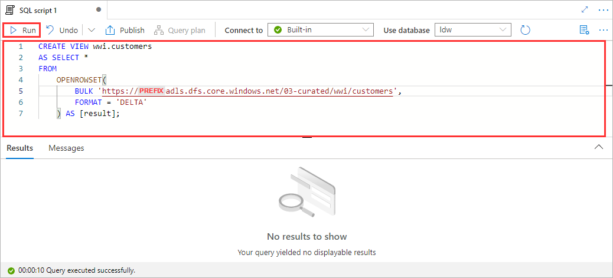

2. Copy and paste the code snippet below, replace `YOUR_DATA_LAKE_ACCOUNT` with the name of your Azure Data Lake Storage Gen2 account, and click **Run**

    ```sql
    CREATE VIEW wwi.orders
    AS SELECT *
    FROM
        OPENROWSET(
            BULK 'https://YOUR_DATA_LAKE_ACCOUNT.dfs.core.windows.net/03-curated/wwi/orders',
            FORMAT = 'DELTA'
        ) AS [result];
    ```

    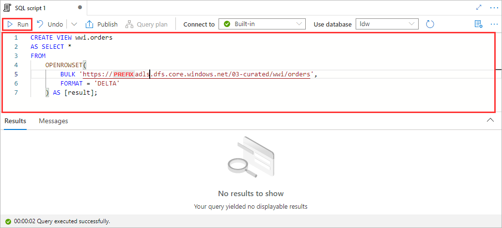

<div align="right"><a href="#module-03---logical-data-warehouse">↥ back to top</a></div>

## 6. Explore your data

The serverless SQL query service enables you to [read data](https://docs.microsoft.com/azure/synapse-analytics/sql/query-delta-lake-format) stored in the Delta Lake format using the `OPENROWSET` function. Since we have created virtual tables which wrap our serverless SQL queries utilizing the OPENROWSET function, we can simply refer to the views (e.g. `SELECT * FROM wwi.customers`).

1. Navigate to the **Data** hub

    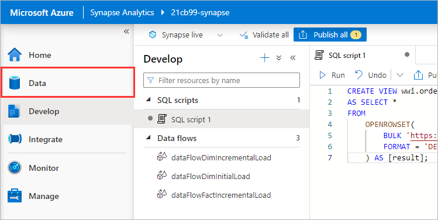

2. Click the web browser **Refresh** button to refresh the entire page

    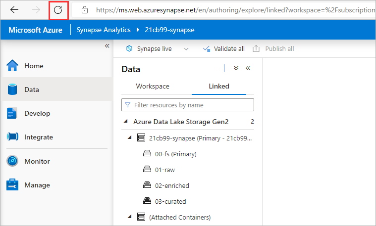

3. Under the **Workspace** tab, you should see a new **SQL database** called `ldw`

    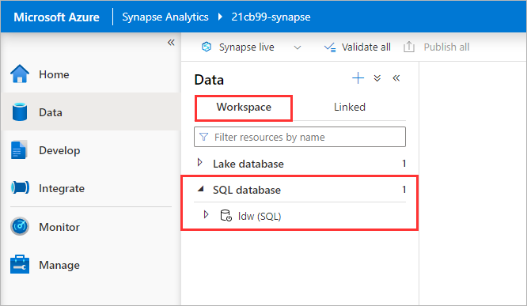

4. Expand the `ldw` database, navigate to **Views**

    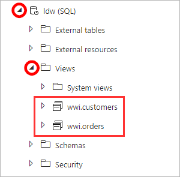

5. Right-click on `wwi.customers` and select **New SQL script > Select TOP 100 rows**

    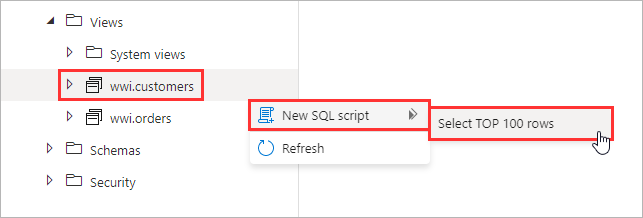

6. Click **Run**

    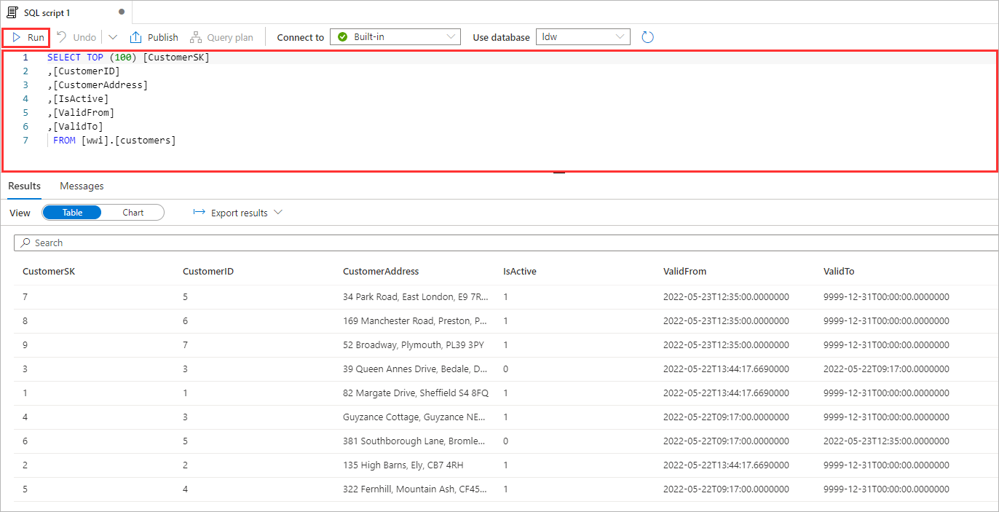

7. Replace the existing SQL by copying and pasting the below code snippet, and click **Run**

```sql
SELECT
    orders.CustomerKey,
    customers.CustomerAddress,
    SUM(orders.Quantity) AS Quantity
FROM
    wwi.orders AS orders,
    wwi.customers AS customers
WHERE
    orders.CustomerKey = customers.CustomerSK
GROUP BY
    orders.CustomerKey,
    customers.CustomerAddress
ORDER BY
    orders.CustomerKey ASC
```

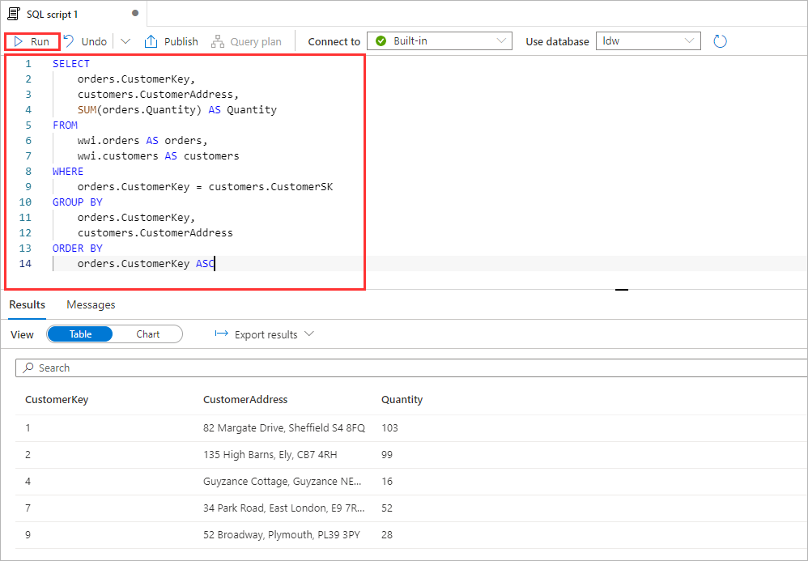

<div align="right"><a href="#module-03---logical-data-warehouse">↥ back to top</a></div>

## :tada: Summary

You have successfully created a relational layer on top of Delta Lake tables residing in your Azure Data Lake Storage Gen2 account.

## :white_check_mark: Results

Azure Synapse Analytics

- [x] 1 x Database (ldw)
- [x] 1 x Master key
- [x] 1 x Database Scoped Credential (WorkspaceIdentity)
- [x] 1 x Schema (wwi)
- [x] 2 x Views (wwi.customers, wwi.orders)


[Continue >](../modules/module04.md)
