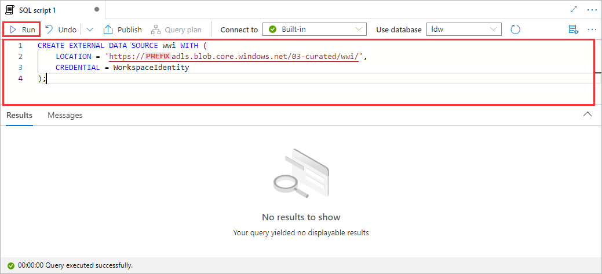

# Module 03 - Logical Data Warehouse

[< Previous Module](../modules/module02c.md) - **[Home](../README.md)** - [Next Module >](../modules/module04.md)

## :thinking: Prerequisites

- [x] Lab environment deployed
- [x] Module 1D complete
- [x] Module 2C complete

## :loudspeaker: Introduction

In this module, we will setup a Logical Data Warehouse (LDW), a relational layer, on top of the data files residing in Azure Data Lake Storage Gen2.

## :dart: Objectives

- Create a database.
- Create a schema.
- Create views on top of Delta Lake tables.

## Table of Contents

- [1. Create a Database](#1-Create-a-Database)
- [2. Create a Master Key](#2-Create-a-Master-Key)
- [3. Create a Database Scoped Credential](#3-Create-a-Database-Scoped-Credential)
- [4. Create an External Data Source](#4-Create-an-External-Data-Source)
- [5. Create a Schema](#5-Create-a-Schema)
- [6. Create Views](#6-Create-Views)
- [7. Explore your data](#7-Explore-your-data)

## 1. Create a Database

1. Navigate to the **Develop** hub

    

2. Click the **[+]** icon to add a new resource and select **SQL script**

    

3. Copy and paste the code snippet below and click **Run**

```sql
CREATE DATABASE ldw COLLATE Latin1_General_100_BIN2_UTF8;
```


4. To the right of the **Use database** drop-down menu, click the **Refresh** icon

    

5. Set the **Use database** property to `ldw`

    

<div align="right"><a href="#module-03---logical-data-warehouse">↥ back to top</a></div>

## 2. Create a Master Key

1. Copy and paste the code snippet below and click **Run**

```sql
CREATE MASTER KEY ENCRYPTION BY PASSWORD = 'oL@Rd9lvH&HB';
```


<div align="right"><a href="#module-03---logical-data-warehouse">↥ back to top</a></div>


## 3. Create a Database Scoped Credential

1. Copy and paste the code snippet below and click **Run**

```sql
CREATE DATABASE SCOPED CREDENTIAL WorkspaceIdentity
WITH IDENTITY = 'Managed Identity';
```


<div align="right"><a href="#module-03---logical-data-warehouse">↥ back to top</a></div>

## 4. Create an External Data Source

1. Copy and paste the code snippet below, replace `YOUR_DATA_LAKE_ACCOUNT` with the name of your Azure Data Lake Storage Gen2 account, and click **Run**

```sql
CREATE EXTERNAL DATA SOURCE wwi WITH (
    LOCATION = 'https://YOUR_DATA_LAKE_ACCOUNT.blob.core.windows.net/03-curated/wwi/',
    CREDENTIAL = WorkspaceIdentity
);
```



<div align="right"><a href="#module-03---logical-data-warehouse">↥ back to top</a></div>

## 5. Create a Schema

1. Copy and paste the code snippet below and click **Run**

```sql
CREATE SCHEMA wwi;
```


<div align="right"><a href="#module-03---logical-data-warehouse">↥ back to top</a></div>

## 6. Create Views

1. Copy and paste the code snippet below, replace `YOUR_DATA_LAKE_ACCOUNT` with the name of your Azure Data Lake Storage Gen2 account, and click **Run**

```sql
CREATE VIEW wwi.customers
AS SELECT *
FROM
    OPENROWSET(
        BULK 'https://YOUR_DATA_LAKE_ACCOUNT.dfs.core.windows.net/03-curated/wwi/customers',
        FORMAT = 'DELTA'
    ) AS [result];
```


2. Copy and paste the code snippet below, replace `YOUR_DATA_LAKE_ACCOUNT` with the name of your Azure Data Lake Storage Gen2 account, and click **Run**

```sql
CREATE VIEW wwi.orders
AS SELECT *
FROM
    OPENROWSET(
        BULK 'https://YOUR_DATA_LAKE_ACCOUNT.dfs.core.windows.net/03-curated/wwi/orders',
        FORMAT = 'DELTA'
    ) AS [result];
```


<div align="right"><a href="#module-03---logical-data-warehouse">↥ back to top</a></div>

## 7. Explore your data

1. Navigate to the **Data** hub

    

2. Click the web browser **Refresh** button to refresh the entire page

    

3. Under the **Workspace** tab, you should see a new **SQL database** called `ldw`

    

4. Expand the `ldw` database, navigate to **Views**

    

5. Right-click on `wwwi.customers` and select **New SQL script > Select TOP 100 rows**

    

6. Click **Run**

    

7. Replace the existing SQL by copying and pasting the below code snippet, and click **Run**

```sql
SELECT
    orders.CustomerKey,
    customers.CustomerAddress,
    SUM(orders.Quantity) AS Quantity
FROM
    wwi.orders AS orders,
    wwi.customers AS customers
WHERE
    orders.CustomerKey = customers.CustomerSK
GROUP BY
    orders.CustomerKey,
    customers.CustomerAddress
ORDER BY
    orders.CustomerKey ASC
```


<div align="right"><a href="#module-03---logical-data-warehouse">↥ back to top</a></div>

## :tada: Summary

You have successfully created a relational layer on top of Delta Lake tables residing in your Azure Data Lake Storage Gen2 account.

[Continue >](../modules/module04.md)