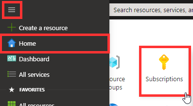
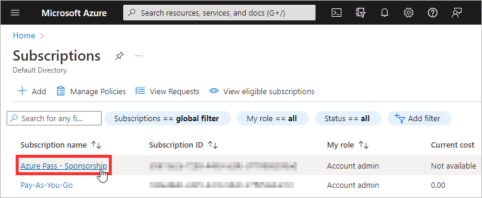
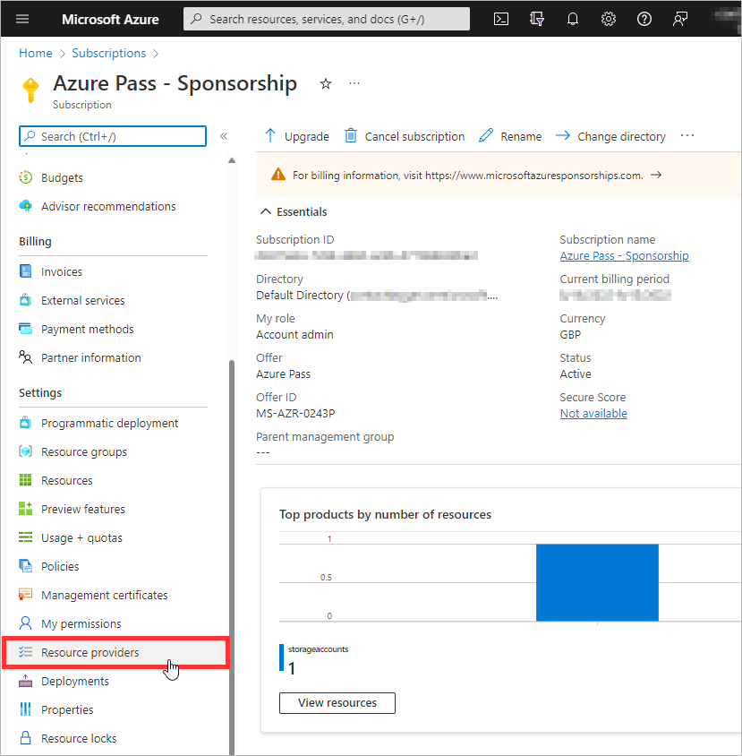
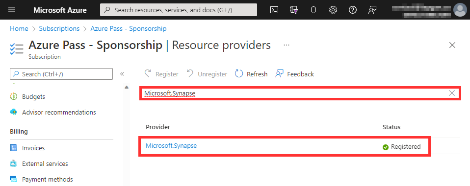

# How to Register a Resource Provider

[< Previous Module](./azurepass.md) - **[Home](./README.md)** - [Next Module >](./modules/module00.md)

## :stopwatch: Estimated Duration

10 minutes

## :thinking: Prerequisites

* An Azure subscription

## :loudspeaker: Introduction

In order to successfully deploy the lab environment, we must first ensure all the required resource providers have been registered.

## Initialize Cloud Shell

1. In the Azure Portal, click the **Cloud Shell** icon.
1. Set the **Subscription** to target Azure Subscription (e.g. `Azure Pass - Sponsorship`).
1. Click **Create storage**

    

## Register Missing Resource Providers

1. Hover your mouse over the code snippet below and click **Copy** button.

```powershell
$uri = "https://raw.githubusercontent.com/tayganr/lakehouse/main/template/lakehouselab.ps1"
Invoke-WebRequest $uri -OutFile "preDeploymentScript.ps1"
./preDeploymentScript.ps1
Write-Host "You can now close Cloud Shell"
```

2. Right-click within Cloud Shell, and click **Paste**.

    

3. Follow the prompts to specify your Azure subscription (e.g. `Azure Pass - Sponsorship`).

    

## Confirm Registration Status

1. In the Azure Portal, open the side menu, click **Home**, and select **Subsciptions**.

    

2. Select your Azure subscription (e.g. `Azure Pass - Sponsorship`).

    

3. Scroll down the left side menu, under Settings, click **Resource providers**.

    

4. Search for each Resource Provider one at a time, and check that the status is **Registered**. Note: This can take several minutes to complete.

    The subscription must have the following resource providers registered.

    - Microsoft.Authorization
    - Microsoft.EventGrid
    - Microsoft.Sql
    - Microsoft.Storage
    - Microsoft.Synapse
    - Microsoft.DataFactory

    

## :tada: Summary

You have successfully registered all the required resource providers.

[Continue >](./modules/module00.md)
